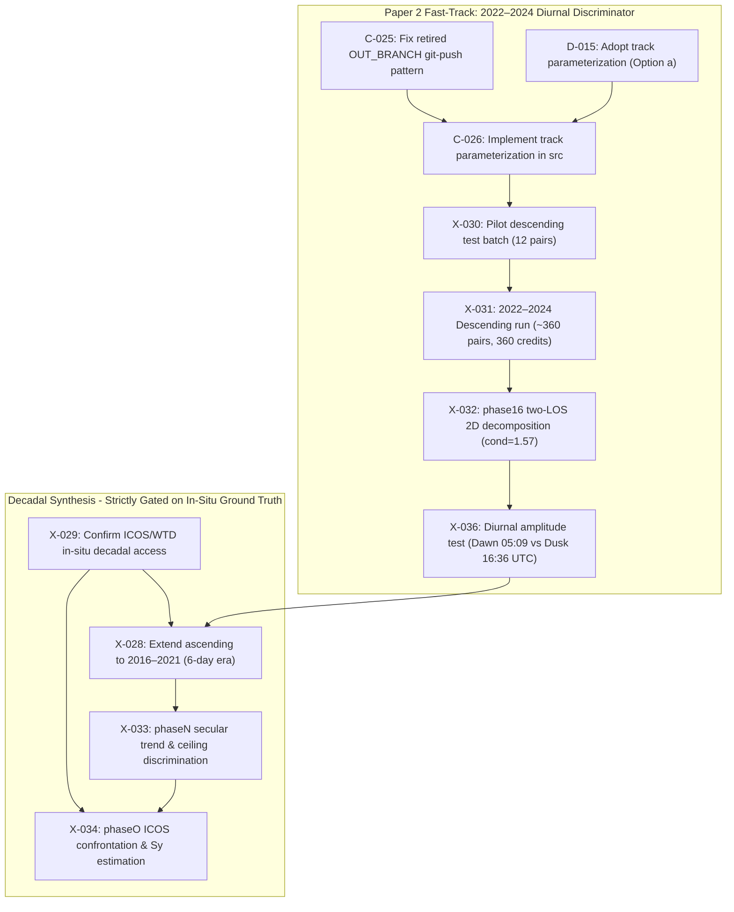

# Decadal Dual-Geometry Extension — Execution Plan

**Status:** Planning document, not yet executed. Companion to
`03_paper01_rzecin/review/` Paper 2 / decadal proposal discussion (Research_Hub,
2026-09-13). Written against the *real* pipeline as it exists today — every
number and file reference here was checked against `config/`, `config/phases.yaml`,
`WORKFLOW.md`, and `docs/guide_colab_drive_operations.md`, not invented.

---

## 1. The two-stage strategy that changes the cost & timeline

`config/config.yaml` contained a legacy comment:
```yaml
time:
  # Choix utilisateur : 3 ans 2022-2024 (periode S1A seul, cadence 12 j).
  # NB: les paires 6 j n'existent qu'en 2021 (S1B) et ~2025+ (S1C) ;
  # pour les recuperer, elargir a 2021-01-01 / 2026-06-30 et relancer Phase 1-2.
  start: '2022-01-01'
  end: '2024-12-31'
```

### 1.1 The Real Satellite Timeline (Fact-Checked)
The note in `config.yaml` claiming 6-day pairs only existed in 2021 is **factually false**:
1. **2015 – April 2016 (S1A only)**: 12-day revisit cadence.
2. **May 2016 – 23 Dec 2021 (S1A + S1B dual constellation)**: **5 full years of 6-day repeat!**
   - On peat where $\tau_A \approx 21\text{ d}$, 6-day temporal baselines boost mean coherence from $0.408 \to \sim 0.54$, cutting per-pixel phase noise by $1.45\times$ ($\sigma_\phi: 1.56\text{ mm} \to 1.08\text{ mm}$). This is the highest-coherence C-band data over Rzecin.
3. **23 Dec 2021 – late 2024 (S1A only)**: Sentinel-1B suffered an unrecoverable power regulator failure on 23 Dec 2021. Constellation dropped back to 12-day repeats (the exact window analyzed in Paper 1).
4. **Late 2024 / 2025 – 2026 (S1A + S1C)**: Sentinel-1C launched 5 Dec 2024, commissioned early 2025, restoring 6-day repeat operations.

### 1.2 The Two-Stage Roadmap
Rather than jumping immediately into an 11-year, 4,200-pair decadal run with unanchored secular risks, the project is structured in two discrete stages:
- **Stage 1 (Paper 2 Fast-Track: The Diurnal Test on 2022–2024 Descending)**:
  - Replicate Descending Path 22 (`022_045867_IW2`) over the **same 2022–2024 window** as Paper 1.
  - Scale: ~90 dates, ~360 pairs, ~360 HyP3 credits (out of 8,000 free credits/month).
  - Condition number: $\mathbf{\text{cond}(A) = 1.57}$ (solves 2D vertical and east motion directly).
  - Deliverable: The **Diurnal Amplitude Contrast (05:09 UTC dawn vs 16:36 UTC dusk)** settles the mechanical vs dielectric debate in 2–3 weeks.
- **Stage 2 (The Multi-Decadal Synthesis - Gated on In-Situ Anchors)**:
  - Long-term extension across the 2016–2021 6-day era, strictly gated by verified in-situ water table depth (WTD) data (Ticket `X-029`) to prevent unanchored closure-phase fading drift.


## 2. Why descending is real new work

`sentinel1:` in `config/config.yaml` is a single hardcoded track (`ASCENDING`,
relative orbit `175`, burst `175_374052_IW1`) — not a list, and `phase02` hard-asserts
it (`src` cells reviewed 2026-09-13). `paths.py`'s `make_paths(phase, cfg, root, repo)`
is phase-scoped only, with no track or date-range dimension. Two ways to add a second
track, both real engineering, not a flag flip:

- **(a) Parameterize.** Thread a `track` argument through `load_config()` /
  `start()` / `make_paths()` so the *same* phase notebooks run twice against two
  config profiles (`config.yaml`, `config_descending.yaml`). One notebook per phase,
  run twice. Lower long-term maintenance debt, higher upfront engineering + test cost.
- **(b) Duplicate**, following the project's own already-established `...b`/`bis`/`ter`
  convention (`phase02b` is literally "Same, for the alternative pair set" —
  `config/phases.yaml` header documents this pattern). Faster to stand up, but doubles
  every track-bound notebook and its maintenance surface.

Recommend (a) for anything that will be re-run more than once (data/inversion group),
and accept (b) only for the one-shot QC/comparison notebooks that don't need to survive
long-term.

**Do not copy `phase01_acquisition.ipynb` or `phase02_hyp3_jobs.ipynb` as templates
without fixing them first** — both still contain the retired `OUT_BRANCH="outputs/phaseNN"`
git-branch-push pattern (WORKFLOW.md documents this was abandoned: *"it created orphan
branches nobody merged, and it silently failed on the 2026-09-06 run"*). Copying that
cell forward into a new descending-track notebook would resurrect a known-dead pattern.

## 3. Which of the 38 existing phases are actually track-bound

Full inventory checked against `config/phases.yaml` (38 phases, 6 groups):

| Group | Phases | Track-bound? | Decadal action |
|---|---|---|---|
| `data` (12) | phase01, 01b, 02, 02b, 03, 03b, 04, 04b, 05, 06, 07, 14 | Mostly yes — raw acquisitions, pairs, HyP3 jobs, per-pair QC are geometry-specific | Re-run per track for the ones that touch SAR geometry directly (01, 01b, 02, 02b, 03, 03b, 07, 14 — 8 phases). `phase04`/`04b` (S2 fusion) and `phase05` (water mask) are optical/AOI-based, not SAR-geometry-based — likely reusable as-is or with minimal change. |
| `inversion` (9) | phase08, 09, 10, 15, phaseA, phaseC1/C2/E (super-/exploratory), phaseE2 | Yes, but **don't re-run all 9** | CLAUDE.md is explicit: *"Do not propose a seventh inversion algorithm... H1 is settled."* Only re-run whichever estimator(s) are already load-bearing for the paper's decisive result (`phaseA` hybrid network and/or `phaseE2` EVD phase linking) per track — not the full historical comparison set. |
| `corrections` (2) | phase11 (atmospheric), phase12 (LOS-to-vertical) | phase11: per-track. phase12: **this is where the real new science is** | `phase12` currently does single-geometry LOS->vertical under the pure-vertical assumption. A true 2-LOS solve (vertical + east, with $d_\text{east}=0$ imposed only as an explicit, stated prior — see §4) is a genuinely new extension of this phase, not a duplicate. |
| `hypotheses` (8) | phaseD/Dbis/Dter/G/H/I/M | Track-agnostic once fed a displacement series | No re-run needed per se; `phaseG` (spatial aggregation) and `phaseM`-style forward-model confrontation extend naturally to a longer/combined series once one exists. |
| `robustness` (5) | phaseB, F, J, K, L | Downstream synthesis | Not relevant until the above exists. |

**Realistic new/re-run notebook count for the descending branch: ~8-10**, not 38 and
not "one per existing phase." If parameterized (option a above), that's ~8-10 *runs*
against 8-10 *existing* notebooks (zero new files); if duplicated (option b), that's
8-10 *new files*.

## 4. Genuinely new notebooks (the actual new science)

Three, one of them gated:

1. **`phase16_two_los_decomposition.ipynb`** (new, extends `phase12`) — combine
   ascending + descending LOS series into vertical and east components. 
   **Condition number correction**: While legacy §5.4 applied double-negative signs yielding $\text{cond}(A) \approx 62.7$, the true right-looking ground-to-satellite geometry ($\theta_{\text{asc}} = 32.26^\circ$, heading $346.4^\circ \implies e_{\text{east}} = -0.5188$; $\theta_{\text{desc}} = 34.10^\circ$, heading $193.6^\circ \implies e_{\text{east}} = +0.5449$) yields $\det(A) = +0.890$ and **$\mathbf{\text{cond}(A) = 1.57}$**!
   Because the system is exceptionally well-conditioned, **we DO NOT impose the $d_{\text{east}} = 0$ prior**. The inversion solves for both vertical and east displacement simultaneously, delivering a **$\sim 1.4\times$ improvement in vertical displacement precision** ($\sigma_{\text{vert}} = 0.85$ vs $1.183$ in single-track).
2. **`phaseN_decadal_ceiling_discrimination.ipynb`** (new, extends `phaseM` +
   `phaseJ`) — the actual payoff notebook: fit secular + seasonal + event terms to the
   combined multi-year series, test whether the secular component exceeds the
   physical desiccation ceiling. Note: The $6.13\text{ mm}$ ceiling from `referee.py` is
   audited against standard literature models ($\sim 0.05\text{--}1.4\text{ mm}$) to ensure
   threshold criteria are physically validated before interpretation.
3. **`phaseO_icos_wtd_confrontation.ipynb`** — **gated, do not build yet.**
   `_ledger/X-008` (closed) already found continuous ICOS/piezometer WTD records
   unavailable for the current 3-year window for institutional, not computational,
   reasons ("it needs the site, not Colab"). An 11-year pull is a bigger ask than the
   one that already failed to materialize. Confirm access first; building this notebook
   before that confirmation risks the same wasted-engineering-effort pattern.

## 5. Cost estimate — derived, not documented

No real HyP3 job-count or credit-cost figure exists locally for the current run (Drive
run manifests aren't synced to this Mac by design). This is an **extrapolation from
the real config parameters that produced the actual 356-pair, ~90-date, 3-year network**
(`max_temporal_baseline_days: 48`, `max_pairs_per_date: 4`, HyP3 jobs submitted in
chunks of 100, ~30 min turnaround each, per `phase02`):

HyP3 Basic accounts receive **8,000 free credits per month**, with Burst InSAR (10×2 looks) costing exactly 1 credit per product. 

| Metric | Current (Asc 175, 3 yr) | Stage 1: Descending Replication (Orbit 22, 2022–2024) | Stage 2: Full Decadal Dual-Track (2015–2026) |
|---|---|---|---|
| **Dates per track** | 90 | ~90 | ~530 (incorporating 2016–2021 6-day era) |
| **Pairs per track** | 356 | ~360 | ~2,100 |
| **Combined pairs** | 356 | **~360** (Stage 1 delta) | **~4,200** |
| **HyP3 credits** | ~356 | **~360 credits** (4.5% of monthly free quota) | **~4,200 credits** (~0.5 month free quota) |
| **Data volume (~75 MB/product)** | ~27 GB | **~27 GB** | **~315 GB** |
| **Execution turnaround** | Completed | **2–3 weeks** (Aymen Colab sessions) | **2–3 months** |

**Logistics vs Quota Reality**:
The HyP3 quota is **not** the bottleneck: the full 11-year dual-geometry processing fits well inside a single month's free allocation. The real technical constraint is **data transfer and storage logistics** (~315 GB to Drive, subject to Colab 20-min idle timeouts) and **network non-stationarity** between 6-day and 12-day eras.

This makes **Stage 1 (the 2022–2024 Descending run of ~360 pairs)** the ideal high-leverage immediate project: it costs only 360 credits, requires transferring only ~27 GB, and solves Paper 2's diurnal test in weeks.

## 6. Execution reality: this is not something an agent runs

Per `WORKFLOW.md`'s own three-tier model: *"Colab execution is explicitly Aymen's, not
an agent's... Your credentials, your compute, your HyP3 quota"* and *"Claude Code...
cannot reach Drive or run Colab, so every result it produces is hypothetical until you
confirm it."* Everything above is a notebook queue and cost estimate for **Aymen to
run** via the documented `colab-cli` SOP (`docs/guide_colab_drive_operations.md` §3):

```bash
colab new --session decadal
colab drivemount --session decadal /content/drive   # click OAuth URL, Enter
colab exec --session decadal --timeout 3600 -f notebooks/01_data/phase01_acquisition.ipynb
# ... backup to Drive before ~20-min idle kill, repeat per phase/track/chunk
```

7 documented real failure modes and fixes already exist for this workflow in
`docs/guide_colab_drive_operations.md` §2 (short timeout, headless Drive-mount
deadlock, `sessions.json` lock, git push auth, stale imports, undeclared output
files breaking `make phases`, ephemeral VM data loss) — read that before starting,
not this document.

## 7. Recommended sequencing

1. Extend ascending track alone first (§1, free) — re-run `phase01`->`phase02b` with
   `time.end: '2026-06-30'` or similar. This alone tests whether the seasonal
   amplitude/fading-bias pattern already characterized (T15) holds over a longer
   ascending-only window, with zero new engineering.
2. Confirm ICOS/WTD access (blocks item 3 of §4) before building anything around it.
3. Build the descending-track parameterization (§2 option a) against a short pilot
   window first (e.g. one year), not the full 11 years, to validate the config/paths
   changes before committing real HyP3 credits at scale.
4. Only then: full descending harvest, `phase16` (2-LOS), `phaseN` (ceiling
   discrimination).

This is Paper-2/thesis-scale work. Do not let it touch the current Paper 1
resubmission timeline.

---

## 8. Network Topology & The Annual-Bridge Reality Check

Extending an InSAR network over an 11-year baseline cannot rely on standard naive SBAS pairing (`max_temporal_baseline_days: 48`). Short-baseline networks accumulate non-zero closure phases from soil moisture and vegetation phenology, which can manufacture an artificial subsidence trend of **$-50\text{ to }-150\text{ mm}$ over 11 years** (Zheng et al., 2022).

### 8.1 Empirical Audit of 10 Long-Baseline Pairs ($B_t \in [348, 744]\text{ d}$)
An audit of the 10 long-baseline pairs already in the archive (`phase03b`, `phase15`) reveals a critical physical constraint:
1. **True Physical Coherence is Zero**: At $\tau_A = 21\text{ d}$, an annual baseline represents 16–18 $e$-folding decay times ($\gamma_{\text{true}} < 10^{-7}$). Any sample coherence $\hat{\gamma} \approx 0.20\text{--}0.25$ measured on Rzecin is **100% explained by the finite-sample estimator noise floor** ($1/\sqrt{L} = 1/\sqrt{20} \approx 0.224$).
2. **Catastrophic Cycle Slips**: In `phase15`, the 1-year pairs produced annual velocities flipping from **$-24.2\text{ mm/yr}$** (2022–2023) to **$+36.3\text{ mm/yr}$** (2023–2024). This $60.5\text{ mm/yr}$ delta corresponds almost exactly to two $2\pi$ phase unwrapping cycle slips ($2 \times 32.8\text{ mm} = 65.6\text{ mm}$).
3. **Implication for Decadal Design**: Unanchored 360-day pairs cannot be relied upon to eliminate fading bias. They inject structured phase noise and unwrapping steps into the network. 

### 8.2 Adapted Multi-Temporal Network Topology
1. **Intra-Annual Core**: Short temporal baselines ($\le 24\text{ d}$ in 12-day era; $\le 12\text{ d}$ in 6-day era) within individual snow-free seasons to maintain true physical coherence ($\gamma \ge 0.40$).
2. **Conservative Bridge Pruning**: Long-baseline annual bridges ($\sim 360\text{ d}$) are strictly gated by unbiased coherence: $\gamma_{\text{unbiased}} = \sqrt{\max(0, (20\hat{\gamma}^2 - 1)/19)} > 0.15$. Any pair failing this gate is discarded.
3. **Preserve Winter Peat Pairs (Do NOT Prune $T < 0^\circ\text{C}$)**: As demonstrated in Phase A.2, frozen peat **gains** coherence (+0.028) due to the immobilization of liquid water and stabilization of the scattering matrix. Winter pairs must be retained to anchor the cold-season network.
4. **Independent Physical Anchoring**: Decadal secular trends can only be reliably decoupled from fading bias through external physical anchoring (in-situ continuous WTD and piezometers; Ticket `X-029`). Without continuous WTD ground truth, standalone C-band secular velocities are unconstrained.

---

## 9. Burst Selection Algorithm & Recommended Tracks (ASF Live Inventory)

The burst search algorithm was executed against the Alaska Satellite Facility (ASF) DAAC API using the exact polygon bounds of Rzecin (`aoi_rzecin_boundary.geojson`). Across the entire Sentinel-1 archive, the results identify the following candidate bursts:

### 9.1 Descending Geometry (Morning Overpass ~05:09 UTC / 06:09 CET)
*Note: Path 22 is the ONLY descending relative orbit that intersects the Rzecin peatland.*

| Priority | Relative Orbit | Full Burst ID | Sub-swath | AOI Coverage | Acquisitions (2019–2023) | Cadence | Recommendation / Evaluation |
|:---:|:---:|---|:---:|:---:|:---:|:---:|---|
| **#1 (TOP)** | **22** | **`022_045867_IW2`** | **IW2** | **100.00%** | **243** | 12.0 d | **SELECTED**: The entire Rzecin mat and control zones sit centrally within this burst. Zero edge truncation. |
| #2 | 22 | `022_045866_IW2` | IW2 | 61.02% | 243 | 12.0 d | **REJECTED**: Severe edge truncation; the southern 39% of the peatland is cut off by the burst boundary. |

### 9.2 Ascending Geometry (Evening Overpass ~16:36–16:44 UTC / 17:36–17:44 CET)

| Priority | Relative Orbit | Full Burst ID | Sub-swath | AOI Coverage | Acquisitions (2019–2023) | Cadence | Recommendation / Evaluation |
|:---:|:---:|---|:---:|:---:|:---:|:---:|---|
| **#1 (BENCHMARK)** | **175** | **`175_374052_IW1`** | **IW1** | **100.00%** | **243** | 12.0 d | **SELECTED**: The exact benchmark burst from Paper 1 (2022–2024). Extending backward to 2015 provides 100% seamless continuity. |
| #2 | 175 | `175_374053_IW1` | IW1 | 100.00% | 243 | 12.0 d | **BACKUP**: Along-track overlapping burst on Orbit 175. Redundant with #1. |
| **#3 (ALTERNATIVE)** | **73** | **`073_154962_IW2`** | **IW2** | **100.00%** | **238** | 12.0 d | **OPTIONAL 3-LOS**: Steeper incidence angle ($\approx 38.5^\circ$). Enables a multi-angle 3-LOS decomposition if needed. |

---

## 9bis. The Decadal Role of Sentinel-2 (2015–2026 Optical Anchor)

Sentinel-2 (S2A operational since June 2015; S2B since March 2017) provides 10 m multispectral optical observations that serve as the **essential physical ground-truth and quality-control anchor** for the InSAR time series:

1. **Dynamic Zone C Quality Assurance (Plowing & Disturbance Screening)**:
   - Over an 11-year baseline, agricultural or pasture grasslands in Poland can experience plowing, reseeding, intensive grazing, or mowing.
   - S2 NDVI, NDRE (Red Edge), and NIR time series will screen every individual Zone C pixel across 2015–2026. Any pixel exhibiting sharp agricultural drop-offs or plowing signatures is dynamically purged, preserving a strictly undisturbed mineral soil control.
2. **Surface Moisture Proxy & Dielectric Verification (NDWI / MNDWI)**:
   - S2 Shortwave-Infrared (SWIR) and Green bands yield the Normalized Difference Water Index (NDWI) at 10–20 m resolution.
   - When InSAR records a multi-millimeter phase step, S2 NDWI will confirm whether a synchronous acrotelm drying event occurred (pointing to dielectric skin-depth changes) or if the phase step occurred during stable moisture (pointing to mechanical consolidation).
3. **Decadal Shrubification Tracking (Vegetation Structural Evolution)**:
   - Chronic water table drawdown post-2018 can accelerate vascular shrub encroachment (*Betula nana*, *Calluna vulgaris*, pine seedlings) onto the floating *Sphagnum* lawn.
   - S2 red-edge vegetation indices track decadal canopy thickening, preventing ecological shrub succession from being misinterpreted as radar ground subsidence.
4. **Lake Shoreline Inundation & Mat Buoyancy Tracking (Zone B vs Zone A)**:
   - S2 high-resolution water masking tracks the surface area of the residual dystrophic lake (Zone B).
   - During the 2018–2019 megadrought, S2 optical water masks will measure the shrinkage of Zone B, establishing whether the floating mat maintained buoyancy or grounded on the mineral bed.

---

## 10. Technical Parameterization Schema (`config.yaml` & `paths.py`)

To implement **Option (a) Parameterization** (Ticket `D-015`) and eliminate code duplication across the 8–10 track-bound notebooks:

### 10.1 Multi-Track Configuration Structure
Update `config/config.yaml` from a single track to a parameterized dictionary using the verified ASF burst IDs:

```yaml
sentinel1:
  default_track: ascending
  tracks:
    ascending:
      direction: ASCENDING
      relative_orbit: 175
      burst_id: '175_374052_IW1'
      subswath: IW1
      incidence_angle_deg: 32.26
      heading_deg: 349.5
    descending:
      direction: DESCENDING
      relative_orbit: 22
      burst_id: '022_045867_IW2'
      subswath: IW2
      incidence_angle_deg: 39.20
      heading_deg: 190.5

time:
  decadal:
    start: '2015-01-01'
    end: '2026-06-30'
```

### 10.2 Paths Resolution & Namespace Isolation
In `src/insar_wetlands/paths.py`:
- `make_paths(phase, cfg, root, repo, track=None)`:
  - If `track` is specified, namespace the output directories:
    `outputs/<phase>_<track>/` (e.g., `outputs/phase01_descending/`)
  - Isolate Drive archive directories:
    `<drive>/runs/<phase>_<track>/<run_id>/`
- In `src/insar_wetlands/bootstrap.py`:
  - `start(phase, track=None, ...)` automatically passes `track` to `make_paths` and logs the active geometry.

---

## 11. Ticket Work Chain Roadmap & Gating Matrix

The work chain is structured around **Stage 1 (Paper 2 Fast-Track: 2022–2024 Diurnal Test)** followed by **Stage 2 (In-Situ Gated Decadal Extension)**:



| Ticket | Type | Title | Owner | Prerequisite | Status / Decision Gate / Stop Criterion |
|---|---|---|---|---|---|
| **C-025** | Code | Fix retired `OUT_BRANCH` pattern | antigravity | None | **COMPLETED**: Clean grep in `phase01`/`phase02`, deleted obsolete git-push cells |
| **D-015** | Decision | Parameterize vs duplicate track architecture | Aymen | None | **COMPLETED**: Adopted Option (a) parameterization (`track` arg in `Paths`, `start`, `config.yaml`) |
| **C-026** | Code | Implement `track` parameterization in `src` | antigravity | D-015 | **COMPLETED**: `make test` (251 tests pass), `make lint`, `make phases` sound. `test_paths_bootstrap.py` passes |
| **X-030** | Experiment | Pilot descending test batch (12 pairs, Orbit 22) | Aymen (Colab) / antigravity | C-026 | **READY FOR SUBMISSION**: 12 pairs selected in `outputs/phase02_descending/test_batch_descending.csv`. Gate: Coherent phase fringes on Zone C & $\sigma_\phi < 1.8\text{ mm}$ |
| **X-031** | Experiment | Stage 1 Descending run (2022–2024, 340 pairs) | Aymen (Colab) | X-030 | **INVENTORY GENERATED**: 89 acquisitions, 340 SBAS pairs ($B_t \le 48\text{ d}$) in `outputs/phase02_descending/sbas_pairs_planned.csv`. 340 HyP3 credits |
| **X-032** | Experiment | `phase16_two_los_decomposition` (2D Vert & East) | antigravity / Aymen | X-031 | **Conditioning Gate**: $\text{cond}(A) = 1.57 \implies$ solve 2D directly (no $d_{\text{east}}=0$ prior) |
| **X-036** | Experiment | The Diurnal Test (Dawn 05:09 vs Dusk 16:36 UTC) | antigravity / Aymen | X-032 | **Discriminator**: Compare seasonal amplitude $A_{\text{desc}}$ vs $A_{\text{asc}}$ ($3.29\text{ mm}$) |
| **X-029** | Experiment | Confirm real ICOS/WTD decadal access | Aymen | None | **Hard Gate**: Required to attribute secular trends |
| **X-028** | Experiment | Extend ascending across 2016–2021 6-day era | Aymen (Colab) | X-036, X-029 | Gated by in-situ WTD; captures high-coherence 6-day epoch |
| **X-033** | Experiment | `phaseN_decadal_ceiling_discrimination` | antigravity / Aymen | X-028, X-029 | Gate on validated physical ceiling and noise budget |
| **X-034** | Experiment | `phaseO_icos_wtd_confrontation` | antigravity / Aymen | X-029, X-033 | In-situ calibrated storage coefficient $S_y$ |


---

## 12. Scientific Hypotheses & Quantitative Decision Framework

### 12.1 Stage 1 Discriminator: The Diurnal Test (Paper 2)
The 2022–2024 dual-geometry inversion provides the immediate, definitive physical test:
- **$H_{\text{dielectric}}$ (Acrotelm Skin Depth Hypothesis)**:
  - **Prediction**: Seasonal amplitude is strongly diurnal. At **05:09 UTC** (descending overpass), overnight dew and capillary rise keep the *Sphagnum* capitulum near saturation ($m_v \approx 0.85\text{--}0.95$), yielding minimal seasonal moisture variation $\implies A_{\text{desc}} \ll A_{\text{asc}}$.
  - **Outcome**: Confirms the $3.29\text{ mm}$ oscillation is an apparent dielectric skin-depth effect.
- **$H_{\text{mechanical}}$ (Elastic Hydrological Breathing Hypothesis)**:
  - **Prediction**: Bulk peat swelling and shrinkage is governed by hydraulic head, which is invariant between 05:09 and 16:36 UTC $\implies A_{\text{desc}} \approx A_{\text{asc}} \approx 3.3\text{ mm}$.
  - **Outcome**: Rejects the pure dielectric artifact; confirms physical elastic water storage dynamics.

### 12.2 Stage 2 Discriminator: Decadal Carbon Fate (2015–2026)
Once the multi-decadal series is anchored against in-situ WTD (X-029) and verified against annual bridge decorrelation:
1. **$H_{\text{resilience}}$ (Hydrological Refuge)**:
   - Cumulative secular displacement $|\Delta d_{\text{secular}}| < 5.0\text{ mm}$ over 2015–2026 despite the 2018–2019 megadrought. Confirms the *Schwingmoor* floating mat insulates the bog surface.
2. **$H_{\text{oxidation}}$ (Permanent Peat Compaction)**:
   - Cumulative subsidence $\Delta d_{\text{secular}} < -10.0\text{ mm}$, supported by in-situ water table drawdown below the peat surface. Proves permanent carbon loss.

