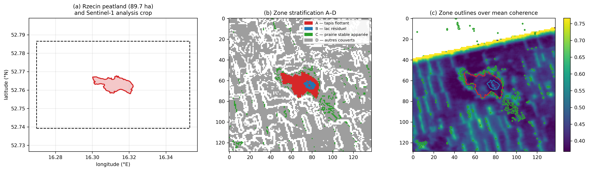
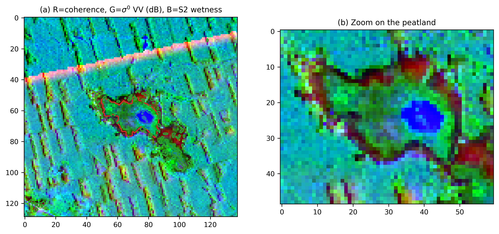
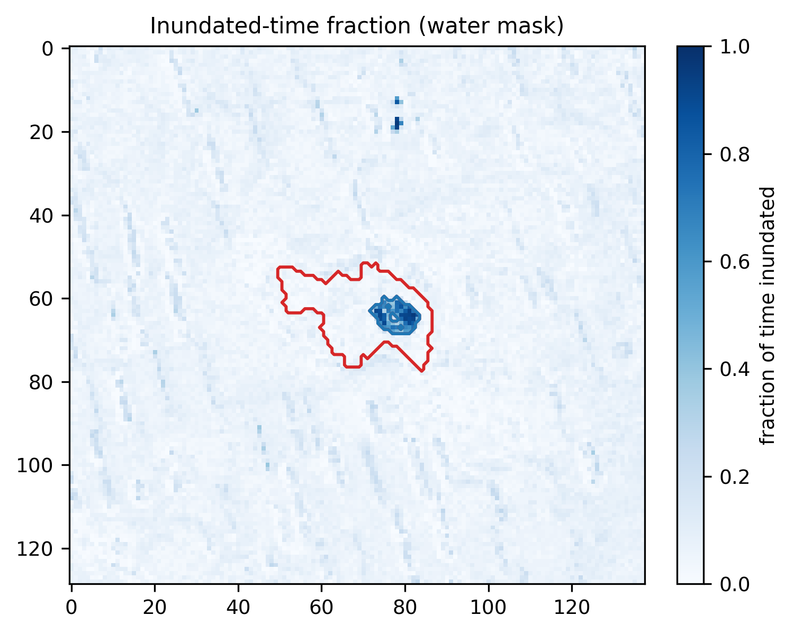

## 2. Study area and data

### 2.1 Study area

The **Rzecin peatland** (52.7632 °N, 16.3098 °E, Greater Poland; **89.7 ha**) is
a transitional poor fen carrying a floating *Sphagnum* mat (*Schwingmoor*) with
a residual lake undergoing terrestrialisation (Fig. 2). Three properties govern
its radar response:

- **Near-surface water table**, 0–30 cm below the surface and hydrologically
  stable (Juszczak et al., 2013).
- **Dense low canopy** of *Sphagnum*, sedges and ericaceous shrubs — a
  substantial scattering volume at C-band.
- **Mobile substrate**: the mat rests on water, which is the basis for expecting
  pronounced vertical motion.

The site is therefore, a priori, the case where the geomorphological signal
should be **largest**, which makes it a demanding test rather than a favourable
one.

### 2.2 SAR data

| Property | Value |
|---|---|
| Sensor | Sentinel-1A, IW mode, SLC bursts |
| Polarisation | VV (interferometry); VV + VH (backscatter) |
| Relative orbit | 175, ascending |
| Burst | `175_374052_IW1` (AOI coverage verified) |
| Period | 2022-01-01 to 2024-12-31 |
| Revisit | 12 days (**S1A-only era**: S1B had failed, S1C was not yet operational) |
| Interferograms | **356 pairs** over ~90 acquisitions |
| Processing | ASF **HyP3** `INSAR_ISCE_BURST` (coregistration, SNAPHU unwrapping, geocoding) |
| Grid | UTM, ~40 m posting; analysis crop 129 × 138 pixels |
| **Incidence angle (measured)** | **32.26°** over zone A → LOS-to-vertical factor **1.183** |

> **Scope note.** The 2022–2024 window falls in the S1A-only era (12-day
> revisit). The return to a two-satellite constellation (S1C, S1D) restores the
> 6-day cycle and will reduce *temporal* decorrelation for future studies. It
> does **not** change the wavelength, on which volumetric decorrelation depends
> (§5.4).

### 2.3 Auxiliary data

| Source | Use | Volume |
|---|---|---|
| **Sentinel-2 L2A** | NDWI/MNDWI → greenness, surface wetness, land-cover matching | 68–69 dates |
| **Sentinel-1 RTC** (Microsoft Planetary Computer) | σ⁰ VV/VH, cross-pol ratio, **RVI**, amplitude dispersion | 85 dates |
| **ERA5** | precipitation, 2 m temperature → antecedent precipitation index, freeze test | daily |
| **ESA WorldCover 10 m** | land-cover class for matching | 1 tile |
| **Copernicus DEM** (via HyP3) | slope control, elevation | static |

### 2.4 Zone stratification

Four zones are defined on the radar grid (Fig. 2, Table 1):

| Zone | Definition | *n* px | Area |
|---|---|---|---|
| **A** | vegetated mat — inside the polygon, non-inundated | 499 | 79.84 ha |
| **B** | residual lake — inside, inundated fraction > 0.30 | 65 | 10.40 ha |
| **C** | **matched grassland** — outside, same WorldCover class as A, Sentinel-2 features within the [p10, p90] range of A, slope < 5° | 398 | 63.68 ha |
| **D** | other external cover (context; also the reservoir from which null realisations are drawn) | 10 750 | 1 720 ha |

**Zone C is the core of the design.** It is a control matched in land cover and
phenology, which isolates what is specific to the mat from what merely reflects
"vegetation at C-band".

### 2.5 Objective validation of the masks

Three independent checks, none of them visual:

1. **Area.** A + B = **90.24 ha** against **89.7 ha** documented → **+0.6 %**.
   This is a numerical verification of geolocation that no visual inspection can
   provide.
2. **Phenological twinning.** Median Sentinel-2 wetness is **−0.513** (A) versus
   **−0.522** (C): the matching is effective, so any coherence difference is not
   a land-cover artefact.
3. **Unambiguous water.** Zone B has σ⁰ VV = **−15.41 dB** (specular) and S2
   wetness **+0.185**, far outside the range of every other zone.

### 2.6 Multi-sensor signature of the zones

| Zone | Coherence | σ⁰ VV (dB) | RVI | S2 wetness | Temporal coherence |
|---|---|---|---|---|---|
| A (mat) | 0.408 | −10.09 | 0.914 | −0.513 | 0.604 |
| B (lake) | 0.396 | **−15.41** | 0.993 | **+0.185** | 0.584 |
| C (grassland) | **0.492** | −11.22 | 0.881 | −0.522 | **0.734** |
| D (other) | 0.438 | −9.28 | 1.045 | −0.440 | 0.639 |

The polygon is expressed in **five independent sensors**, with disjoint per-zone
distributions (Fig. 7) and a **sharp step** at the boundary in all radial
profiles (Fig. 3).
