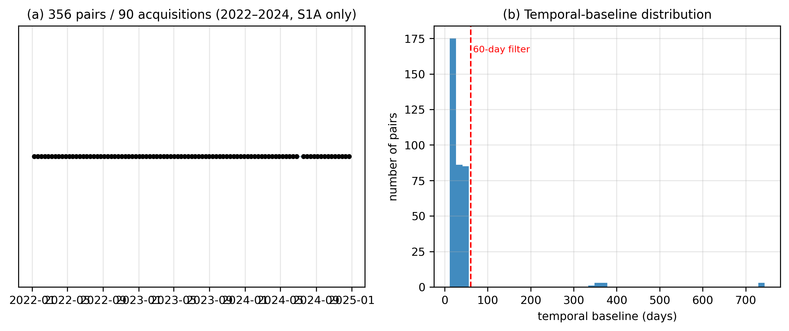

## 2. Study area and data

### 2.1 Study area

The **Rzecin peatland** (52.7632 °N, 16.3098 °E, Greater Poland; **89.7 ha** total
reserve area, Milecka et al., 2017; Juszczak et al., 2013; Lamentowicz et al., 2008;
Wojterska et al., 2001; Oświecimska-Piasko et al., 2006) is a transitional poor
fen carrying a floating *Sphagnum* mat (*Schwingmoor*) with a residual lake undergoing
terrestrialisation (Figure 1; Barabach, 2012, 2015). Three properties govern its radar response:

- **Near-surface water table**, 0–30 cm below the surface and hydrologically
  stable (Juszczak et al., 2013).
- **Dense low canopy** of *Sphagnum*, sedges and ericaceous shrubs — a
  substantial scattering volume at C-band.
- **Mobile substrate**: the mat rests on water, which is the basis for expecting
  pronounced vertical motion.

The site is therefore, a priori, the case where the geomorphological signal
should be **largest**, which makes it a demanding test rather than a favourable
one.

### 2.2 SAR data

| Property | Value |
|---|---|
| Sensor | Sentinel-1A, IW mode, SLC bursts |
| Polarisation | VV (interferometry); VV + VH (backscatter) |
| Relative orbit | 175, ascending |
| Burst | `175_374052_IW1` (AOI coverage verified) |
| Period | 2022-01-01 to 2024-12-31 |
| Revisit | 12 days (S1A-only era: S1B had failed, S1C was not yet operational; ESA, 2024) |
| Interferograms | 356 pairs over ~90 acquisitions |
| InSAR Processor | ASF HyP3 `INSAR_ISCE_BURST` (ISCE2 backend) |
| Multilooking | 10 range × 2 azimuth looks (~40 m pixel posting) |
| Phase filtering | Goldstein adaptive filter, parameter $\alpha = 0.5$ |
| Phase unwrapping | SNAPHU (Minimum Cost Flow) |
| Topographic phase | Copernicus 30 m GLO-30 DEM |
| Water masking | Disabled during unwrapping across wetland extent |
| Analysis grid | UTM, ~40 m posting; analysis crop 129 × 138 pixels |
| Incidence angle (measured) | 32.26° over zone A → LOS-to-vertical factor 1.183 |

> **Scope note.** The 2022–2024 window falls in the S1A-only era (12-day
> revisit; ESA, 2024). The return to a two-satellite constellation (S1C, S1D) restores the
> 6-day cycle (ESA, 2024) and will reduce *temporal* decorrelation for future studies. It
> does not change the wavelength, on which volumetric decorrelation depends
> (§5.4).

### 2.3 Auxiliary data

| Source | Use | Volume |
|---|---|---|
| **Sentinel-2 L2A** | NDWI/MNDWI → greenness, surface wetness, land-cover matching | 68–69 dates |
| **Sentinel-1 RTC** (Microsoft Planetary Computer) | σ⁰ VV/VH, cross-pol ratio, **RVI**, amplitude dispersion | 85 dates |
| **ERA5** | precipitation, 2 m temperature → antecedent precipitation index, freeze test | daily |
| **ESA WorldCover 10 m** | land-cover class for matching | 1 tile |
| **Copernicus DEM** (via HyP3) | slope control, elevation | static |

### 2.4 Zone stratification

Four zones are defined on the radar grid (Figure 1, Table 1):

| Zone | Definition | *n* px | Area |
|---|---|---|---|
| **A** | vegetated mat — inside the polygon, non-inundated | 499 | 79.84 ha |
| **B** | residual lake — inside, inundated fraction > 0.30 | 65 | 10.40 ha |
| **C** | **matched grassland** — outside, same WorldCover class as A, Sentinel-2 features within the [p10, p90] range of A, slope < 5° | 398 | 63.68 ha |
| **D** | other external cover (context; also the reservoir from which null realisations are drawn) | 10 750 | 1 720 ha |

**Zone C is the core of the design.** It is a control matched in land cover and
phenology, which isolates what is specific to the mat from what merely reflects
"vegetation at C-band". However, Zone C consists of 398 pixels dispersed across
disjoint grassland patches outside the peatland. Semivariogram analysis reveals
an effective spatial sample size of $N_{\text{eff}} \approx 5$ independent degrees of
freedom across these fragmented patches. While adequate for aggregate phenological
twinning and primary time-series referencing, this reduced effective sample size
substantially limits the statistical power of per-pixel spatial regression contrasts
in Zone C (§4.2.5).

**Stratification provenance and boundary sensitivity.** The documented 89.7 ha figure
represents the legal and ecological reserve boundary established by published botanical,
wetland inventory, and paleolimnological surveys (Milecka et al., 2017; Juszczak et al., 2013;
Lamentowicz et al., 2008; Wojterska et al., 2001; Oświecimska-Piasko et al., 2006). On our
~40 m radar analysis grid, the interior of this polygon discretizes to 564 pixels (90.24 ha,
a +0.6 % discretization difference). Zone A (79.84 ha, 499 pixels) is an operational
remote-sensing stratification of the non-inundated vegetated peatland, derived by subtracting
the 10.40 ha (65 pixels) residual lake (Zone B, water-mask fraction > 0.30). While sediment
cores and ground-penetrating radar transects confirm the central basin as an active floating
*Sphagnum* mat over gyttja and biogenic sediments (Barabach, 2012, 2015; Milecka et al., 2017),
continuous meter-scale physical coring along the entire perimeter does not exist in published
surveys.
To verify that our results do not depend on exact margin delineation or peripheral grounding,
we performed inward erosion sensitivity tests (removing 1–2 perimeter rings, §4.2.3 and §A.3);
coherence distributions, decorrelation rates, and seasonal amplitudes remain completely invariant.

### 2.5 Objective validation of the masks

Three independent checks, none of them visual:

1. **Area and grid discretisation.** A + B = **90.24 ha** against **89.7 ha** documented → **+0.6 %**.
   This confirms grid scaling and polygon rasterization (area is translation-invariant and cannot by itself prove geolocation; exact co-registration is independently verified by the sharp radial-profile step at signed distance zero in Figure S8 and multi-sensor boundary coincidence in Figure S7).
2. **Phenological twinning.** Median Sentinel-2 wetness is **−0.513** (A) versus
   **−0.522** (C): the matching is effective, so any coherence difference is not
   a land-cover artefact.
3. **Unambiguous water.** Zone B has σ⁰ VV = **−15.41 dB** (specular) and S2
   wetness **+0.185**, far outside the range of every other zone.

### 2.6 Multi-sensor signature of the zones

| Zone | Coherence | σ⁰ VV (dB) | RVI | S2 wetness | Temporal coherence |
|---|---|---|---|---|---|
| A (mat) | 0.408 | −10.09 | 0.914 | −0.513 | 0.604 |
| B (lake) | 0.396 | −15.41 | 0.993 | +0.185 | 0.584 |
| C (grassland) | 0.492 | −11.22 | 0.881 | −0.522 | 0.734 |
| D (other) | 0.438 | −9.28 | 1.045 | −0.440 | 0.639 |

The polygon is expressed in five independent sensors, with disjoint per-zone
distributions (Figure S7) and a sharp step at the boundary in all radial
profiles (Figure S8).
