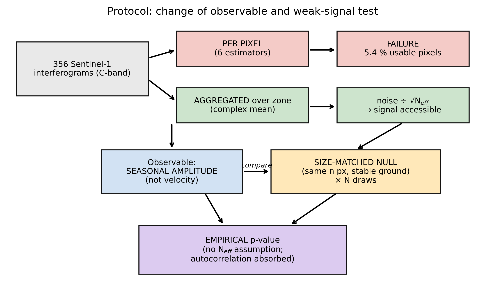
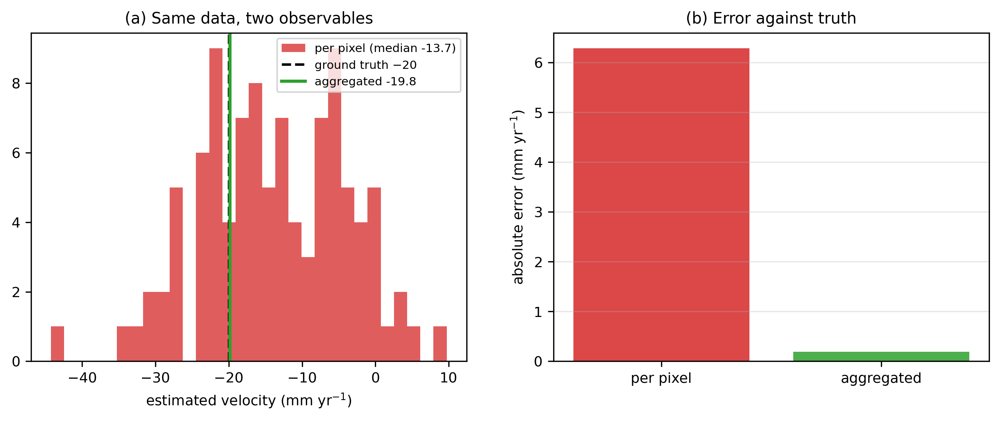

## 3. Methods

Figure 4 summarises the processing logic: the change of observable and the
weak-signal test protocol.

### 3.1 Inversion estimators compared (H1)

Six approaches resting on **mathematically distinct** assumptions:

| # | Method | Distinguishing assumption |
|---|---|---|
| 1 | SBAS (MintPy) | small-baseline network, global inversion |
| 2 | ISBAS | tolerates intermittent pixels (per-pixel sub-network) |
| 3 | Annual pairs | bypasses seasonal decorrelation by state matching |
| 4 | Hybrid network | combines short and long baselines |
| 5 | Weighted least squares | coherence weighting, pair by pair |
| 6 | **Phase linking (EVD)** | **maximum likelihood** over the full coherence matrix |

The sixth is the most powerful: it exploits **all pairs simultaneously** through
the per-pixel N × N complex coherence matrix, whose dominant eigenvector phase is
the estimated phase history. We evaluate it **directly on the delivered
interferograms**, which *are* the entries of that matrix, so no SLC archive or
coregistration step is required — a point of practical importance, since it makes
phase linking available wherever burst interferograms are, without the processing
infrastructure it normally presupposes. Quality is the **temporal coherence**,
the agreement between the estimated history and the observed interferograms.

**Noise floor.** At the redundancy of our network (356 pairs over 89 date
increments, ratio ≈ 4), a *fully decorrelated* pixel returns a temporal
coherence of ≈ **0.55**, established by simulation. Values near 0.55 must
therefore be read as noise, not as weak signal.

### 3.2 Matched-cover comparison (H2)

The central test is **paired by interferogram**: each pair is observed in A *and*
in C, which cancels perpendicular baseline and same-day atmosphere, leaving only
the surface difference.

**Statistics.** A Wilcoxon signed-rank test on the differences coh(A) − coh(C).
Because the 356 pairs are **not independent** — they share ~90 acquisition dates
— a pair-level bootstrap would understate uncertainty. We therefore report a
**date-jackknife**: each acquisition and all pairs containing it are removed in
turn, and the result is retained only if the sign is stable for every removal.

### 3.3 Spatial aggregation: the change of observable (H3)

**Quantitative motivation.** The per-pixel phase standard deviation at γ = 0.4
is ≈ 1.5 rad. Complex averaging over *N* pixels divides this by √N_eff: over the
499 mat pixels, ≈ 0.07 rad (≈ 0.3 mm), or ≈ 1 mm even at N_eff = 50 — well below
the 10–40 mm sought. **The signal is not below the noise floor; it is below the
*per-pixel* noise floor.**

**Enabling physical assumption.** The mat is a hydrological unit and breathes as
a block, so averaging does not destroy the signal (as it would for a
heterogeneous deformation field) but suppresses the random component. This
assumption is stated explicitly and is testable by subdividing the zone.

**Three observables.**

1. **|R|**, the mean resultant length, R = Σ w·exp(iφ) / Σ w with w the
   coherence. Random phases give |R| ≈ 1/√N_eff. Computed on **wrapped** phase,
   hence immune to unwrapping errors.
2. **Aggregated double difference A − C**: same pair, same ~1 km spatial scale,
   so atmosphere and orbit cancel and differential motion remains.
3. **Seasonal amplitude**: fit of *y* = c + d·t + a·cos(2πt) + b·sin(2πt), with
   amplitude √(a² + b²). **This is the correct observable**: bog breathing is
   seasonal, not a drift. A *velocity* regressed on a periodic signal does not
   return zero. For a cycle of amplitude *A* observed over *N* whole annual
   periods, the ordinary-least-squares slope is −(6/π*N*²)·*A*·cos φ, with φ the
   phase of the cycle at the start of the window: it vanishes only when the
   window opens at an extremum, and otherwise reports **window placement**
   rather than a physical rate. Trend and harmonic are therefore estimated
   **jointly** above; fitting them in sequence lets the line absorb part of the
   cycle and biases both.

### 3.4 Weak-signal test protocol

This is our central methodological contribution, and it **invalidated two
intermediate conclusions** during the study.

**Size-matched null control.** Aggregate noise falls as 1/√N. A null built on
2 200 pixels while the tested zone has 499 carries ≈ 2× less noise and therefore
**understates the floor**, manufacturing false detections. Null realisations are
consequently **compact adjacent patches of stable ground with exactly the same
pixel counts** as the zones being compared.

**Empirical *p*-value.** A single null realisation is not a test. We draw *N*
independent nulls and compute p = (1 + #{null ≥ observed}) / (1 + N).

> This *p*-value has a **floor** of 1/(1 + N): with 92 draws it cannot fall
> below 0.011. Values at the floor are reported as "*p* ≤".

**Identical treatment of the null.** Where the observed statistic results from a
selection — the best |r| over ~16 lags — the null undergoes **the same sweep**,
otherwise the comparison is biased.

### 3.5 Mechanism discrimination (H3)

- **Lake control.** The residual lake **cannot breathe mechanically**. If it
  shows the same seasonal amplitude as the mat, the signal is dielectric.
- **Mat minus lake.** Referencing A to B cancels any cycle common to saturated
  surfaces, leaving only motion specific to the mat.
- **Order of magnitude.** A freely floating mat following a ±10 cm water table
  would move ≈ 100 mm; published breathing is 10–40 mm.
- **Closure-phase bias.** Displacement, even non-rigid, closes triplets to zero;
  a monotonic dielectric drift biases them (De Zan et al., 2015; Ansari et al.,
  2021). Computed on **wrapped** phase, and distinct from the detection of 2π
  unwrapping errors.

### 3.6 Within-mat predictive model (H2, H4)

The target is temporal coherence treated as a **continuous** variable — the 0.7
threshold is an arbitrary convention that would reduce 499 pixels to a single
number — and the analysis exploits variability **inside** zone A.

- **Spearman** correlations for monotone, outlier-robust marginal ranking.
- **Standardised multiple regression** for *partial* effects.
- **Variance inflation factors are mandatory before reading any coefficient.**
  RVI = 4r/(1 + r) and VH/VV in dB = 10·log₁₀ r are two **monotone transforms of
  the same ratio**, hence almost perfectly collinear (VIF ≈ 240), producing large
  opposite-signed coefficients if left unchecked.
- **Cross-validated R²** (5 folds), never in-sample R².
- Random-forest permutation importance as a non-linear complement only, never as
  the primary argument.

### 3.7 Hydrological coupling (H4)

**The autocorrelation trap.** InSAR and hydrological series are both strongly
autocorrelated, so a naive correlation *p*-value is far too optimistic. We reuse
the **size-matched null series**, which share the same temporal structure, so the
null distribution absorbs autocorrelation by construction.

**The seasonality trap.** Two annual-cycle signals **always** correlate strongly
at *some* lag: the sweep merely aligns phases, and 54 days is 53° of annual phase
rather than a physical delay. Causal conclusions are therefore drawn **only on
deseasonalised anomalies**, with the annual harmonic removed from both series.

**Interpreting the residual lag.** A dielectric response to moisture is
near-instantaneous; mechanical settling would lag the water table by weeks.

### 3.8 Software and reproducibility

All processing uses an open Python stack (`numpy`, `xarray`, `rioxarray`,
`scipy`, `scikit-learn`) with a purpose-built package. Every scientific routine
is covered by synthetic unit tests that verify recovery of a known ground truth,
including: EVD phase linking on a sparse network; aggregation recovering a
displacement buried under per-pixel noise; the collapse of a spurious correlation
between two independent annual cycles; and the size-matched null construction.
The complete analysis code is available at [repository DOI].
