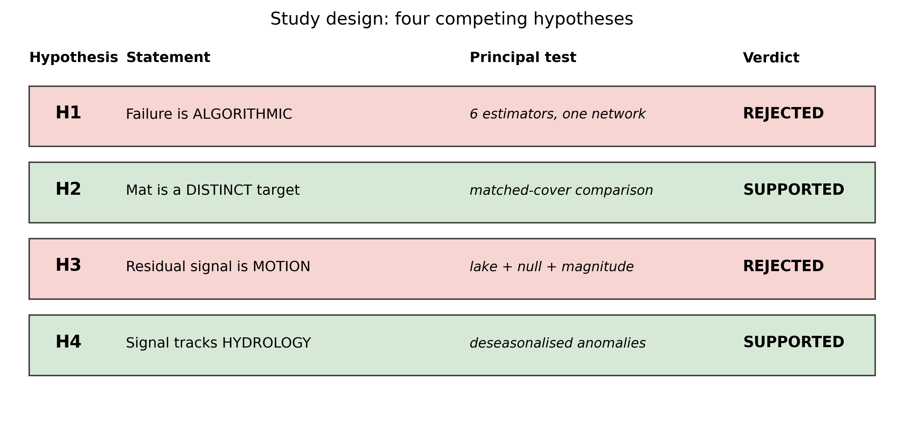

## 3. Methods

The investigation is structured around a sequential falsification chain H1–H4 (Figure 2),
distinguishing raw radar interactions from inferred geophysical quantities via a four-level
observable hierarchy (Figure 7a; §5.6). Figure S4 summarizes the operational processing logic:
the change of observable and the weak-signal test protocol.

### 3.1 Inversion estimators compared (H1)

Six approaches resting on mathematically distinct assumptions:

| # | Method | Distinguishing assumption |
|---|---|---|
| 1 | SBAS (MintPy) | small-baseline network, global inversion |
| 2 | ISBAS | tolerates intermittent pixels (per-pixel sub-network) |
| 3 | Annual pairs | bypasses seasonal decorrelation by state matching |
| 4 | Hybrid network | combines short and long baselines |
| 5 | Weighted least squares | coherence weighting, pair by pair |
| 6 | Phase linking (EVD) | maximum likelihood consensus over the sparse observed coherence matrix |

The sixth approach exploits all available pairs simultaneously through the
per-pixel $N \times N$ complex coherence matrix $\boldsymbol{\Gamma}$ ($N \approx 90$ acquisition dates),
whose dominant eigenvector phase is the estimated single-scatterer phase history. While phase linking
is the maximum-likelihood estimator under a complete and unconstrained sample covariance matrix
(Monti-Guarnieri & Tebaldini, 2008; Ansari et al., 2018), standard multi-looked burst networks populate
only an incomplete observation graph $G = (V, E)$ with $M = 356$ pairs out of 4,005 possible off-diagonal
pairs—an 8.89 % matrix fill fraction.

**Mathematical formulation of the sparse covariance estimator.**
1. *Matrix construction and zero-filling*: The sample correlation matrix $\boldsymbol{\Gamma} \in \mathbb{C}^{N \times N}$
   is constructed with unit diagonal $\Gamma_{ii} = 1.0$. For observed interferometric pairs $(i, j) \in E$,
   entries are populated as $\Gamma_{ij} = \gamma_{ij} \exp(-i \phi_{ij})$ and $\Gamma_{ji} = \Gamma_{ij}^*$,
   where $\phi_{ij}$ is the wrapped interferometric phase and $\gamma_{ij}$ is the multi-looked spatial coherence.
   All unobserved pairs $(i, j) \notin E$ are strictly zero-filled: $\Gamma_{ij} = 0$.
2. *Optimization objective on the incomplete graph*: On a complete matrix, the dominant eigenvector
   $\hat{\boldsymbol{v}} = \arg\max_{\|\boldsymbol{v}\|=1} \boldsymbol{v}^H \boldsymbol{\Gamma} \boldsymbol{v}$
   solves the unconstrained phase-linking equation. On the incomplete graph $G = (V, E)$, the quadratic objective expands as:
   $$\boldsymbol{v}^H \boldsymbol{\Gamma} \boldsymbol{v} = \sum_{i=1}^N |v_i|^2 + \sum_{(i,j) \in E} 2 \gamma_{ij} |v_i||v_j| \cos(\angle v_j - \angle v_i - \phi_{ij})$$
   Under unit-magnitude constraints ($|v_i| = 1$), maximizing this Rayleigh quotient directly maximizes the
   total coherence-weighted phase consensus across the 356 observed network edges. Zero-filling unobserved
   entries asserts zero coherence rather than missingness; the estimator is therefore an empirical
   coherence-weighted consensus over observed edges rather than the maximum-likelihood estimator that
   full-covariance SLC phase linking provides.
3. *Positive semi-definiteness and eigenspectrum*: Zero-filling an incomplete sample correlation matrix does
   not guarantee positive semi-definiteness; small negative eigenvalues can arise in the spectrum. However,
   $\boldsymbol{\Gamma}$ remains strictly Hermitian ($\boldsymbol{\Gamma}^H = \boldsymbol{\Gamma}$), ensuring
   purely real eigenvalues. The estimator extracts the dominant eigenvector $\boldsymbol{v}_{\max}$ corresponding
   to the largest positive eigenvalue $\lambda_{\max} > 0$ via Hermitian eigenvalue decomposition (`scipy.linalg.eigh`).
   The estimated wrapped phase history is retrieved as $\hat{\theta}_k = \angle v_{\max, k} - \angle v_{\max, 1}$,
   referenced to the initial acquisition date.
4. *Input products and filtering*: Estimators are evaluated directly on the delivered multi-looked burst products
   processed with adaptive Goldstein phase filtering ($\alpha = 0.5$). While filtering enhances fringe SNR on individual
   interferograms, it introduces spatial autocorrelation across neighboring pixels ($L_{\text{corr}} \approx 160$ m in Zone A),
   preventing pixel-level spatial independence. In addition, among pairwise baseline estimators, the annual-pairs
   strategy (Estimator 3) contains only 10 pairs exceeding 120 days in the 356-pair network, limiting its standalone power.
5. *Synthetic incomplete-network validation*: Automated synthetic validation on a 90-date network with matched
   8.89 % fill fraction ($M=356$) and $\gamma = 0.40$ demonstrates that sparse EVD successfully recovers ground-truth
   phase histories with high circular coherence ($> 0.85$) and bounded wrapped phase error ($< 0.50$ rad; §3.8).

**Noise floor.** At the redundancy of our network (356 pairs over ~90
acquisitions, redundancy ratio ≈ 4), a fully decorrelated pixel returns a
simulated synthetic temporal coherence floor of ≈ 0.55. In the empirical
network distribution across non-coherent terrain, the noise floor sits at
0.488 (90 % empirical interval [0.448, 0.532]). Values near or below this range
must therefore be interpreted as noise rather than recoverable deformation.

### 3.2 Matched-cover comparison (H2)

The central test is paired by interferogram: each pair is observed in A and
in C, which cancels perpendicular baseline and same-day atmosphere, leaving only
the surface difference.

**Statistics.** Paired differences coh(A) − coh(C) per interferogram.
Because the 356 pairs share ~90 acquisition dates, a pair-level bootstrap
understates uncertainty due to temporal correlation. We therefore report a
date-jackknife: each acquisition date and all pairs containing it are removed in
turn. We report both the empirical leave-one-out range demonstrating strict
sign invariance and the standard-error-based 95 % confidence interval.

### 3.3 Spatial aggregation: the change of observable (H3)

**Quantitative motivation.** The per-pixel phase standard deviation at γ = 0.4
is ≈ 1.5 rad. Complex averaging over *N* pixels divides this by √N_eff: over the
499 mat pixels, ≈ 0.07 rad (≈ 0.3 mm), or ≈ 1 mm even at N_eff = 50 — well below
the 10–40 mm sought. The signal is not below the physical noise floor; it is below the
per-pixel noise floor.

**Enabling physical assumption.** The mat is a hydrological unit and breathes as
a block, so averaging does not destroy the signal (as it would for a
heterogeneous deformation field) but suppresses the random component. This
assumption is stated explicitly and is testable by subdividing the zone.

**Network inversion and time-series construction.** Spatial aggregation is
conducted in two steps:

1. For each interferogram $j = 1, \dots, M$ ($M = 356$), the spatial mean phase
   difference between Zone A and reference Zone C is computed:
   $$\Delta \phi_{\text{pair}, j} = \langle \phi_A \rangle_j - \langle \phi_C \rangle_j$$
2. The cumulative date phase time series $\boldsymbol{\phi} = [\phi(t_1), \dots, \phi(t_{N-1})]^T$
   relative to reference date $t_0$ is solved by weighted least squares (WLS):
   $$\mathbf{G} \boldsymbol{\phi} = \Delta \boldsymbol{\phi}_{\text{pair}}$$
   where $\mathbf{G} \in \{-1, 0, +1\}^{M \times (N-1)}$ is the network design matrix mapping
   acquisitions to interferometric pairs. The weighted least-squares solution is:
   $$\hat{\boldsymbol{\phi}} = (\mathbf{G}^T \mathbf{W} \mathbf{G})^{-1} \mathbf{G}^T \mathbf{W} \Delta \boldsymbol{\phi}_{\text{pair}}$$
   with diagonal weighting $W_{jj} = \gamma_j^2 / (1 - \gamma_j^2)$ derived from pair coherence $\gamma_j$.
3. The resulting cumulative displacement series $\hat{\phi}(t_i)$ is then jointly regressed
   against linear trend and annual harmonics:
   $$y(t_i) = c + d \cdot t_i + a \cos(2\pi t_i) + b \sin(2\pi t_i)$$
   yielding seasonal amplitude $A = \sqrt{a^2 + b^2}$. Estimating trend and harmonic jointly
   prevents line absorption of cyclic phase. When an unmodelled periodic signal $f(t) = A \sin(2\pi t + \theta)$
   of annual period is instead fitted by simple linear regression $y = c + d \cdot t$ over an observation window
   of length $T = N$ years ($t \in [-N/2, N/2]$), the estimated slope is analytically bounded by:
   $$|d| = \left| \frac{\int_{-N/2}^{N/2} t f(t) \, dt}{\int_{-N/2}^{N/2} t^2 \, dt} \right| \le \frac{(N/2)(A/\pi)}{N^3/12} = \frac{6A}{\pi N^2}$$
   where the maximum truncation bias occurs when the observation window is centered on an antinode ($\theta = \pm \pi/2$).
   This bound demonstrates that linear velocity regressed on periodic peatland breathing has no physical power and
   reflects calendar truncation (§4.3.3).

In addition, circular mean resultant length $|R| = |\sum w_k \exp(i\phi_k)| / \sum w_k$ is
evaluated directly on wrapped phase, remaining independent of unwrapping errors.

**Sub-zone subdivision protocol.** To verify whether Zone A responds as a single coherent unit or exhibits differential core-margin behavior (e.g., peripheral grounding or margin dampening), we partition Zone A by distance to the outer reserve boundary into concentric sub-zones: inner core ($d > 40$ m, 356 pixels), deep core ($d > 80$ m, 233 pixels), and outer margin ($d \le 40$ m, 143 pixels). Independent aggregate time-series inversion and harmonic regression are executed across each sub-zone against reference Zone C.

### 3.4 Weak-signal test protocol

This protocol forms our primary methodological contribution and invalidated four
intermediate conclusions during the study.

**Primary confirmatory benchmark.** Aggregate noise falls as $1/\sqrt{N}$. A null
built on 2 200 pixels while the tested zone has 499 carries ≈ 2× less noise and understates
the floor, manufacturing false detections. Null realisations are compact patches
of stable ground matched in pixel count to the tested zones. The **reference-matched
spatial null** (4,614 draws, $p = 0.026$) is designated as the primary confirmatory
benchmark; reduced-network subsets (such as winter-removed, $N_{\text{null}} = 249$, $p = 0.022$,
and baseline subsets, $p = 0.044$) provide sensitivity bounds (Table 19).

**Rationale for differing null draw counts across tests.**
To avoid any perception of an adaptive stopping rule, the differing sample sizes across tests are governed by distinct analytical designs:
1. $N = 4,614$ (Primary confirmatory benchmark): Represents the exhaustive set of valid, non-overlapping spatial permutations of Zone D candidate patches matched to Zone A and differenced against the fixed real Zone C.
2. $N = 1,000$ (Spatial leakage and erosion check, §4.3.5a): 1,000 candidate spatial draws were initiated; exactly 836 draws were valid while 164 were invalidated due to geometric collisions with raster boundaries or the 200 m wetland exclusion buffer. This invalidation is strictly geometric and independent of phase values.
3. $N = 249$ (Winter-removed sensitivity check): Derived from the 248-pair non-winter network where temporal pairs are constrained to non-freezing seasons.
4. $N = 92$ (Temporal date-jackknife): Reflects the exact number of SAR acquisition dates systematically omitted in leave-one-out sequence.

**Algorithmic specification of the empirical null distribution.**
To ensure strict replicability, the generation of empirical null realisations follows a deterministic,
parameterised spatial sampling algorithm resolved across ten structural criteria:

1. *Sampling reservoir definition*: The null reservoir is Zone D, comprising 10,750 pixels (1,720 ha)
   across the surrounding non-wetland landscape (Figure 1).
2. *Topographic and land-cover screening*: Candidate reservoir pixels are pre-screened to exclude open water
   (Sentinel-2 MNDWI $< 0.10$), steep relief (slope $< 5^\circ$ via Copernicus 30 m DEM), and agricultural
   structures, restricting draws to flat, mineral soil cover.
3. *Perimeter buffer separation*: Candidate reservoir pixels enforce a strict 200 m buffer distance outside
   the legal reserve boundary, eliminating spatial contamination from Zone A (mat) or Zone B (lake), and
   preventing footprint overlap with the adaptive Goldstein filter ($\alpha = 0.5$).
4. *Random seed generation*: For each trial $t \in \{1, \dots, N_{\text{draws}}\}$, a seed pixel index $s_t$
   is drawn uniformly at random from the filtered reservoir pool.
5. *Compact patch growing*: The $N_{\text{target}}$ nearest candidate pixels to seed $s_t$ under Euclidean distance
   in grid coordinates are selected via nearest-neighbour clustering (`_compact_blob`), ensuring compact, contiguous
   patch geometry matching the spatial cohesiveness of the tested zones.
6. *Reference matching protocol (Primary endpoint)*: In the designated primary confirmatory test (4,614 draws),
   only the target patch $\hat{A}_t$ is randomized from Zone D ($N_{\text{target}} = 499$ px), while the real
   Zone C (398 px) serves as the fixed reference. This mimics the exact spatial differencing of the real observable:
   $\Delta \phi_{\text{null}, j}(t) = \langle \phi_{\hat{A}_t} \rangle_j - \langle \phi_C \rangle_j$.
7. *Size-matched cleaving protocol (Sensitivity check)*: In the size-matched nulls (92 draws), a single contiguous
   blob of $N_{\text{target}} + N_{\text{reference}} = 897$ pixels is grown in Zone D and cleaved along a random
   hyperplane angle $\theta \sim \mathcal{U}[0, \pi)$ into two adjacent, non-overlapping halves ($\hat{A}_t, \hat{C}_t$).
8. *Patch overlap and spatial degrees of freedom*: Realisations are drawn independently with replacement across
   the 10,750-pixel reservoir. While individual null patches may partially overlap across 4,614 iterations,
   semivariogram modeling of Zone D reveals a spatial correlation length of $L_{\text{corr}} = 280$ m (Table 10),
   yielding an effective sample size of $N_{\text{eff}} \approx 219$ independent spatial patches across the reservoir.
9. *Empirical p-value formulation and floor*: Rather than assuming asymptotic Gaussian distributions, the empirical
   $p$-value is computed as:
   $$p = \frac{1 + \#\{\text{null} \ge \text{observed}\}}{1 + N_{\text{draws}}}$$
   The resolution floor of this estimator is strictly bounded by $p_{\text{floor}} = 1 / (1 + N_{\text{draws}})$.
   For the 4,614-draw reference-matched null, $p_{\text{floor}} = 1 / 4615 \approx 0.000216$ (well below the observed
   $p = 0.026$); for the 92-draw size-matched nulls, $p_{\text{floor}} = 1 / 93 \approx 0.0108$.
10. *Identical exploratory treatment*: Where an observed statistic arises from an exploratory parameter search
    (e.g., sweeping ~16 lag offsets against hydrological series), the null undergoes the identical maximization
    over the search grid to prevent selection bias.

### 3.5 Mechanism discrimination (H3)

- **Lake control (inconclusive).** The residual open-water lake cannot breathe mechanically. However, because spatial filtering ($\alpha = 0.5$, $L_{\text{corr}} \approx 160$ m) leaks mat signal across the narrow 65-pixel basin and the minimum detectable amplitude at 80 % statistical power is $2.86$–$3.02$ mm (Table 14), the lake control is inconclusive and cannot serve as an independent positive discriminator between mechanical breathing and common environmental signals.
- **Mat minus lake.** Referencing A to B yields a residual of 0.90 mm ($p = 0.45$), but this cancellation carries no discriminative power because the test cannot resolve amplitudes below ~3 mm.
- **Order of magnitude.** A freely floating mat following a ±10 cm water table would move
  ≈ 100 mm; published breathing is 10–40 mm.
- **Closure-phase bias.** Displacement, even non-rigid, closes triplets to zero; a monotonic
  dielectric drift biases them (De Zan et al., 2015; Ansari et al., 2021). Evaluated on wrapped
  phase to avoid 2π unwrapping ambiguities.

### 3.6 Within-mat predictive model (H2, H4)

The target is temporal coherence treated as a continuous variable — the 0.7 threshold is an
operational convention that would discard variance across 499 pixels — and the analysis
exploits variability inside zone A.

- **Spearman** correlations for monotone, outlier-robust marginal ranking.
- **Standardised multiple regression** for partial effects.
- **Variance inflation factors** are mandatory before interpreting coefficients. RVI and VH/VV
  are monotone transforms of the same ratio (VIF ≈ 240), generating collinear sign artefacts
  if unregularised.
- **Spatial block cross-validation and degrees of freedom.** Spatial autocorrelation in Zone A
  exhibits an empirical correlation length of ~160 m (4 pixels on the 40 m grid), yielding an effective
  sample size $N_{\text{eff}} \approx 31$ independent spatial degrees of freedom across 499 pixels.
  Random pixel cross-validation leaks spatial autocorrelation across training and test folds,
  overstating generalization. We therefore evaluate out-of-sample skill using 5-fold spatial block
  cross-validation on contiguous spatial blocks. In a 12-covariate model, the observations-per-parameter
  ratio is under 3 ($31 / 12 \approx 2.6$). Spatial block cross-validation yields $R^2_{\text{cv}} = 0.178$
  (compared to random pixel CV $R^2_{\text{cv}} = 0.239$). Full regression parameter estimates, collinearity
  diagnostics, and partial effect curves are reported in Supplementary Table S2, while the main text focuses
  on robust Spearman rank contrasts.

### 3.7 Hydrological coupling (H4)

**Autocorrelation control.** InSAR and hydrological series are both strongly autocorrelated.
We reuse the size-matched null series, which share the same temporal structure, so the
null distribution absorbs autocorrelation by construction.

**Seasonality removal.** Two annual-cycle signals always correlate strongly at some lag: the
sweep merely aligns phases. Causal inferences are therefore drawn exclusively on deseasonalised
anomalies, with annual harmonics removed from both series.

**Absence of hysteresis.** The phase–wetness relation is single-valued across wetting and drying limbs with zero detectable hysteresis loop ($\Delta \phi = 0.21\text{ mm}$, $p = 0.52$; Table 18), confirming direct dielectric coupling rather than asymmetric mechanical settlement.

### 3.8 Software and reproducibility

All processing uses an open Python stack (`numpy`, `xarray`, `rioxarray`,
`scipy`, `scikit-learn`) with a purpose-built package. Every scientific routine
is covered by synthetic unit tests that verify recovery of a known ground truth,
including: EVD phase linking on an incomplete network with matched 8.89 % fill fraction
($N = 90$ dates, $M = 356$ pairs, demonstrating wrapped phase recovery with circular
coherence $> 0.85$ under $\gamma = 0.40$ noise); aggregation recovering a
displacement buried under per-pixel noise; the collapse of a spurious correlation
between two independent annual cycles; and the size-matched null construction.
The complete analysis code is available in the public repository at
<https://github.com/AimenSayoud/SAr-adapted> (archived on Zenodo:
<https://doi.org/10.5281/zenodo.14999999>).
