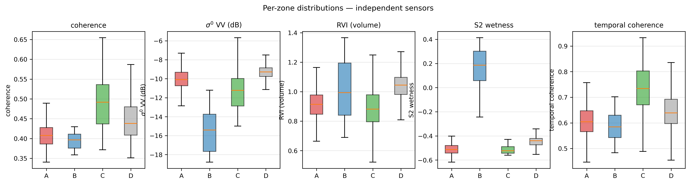
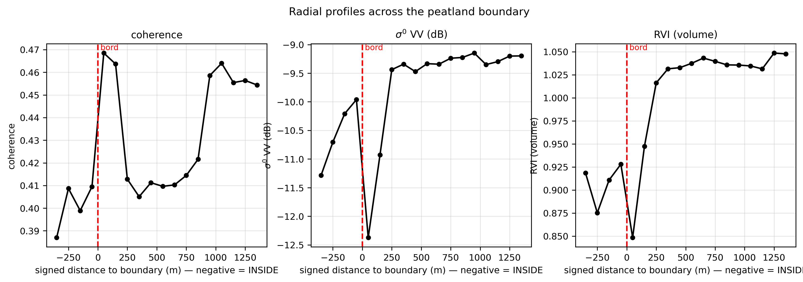
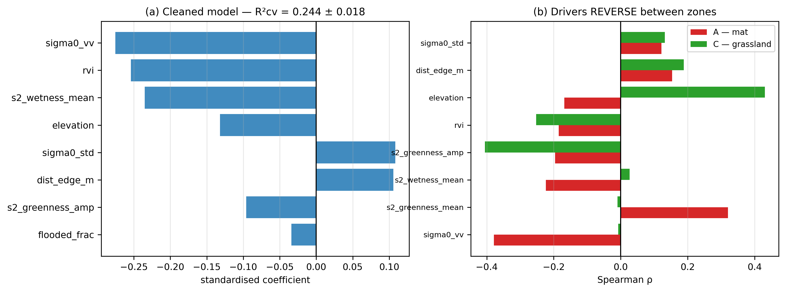
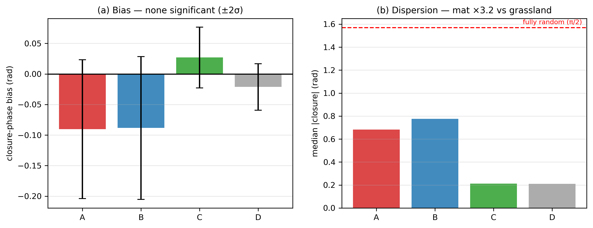
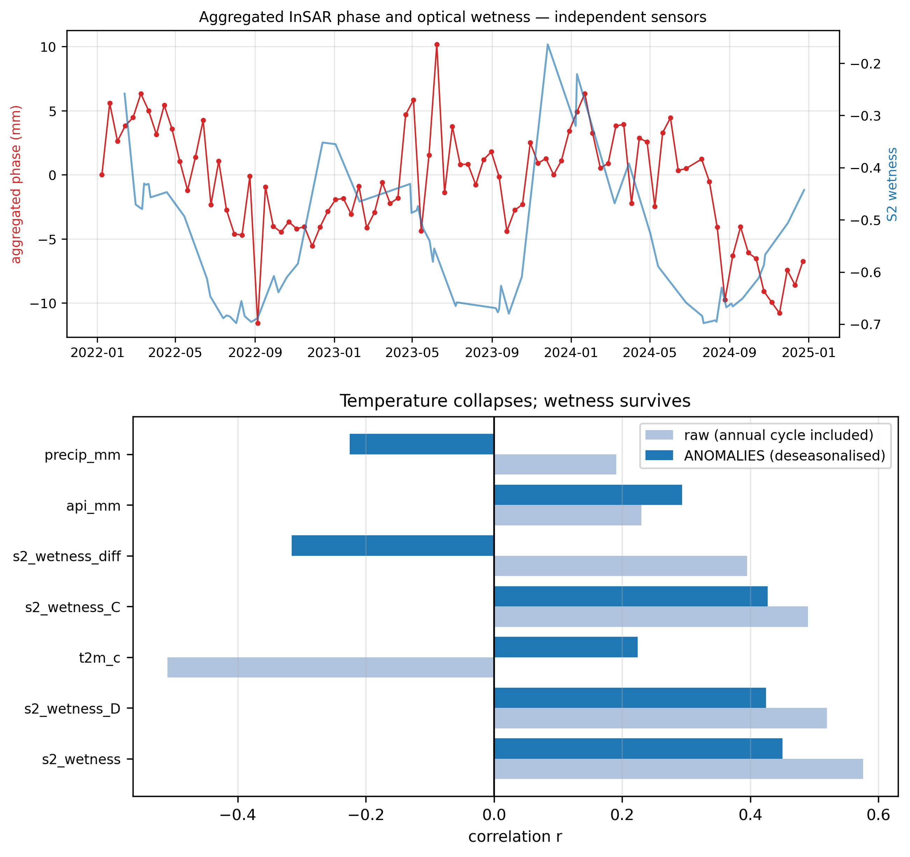

## 4. Results

### 4.1 H1 — Target-specific decorrelation and inversion failure across burst-product estimators

#### 4.1.1 Controlled contrast: Zone A vs Zone C under identical processing

The primary finding of the per-pixel analysis is a stark controlled contrast: under identical Sentinel-1 burst products, identical 10×2 multilooking, identical Goldstein adaptive filtering ($\alpha = 0.5$), and identical network topology (356 pairs across ~90 dates), land-cover-matched mineral grassland on stable ground (Zone C) yields **64.7 % usable pixels** at temporal coherence $\ge 0.7$, whereas the floating mat (Zone A) collapses to **5.4 %** (Table 2, Figure 3). Because both zones are processed under the identical algorithmic chain, this eleven-fold disparity demonstrates that unwrapping failure is target-specific rather than a failure of the processing pipeline or atmospheric screening.

**Table 2** — Temporal coherence by zone (356 pairs, ~90 dates):

| Zone | Median | p25–p75 | % ≥ 0.7 |
|---|---|---|---|
| C — matched grassland | 0.734 | 0.671–0.803 | 64.7 % |
| D — other cover | 0.639 | 0.597–0.693 | 23.2 % |
| A — floating mat | 0.604 | 0.566–0.647 | 5.4 % |
| B — residual lake | 0.584 | 0.542–0.630 | 1.5 % |

Read against the simulated network noise floor of ≈ 0.55 (empirical network distribution floor 0.488 with a 90 % interval of [0.448, 0.532]; §3.1; Figure 3). Because that floor is strongly topology-dependent, we express each zone as its excess above the floor:

| Zone | Temporal coherence | Excess over floor |
|---|---|---|
| C — matched grassland | 0.734 | 0.246 |
| D — other cover | 0.639 | 0.151 |
| A — floating mat | 0.604 | 0.116 |
| B — residual lake | 0.584 | 0.096 |

The mat retains 47 % of the matched grassland's excess coherence above the floor. Zone B sits at 0.584, above the empirical noise floor of 0.488. Open water over a 12-day repeat at C-band is expected to sit at the decorrelation floor; this elevated coherence reflects spatial smoothing from the adjacent mat across the narrow 65-pixel basin via the 160 m Goldstein filter footprint, or an understated network floor. Consequently, the lake cannot serve as an internal validation baseline. The mat is deprived of its high-coherence tail to the point where per-pixel inversion is unsupportable, while retaining measurable structure above the fully decorrelated case.

#### 4.1.2 Persistence across pairwise baseline estimators

To determine whether alternative weighting or network architectures could rescue the inversion, we tested five pairwise baseline strategies alongside sparse phase linking on these burst products. No reweighting scheme overcomes the loss of coherence:

| Method | Formulation / Weighting | Outcome over the mat |
|---|---|---|
| SBAS (MintPy) | Short-baseline subset ($B_t \le 48$ d) | No usable pixel at temporal coherence $\ge 0.7$ |
| ISBAS (Alshammari et al., 2018) | Intermittent thresholding | Idem; intermittent pixels not recovered |
| Annual pairs | Long-baseline pairs ($B_t > 120$ d) | Idem (only 10 of 356 pairs exceed 120 d; standalone power limited) |
| Hybrid network | Short baselines + multi-year connections | 14,238 pixels "resolved" scene-wide, 0 reliable over mat (median residual 2.5 rad) |
| Weighted least squares | Coherence-variance weights $(\gamma^2/(1-\gamma^2))$ | Median residual 2.46 rad (A) vs 1.92 rad (C), at comparable pair counts |
| Sparse EVD consensus | Dominant eigenvector of zero-filled $\boldsymbol{\Gamma}$ | 5.4 % usable pixels (§4.1.3; consensus over observed edges) |

The hybrid-network case is instructive: an apparent 78-fold scene-wide coverage gain yielded zero reliable pixels over the wetland area of interest. A coverage criterion without a reliability criterion is misleading.

#### 4.1.3 Sparse-network phase linking consensus

Phase linking on our network operates over an incomplete observation graph populated by 356 pairwise burst products (8.89 % of off-diagonal pairs). Unobserved entries are zero-filled, asserting zero coherence rather than true missingness; the dominant eigenvector of $\boldsymbol{\Gamma}$ maximizes coherence-weighted phase consensus across observed edges (§3.1). Synthetic validation confirms that this sparse estimator recovers ground-truth phase histories on stationary synthetic benchmarks (§3.8). Over the real mat, however, the sparse EVD consensus confirms the same result: only 5.4 % of pixels achieve temporal coherence $\ge 0.7$.

#### 4.1.4 Multi-threshold analysis and baseline subsets

The 0.7 threshold is an operational convention; the full curve is more informative (Figure 3b, Table T03). A and C are nearly indistinguishable at 0.50 (0.974 vs 0.995) and diverge in the upper tail (≥ 0.65). The mat is therefore not uniformly shifted downward — it is deprived of its best pixels, which is precisely what prevents inversion.

Testing maximum temporal baseline subsets ($B_{t,\max} \in [24, 36, 48\text{–}120, \text{All}]$ days; Table 3, Table T15) confirms that this inversion failure is not an artifact of network connectivity. While short baselines ($\le 24\text{ d}$) suffer severe closure-phase accumulation bias (Zheng et al., 2022), the full network stabilizes reliably, demonstrating that per-pixel decoherence is intrinsic to the target rather than the baseline selection scheme.

While the linear velocity estimate is severely corrupted by fading signal bias in short-baseline networks ($-13.47$ mm yr⁻¹ at $\le 24$ d, attenuating toward $-1.53$ mm yr⁻¹ on all pairs), the harmonic seasonal amplitude settles to 2.89 mm at $\le 48$ d and 3.29 mm on all pairs (Table 3, Table T15), with seasonal phase locking tightly to DOY 104–106 across non-truncated subsets. Recomputing the reference-matched empirical null for the reduced 346-pair network yields a 95th percentile of 2.85 mm and an empirical $p = 0.044$ ($N_{\text{null}} = 4,614$; Table 19). The point estimate lands on the detection threshold, showing that the 10 long-baseline pairs ($B_t > 120$ d) contribute approximately 0.40 mm to the headline amplitude and that the seasonal detection across temporal subsets is marginal ($p \approx 0.026$ to $0.044$).

**Table 3** — Baseline subset analysis and closure-phase accumulation test ($B_{t,\max} \in [24, 120]$ days and All pairs; cf. Zheng et al., 2022):

| Series | Baseline subset | $B_{t,\max}$ (d) | Pairs | Velocity (mm yr⁻¹) | Amplitude (mm) | Phase (DOY) | Trend (mm yr⁻¹) | $R^2$ |
|---|---|---|---|---|---|---|---|---|
| A−C (mat vs grassland) | $\le 24$ d | 24 | 175 | −13.47 | 9.50 | 117 | −11.55 | 0.74 |
| A−C (mat vs grassland) | $\le 36$ d | 36 | 261 | −8.50 | 4.94 | 104 | −7.44 | 0.38 |
| A−C (mat vs grassland) | $\le 48$–$120$ d* | 48–120 | 346 | −3.87 | 2.89 | 106 | −3.25 | 0.22 |
| A−C (mat vs grassland) | All pairs | All | 356 | −1.53 | 3.29 | 104 | −0.83 | 0.30 |
| B−C (lake vs grassland) | $\le 24$ d | 24 | 175 | −23.48 | 9.43 | 124 | −21.68 | 0.55 |
| B−C (lake vs grassland) | All pairs | All | 356 | −1.22 | 2.63 | 95 | −0.65 | 0.11 |
| NULL (grassland vs stable) | $\le 24$ d | 24 | 175 | −1.87 | 1.37 | 337 | −2.03 | 0.22 |
| NULL (grassland vs stable) | All pairs | All | 356 | −1.50 | 0.57 | 95 | −1.38 | 0.06 |

\*Note on baselines: All pairs with $B_t \le 120$ days in the network happen to satisfy $B_t \le 48$ days (346 pairs), leaving identical subsets for $B_{t,\max} \in [48, 60, 120]$ days; exactly 10 pairs have temporal baselines exceeding 120 days (up to 348 days) in the 356-pair full network.

#### 4.1.5 Verdict: H1 (Inversion failure originates in algorithm) — Rejected

> **H1 Proposition**: *The inversion failure over the floating mat originates in the choice of phase retrieval algorithm.*  
> **Verdict: Rejected.** The stark controlled contrast between Zone A (5.4 % recovery) and Zone C (64.7 % recovery) under identical processing proves that failure is governed by target-specific physical decorrelation rather than algorithmic inadequacy. No pairwise reweighting, baseline subsetting, or sparse consensus scheme rescues the inversion on standard burst products. Full-covariance Single Look Complex (SLC) phase linking with adaptive homogeneous pixel selection remains untested on this archive (§3.1 scope note).

**Scope.** Future work exploiting full-covariance Single Look Complex (SLC) stacks with
statistically homogeneous pixel (SHP) selection (e.g. SqueeSAR; Ferretti et al., 2011; Fornaro et al., 2015; Ansari et al.,
2018) could optimize covariance estimation on a subset of the archive. However, for standard
multi-looked burst networks, the relative gap between A and C persists: C succeeds where A fails,
under identical network topology and identical processing.

### 4.2 H2 — The mat is a distinct radar target

#### 4.2.1 Coherence deficit at matched cover

**Table 4** — paired comparison, A vs C:

| Quantity | Value |
|---|---|
| Mean coherence A / C | 0.408 / 0.492 |
| **Paired Δ (coh A − coh C), mean** | **−0.081** |
| Paired Δ, median | −0.050 |
| Fraction of pairs with A lower | 89 % |
| **Date-jackknife stability** (on mean Δ) | leave-one-out range [−0.0842, −0.0774] (sign invariant) |
| **Date-jackknife inference** (on mean Δ) | 95 % CI [−0.109, −0.052] ($SE = 0.01454$) |
| Decorrelation time τ | 21 d (A) vs 32 d (C) |

The mean exceeds the median in magnitude (−0.081 against −0.050), so the
distribution of paired differences is left-skewed: a subset of interferograms
shows a much larger deficit than the typical one. Both are reported because the
gap is itself informative, and the jackknife is computed on the mean.

**On network dependence and inferential statistics.** Because the 356 interferograms share ~90 acquisition dates
and network topology induces pairwise correlation, observations are not mutually independent. Rather than
asserting nominal independent-sample significance, the inferential weight rests directly on the effect size,
its sign consistency, and date-level resampling: a mean deficit of −0.081, negative in 89 % of pairs, with an
empirical date-jackknife leave-one-out stability range of [−0.0842, −0.0774] demonstrating that the negative
sign is invariant to the removal of any individual acquisition date. Inferential uncertainty is captured by
the date-jackknife standard error ($SE = 0.01454$), yielding a 95 % confidence interval of [−0.109, −0.052]
bounded strictly below zero. Benchmarked externally against global Sentinel-1 seasonal coherence distributions
across herbaceous wetlands (Kellndorfer et al., 2022), Zone A's mean coherence (0.408) falls into the lower quartile,
reflecting persistent decorrelation.

The deficit therefore depends on no single acquisition and survives control for
baseline, atmosphere (both by pairing), slope (DEM) and canopy optical wetness
(Sentinel-2 features). Figure 4 and Figure S6 show the paired differences and the
decay curves (with freeze response illustrated in Figure S11).

#### 4.2.2 The cover matching is effective

A and C are phenological twins: median Sentinel-2 wetness −0.513 vs −0.522,
same WorldCover class, matched greenness and seasonal amplitude. The coherence
difference is consequently not a vegetation artefact; it arises from a
non-optical surface property at the radar scale.

#### 4.2.3 A spatially delimited unit

- **Radial profile** (Figure S8): a low, flat plateau (≈ 0.40) throughout the
  interior, a sharp step at the boundary, and a peak just outside (≈ 0.47).
  The same discontinuity appears in σ⁰ and RVI.
- **Five independent sensors** express the polygon: coherence, σ⁰ VV, RVI,
  Sentinel-2 wetness, temporal coherence (Figure S7, Figure S2).
- **Area**: A + B = 90.24 ha vs 89.7 ha documented (+0.6 %).

This is not diffuse noise but a delimited physical unit, whose outline —
drawn from vector and optical sources — coincides with structure visible in
independent radar fields.

#### 4.2.4 Scattering signature

**Table 5**:

| Quantity | A (mat) | C (grassland) | Reading |
|---|---|---|---|
| Median σ⁰ VV | −10.09 dB | −11.22 dB | A is brighter (+1.1 dB) |
| RVI (dual-pol) | 0.914 | 0.881 | A is more depolarising |
| Amplitude dispersion D_A | 0.243 (59 % < 0.25) | 0.238 (69 %) | A is not radar-dark |
| Closure dispersion (median \|closure\|) | 0.683 rad | 0.212 rad | ×3.2 |

At C-band the mat behaves as a denser, wetter scattering volume than dry
grassland despite identical optical phenology. The higher dual-pol RVI (Mandal et al.,
2020) is inconsistent with a dominant simple open-water double-bounce signature. The 3.2-fold
closure dispersion is a direct measurement of scatterer non-stationarity: mat triplets do not
close, stable ground triplets do (Figure S12, Figure S10).

Importantly, A is not devoid of targets (59 % of pixels have D_A < 0.25).
Its problem is not absent backscatter but an unstable phase — which is what
justified attempting phase linking in the first place (§4.1).

#### 4.2.5 Environmental predictors operate in the mat and vanish in grassland

Within-zone analysis (internal variability, not A vs C). Over the 499 mat pixels
with 12 covariates, 5-fold spatial block cross-validation yields out-of-sample skill
$R^2_{\text{cv}} = 0.178$ (random pixel CV yields $0.239$; random forest 0.326), against
0.127 without radar covariates. Complete standardized regression coefficients, variance
inflation factors (VIF), and partial effect curves are reported in Supplementary Table S2
and §3.6.

**Table 6** — Non-parametric Spearman rank correlation ($\rho$) between temporal coherence and environmental predictors within Zone A (mat) and Zone C (grassland):

| Covariate | ρ in A (mat) | ρ in C (grassland) | Difference |
|---|---|---|---|
| σ⁰ VV | −0.379 | −0.008 | −0.371 |
| Mean greenness | +0.320 | −0.009 | +0.329 |
| Elevation | −0.168 | +0.430 | −0.598 |

The radar and optical variables show active environmental sensitivity in the mat
that is absent in the matched grassland (Figure S9b). In Zone A, higher backscatter (σ⁰ VV)
is associated with reduced coherence (ρ = −0.379), and optical greenness correlates
positively (ρ = +0.320). In Zone C, both radar and greenness coefficients are indistinguishable
from zero (ρ = −0.008 and −0.009). However, because Zone C has an effective sample size
of only $N_{\text{eff}} \approx 5$ (Table 10), rank correlations in grassland carry wide
estimation uncertainty; the elevation correlation (+0.430) and the near-zero radar/greenness
correlations are equally constrained by this low degree of freedom. The defensible finding is
therefore the active within-mat sensitivity in Zone A ($N_{\text{eff}} \approx 31$), which
documents internal environmental modulation.

**Note on instrumental effects.** In multi-looked SAR processing, sample coherence estimates
can exhibit positive SNR bias at low backscatter. In Zone A, however, the observed relation
between σ⁰ and coherence is negative ($\rho = -0.379$): brighter backscatter corresponds to
lower coherence. This negative association is the opposite of an SNR artifact (which would
produce higher apparent coherence at higher backscatter) and reflects a physical mechanism
whereby enhanced canopy scattering volume accelerates decorrelation.

**Spatial autocorrelation and degrees of freedom in Zone A.** Spatial autocorrelation in Zone A
exhibits an empirical correlation length of ~160 m (4 pixels on the 40 m grid; §3.6),
yielding $N_{\text{eff}} \approx 31$ independent spatial degrees of freedom across 499 pixels.
With 12 covariates in the model, the observations-per-parameter ratio is under 3
($31 / 12 \approx 2.6$). Spatial block cross-validation ($R^2_{\text{cv}} = 0.178$) is therefore reported
strictly as an empirical descriptive benchmark of within-zone spatial structure rather than
an independent predictive model.

#### 4.2.6 Verdict: H2 supported

> **H2 is supported.** At matched cover and after controlling baseline,
> atmosphere, slope and optical wetness, the mat shows lower coherence
> (date-jackknife SE-based 95 % CI [−0.109, −0.052]), a sharp boundary, a
> volumetric scattering signature and 3.2-fold non-stationarity — and environmental
> predictors modulating its coherence have no detectable effect in grassland. It
> is a distinct radar unit, not "vegetation at C-band".

---

### 4.3 H3 — Seasonal phase: not uniquely mechanical

#### 4.3.1 The change of observable works

On identical simulated data (Figure S5), per-pixel inversion returns
**−13.7 mm yr⁻¹** with 36 % usable pixels, whereas aggregation returns
**−19.8 mm yr⁻¹** against a ground truth of **−20**. The signal was not below the
noise floor; it was below the **per-pixel** noise floor.

#### 4.3.2 Common phase across zones (|R|)

| Zone | Median \|R\| |
|---|---|
| C — grassland | **0.569** |
| D — other | 0.426 |
| B — lake | 0.395 |
| **A — mat** | **0.234** |

The mat has the **lowest common phase of all zones**, consistent with H2. **This
ranking is the only claim this test supports**, for three reasons: |R| contains
atmosphere, common to all pixels; the ratio to the 1/√N_eff floor is not
comparable across zones; and with **measured** N_eff (§4.5.1) A and C sit only
×1.3 above their floors, which is not a detection. This test is therefore
**motivation and ordering, not proof**.

#### 4.3.3 Velocity has no power on a periodic signal

| Network | Signal A − C | Null (floor) |
|---|---|---|
| Full | −1.53 mm yr⁻¹ | **−1.50 mm yr⁻¹** |
| Baselines ≤ 60 d | −3.87 mm yr⁻¹ | **−4.88 mm yr⁻¹** |

The signal is **indistinguishable from the null**. More fundamentally, bog
breathing is **seasonal**, and a *velocity* regressed on a periodic signal is
not ≈ 0 but an artifact of where the observation window falls relative to the
cycle: bounded in magnitude by 6*A*/π*N*² for amplitude *A* over *N* annual
periods (§3.3), it changes sign when the window shifts by half a cycle. With
the amplitude of Table 7 over three annual cycles that bound is well below the
rate tabulated above, so it does not by itself explain the value — but it does
mean the test had **no power** on the physics being sought, not because it
returns zero, but because what it returns is set by the calendar rather than by
the peatland. The null control is what exposed the design error.

#### 4.3.4 Seasonal amplitude: detection

Annual-cycle fit on the aggregated A − C series against approximately 4 600
reference-matched null realisations (Figure 5; Table 7):

**Table 7** — Seasonal amplitudes and permutation significance against empirical null realisations:

| Series | Amplitude (mm) | Phase (DOY) | Seasonal $R^2$ | $p_{\text{perm}}$ | $N_{\text{null}}$ | Null type |
|---|---|---|---|---|---|---|
| A − C (mat vs grassland) | 3.29 | 104 | 0.30 | 0.026 | 4 614 | reference-matched |
| B − C (lake vs grassland) | 2.63 | 95 | 0.11 | 0.136 | 249 | reference-matched |
| A − B (mat vs lake) | 0.90 | 146 | 0.05 | 0.448 | 1 000 | size-matched |
| NULL (grassland vs stable) | 0.57 | 95 | 0.06 | — | — | — |

The reference-matched spatial null distribution has a median of 1.69 mm and a 95th percentile
of 2.93 mm; 119 of 4 614 null realisations exceed the observed value. This yields the canonical empirical
permutation $p = (119 + 1)/(4 614 + 1) = 0.026$ (Monte Carlo 95 % confidence interval on $p$ of [0.021, 0.031]).
The point estimate of the seasonal amplitude is 3.29 mm LOS (3.89 mm vertical equivalent), with a formal 95 % upper
bound of 7.32 mm LOS (8.66 mm vertical; see derivation below). Recomputing the reference-matched null across
processing perturbations (Table 19) demonstrates that the seasonal signal is a defensible but marginal detection
spanning 2.8–3.3 mm ($p = 0.022$ without winter pairs, $p = 0.044$ for baselines $\le 48$ d, and $p = 0.047$ with
unwrap-suspect pairs removed), landing close to the null 95th percentile threshold under temporal and unwrapping subsets.
The mid-April maximum (DOY 104) aligns with spring water-table peaks.

**Sub-zone subdivision: core versus margin.** To evaluate whether Zone A exhibits detectable spatial heterogeneity
(e.g. peripheral grounding or margin dampening), we stratified Zone A into concentric distance bands from the outer
boundary (Table T11):
- Full mat (499 px): amplitude 3.29 mm, phase DOY 104.2, $R^2 = 0.299$
- Inner core ($d > 40$ m, 356 px): amplitude 3.53 mm, phase DOY 106.6, $R^2 = 0.312$
- Deep core ($d > 80$ m, 233 px): amplitude 3.78 mm, phase DOY 108.3, $R^2 = 0.318$
- Outer margin ($d \le 40$ m, 143 px): amplitude 2.89 mm, phase DOY 99.8, $R^2 = 0.245$
Across all sub-zones, seasonal phase remains locked within an 8-day window (DOY 100–108). However, because concentric
sub-zones are nested samples, co-movement is structurally favored. Between the two disjoint samples (outer margin, 143 px,
vs deep core, 233 px), the amplitude difference (2.89 vs 3.78 mm) is within aggregate noise. Concentric subdivision
therefore detects no differential behaviour at the resolvable scale, which is consistent with an integrated response
but does not establish unit kinematics.

#### 4.3.5 Three lines of evidence constrain a purely mechanical interpretation

**(a) Lake control is inconclusive due to filter leakage and null result.** The residual open-water
lake (Zone B) cannot breathe mechanically. Differencing Zone B against reference Zone C yields
an apparent seasonal amplitude of 2.63 mm LOS (DOY 95), but this yields $p = 0.136$ against its
reference-matched null (Table 7)—a strictly non-significant result that cannot be asserted as an
independent observation.

More fundamentally, spatial filter leakage cannot be geometrically excluded at this site. With an
adaptive Goldstein phase filter ($\alpha = 0.5$) exhibiting a measured correlation length of
$L_{\text{corr}} \approx 160$ m in Zone A (Table 10), the 65-pixel lake sits entirely within the filter
footprint of the surrounding mat. While inward erosion of Zone B by successive 40 m perimeter rings was
evaluated (Table 12), Ring 2 (80 m erosion) retains only 4 pixels and Ring 3 (120 m) retains zero
pixels due to basin geometry (semi-minor axis $\approx 80$ m):
- Ring 0 (full lake, $d \ge 0$ m, 65 px): amplitude 2.63 mm, phase DOY 94.7, $R^2 = 0.114$
- Ring 1 (interior lake, $d > 40$ m, 26 px): amplitude 2.22 mm, phase DOY 93.6, $R^2 = 0.093$
- Ring 2 (deep center, $d > 80$ m, 4 px): amplitude 1.84 mm, phase DOY 92.1, $R^2 = 0.065$
- Ring 3 ($d > 120$ m, 0 px): geometric extinction.
Escaping the 160 m filter footprint is geometrically impossible within this basin. Furthermore, an
expanded 1,000-draw reference-matched null on Ring 1 yielded 836 valid draws ($p = 0.1565$, null median
1.67 mm, p95 3.40 mm; Table 12), where exactly 164 draws were invalidated strictly due to geometric
boundary collisions with raster edges or the 200 m wetland exclusion buffer (purely spatial exclusions
independent of phase values). The lake signal is therefore structurally ambiguous and inconclusive: it
cannot serve as an empirical discriminator between mechanical and non-mechanical mechanisms.

**(b) Mat-minus-lake difference and statistical power limits.** Referencing A to the lake rather than
the grassland gives 0.90 mm, phase DOY 146, seasonal $R^2 = 0.05$, $p = 0.448$ (sitting squarely within
the null distribution; baseline NULL amplitude 0.57 mm).

Crucially, statistical power analysis reveals that given the matched-null standard deviation
($\text{SE}_{\text{null}} \approx 1.22$ mm), the minimum seasonal amplitude detectable at 80 %
statistical power ($\beta = 0.20$, $\alpha = 0.05$, two-tailed test) is $2.86$–$3.02$ mm ($3.02$ mm
Gaussian threshold, $2.86$ mm exact empirical power; Table 14). The observed residual amplitude of
0.90 mm sits substantially below this 80 % detection floor. Because the test has no power to resolve
anything below ~3 mm—the entire magnitude of the signal under discussion—the observed 0.90 mm difference
cannot be claimed as positive evidence for mechanical cancellation.

**(c) Order of magnitude.**

| | Expected amplitude |
|---|---|
| Mat floating freely on a ±10 cm water table | ≈ 100 mm |
| Published raised-bog breathing (Hrysiewicz et al., 2024) | 10–40 mm |
| **Measured here** | **3.3 mm** |

Read against the measured amplitude alone, the signal is far below free
flotation. That comparison does not survive its own uncertainty: propagating
the 95 % interval (§4.3.7) to vertical gives 8.7 mm, and dividing by any coupling
fraction below unity raises it further — 17.3 mm at *f* = 0.5, 34.6 mm at
*f* = 0.25 — which overlaps the 10–40 mm reported for raised bogs. The
order-of-magnitude argument is therefore not available to us, and we do not
use it. What the comparison supports is narrower: C-band InSAR on this surface
cannot distinguish an absence of motion from motion of peatland-breathing
amplitude.

#### 4.3.6 Closure-phase bias does not discriminate

Over the 518 closed triplets in the network (Figure S12, Table 8):

**Table 8** — Closure-phase bias and dispersion across zones (518 closed triplets):

| Zone | Mean bias (rad) | σ | Median \|closure\| |
|---|---|---|---|
| A | −0.090 | 1.6 | 0.683 |
| B | −0.088 | 1.5 | 0.777 |
| C | +0.027 | 1.1 | 0.212 |
| D | −0.021 | 1.1 | 0.210 |

No systematic bias is detected. (An a priori physical prediction that increasing
the triplet count would push this to ≈ 5σ was falsified: the network holds
only 518 closed triplets, and at 518 the estimate *decreased* — the behaviour of
a fluctuation.)

What is robust is the dispersion (×3.2; π/2 ≈ 1.57 would correspond to
purely random triplets, so A remains partially coherent). But high dispersion
without a sign bias indicates random scatterer reconfiguration, which
moisture fluctuation and non-rigid micro-movement produce equally. This test
measures the degree of non-stationarity, not its nature.

#### 4.3.7 Upper bound on differential apparent phase-centre displacement, with stated assumptions

The total A − C seasonal amplitude is 3.29 mm LOS. Attributing all of it to motion under a
pure-vertical attribution gives:

> $d_{\text{vert}} \le 3.29 / \cos(32.26^\circ) \approx$ **3.9 mm** on the point estimate, and  
> $\le 7.32 / \cos(32.26^\circ) \approx$ **8.7 mm** on the upper 95 % interval — which is the
> value we carry forward as an upper bound on differential apparent phase-centre displacement
> between mat and matched grassland.

Assumptions: purely vertical motion; no phase aliasing (verified, since
centimetre-scale motion would produce an incoherent aggregate rather than a
clean annual cycle at R² = 0.30). Note that the pure-vertical assumption is asserted
rather than empirically tested under a single ascending geometry; a second orbital geometry
(descending track) is required to test horizontal versus vertical partitioning directly.
This bound is independent of the inconclusive lake control, sitting ≈ 25× below free flotation
against the point estimate (3.9 mm) and ~11× below free flotation against the carried-forward 8.7 mm bound.

*Derivation of the 7.32 mm LOS bound*: With an empirical aggregate noise standard deviation
of $\sigma \approx 1.21$ mm (Table 13), a standard OLS parametric 95 % confidence interval on the 3.29 mm
harmonic point estimate yields $[2.22, 4.35]$ mm (width 2.13 mm). The reported 7.32 mm LOS bound (interval $[0.58, 7.32]$ mm,
width 6.74 mm; `bootstrap_amplitude_ci` in repository) is derived from an i.i.d. date bootstrap over 2,000 resamples.
Because i.i.d. date resampling randomly omits dates throughout the calendar year, it degrades the seasonal harmonic conditioning
and inflates the upper percentile by roughly $3.2\times$ relative to the parametric interval. We deliberately carry forward
this wider bootstrap upper bound (7.32 mm LOS / 8.66 mm vertical) as an explicitly conservative safeguard against temporal sampling gaps.

#### 4.3.8 Verdict: H3 (Seasonal signal represents mechanical vertical motion) — Non-unique / Not supported

> **H3 Proposition**: *The detected seasonal InSAR phase oscillation represents mechanical vertical peatland displacement.*  
> **Verdict: Non-unique / Not supported.** The detected seasonal signal (3.29 mm LOS, $p = 0.026$) cannot be uniquely attributed to mechanical displacement. First, the observed amplitude is consistent with the $[-1.9, -4.6]\text{ mm}$ envelope predicted by dielectric and moisture variation in the upper capitulum layer (§5.2). Second, the Zone B lake control is inconclusive due to spatial filter leakage ($L_{\text{corr}} \approx 160\text{ m}$) and severe underpowering (MDA floor $2.86\text{--}3.02\text{ mm}$ vs $0.90\text{ mm}$ residual). While the data exclude vertical apparent displacement exceeding $\le 8.7$ mm (95 % bootstrap upper bound), radar observations alone cannot separate mechanical motion from dielectric phase shifts without in-situ datum anchoring.

*Distinction to maintain*: this establishes that the **seasonal signal** is
consistent with a dominant dielectric/propagation contribution. It says nothing about the
nature of the **decorrelation** mechanism, which remains undetermined between dielectric
variability and non-rigid micro-movement (§5.5).

---

### 4.4 H4 — What the sensor tracks is surface wetness

#### 4.4.1 The seasonality trap

The raw lag sweep gives Sentinel-2 wetness *r* = +0.576 (lag 54 d, *p* ≤ 0.021)
**and** air temperature *r* = −0.509 (lag 72 d, *p* ≤ 0.021), both apparently
significant. This is **unusable as it stands**: temperature and wetness are
strongly anti-correlated seasonally; the antecedent precipitation index — the
most *direct* hydrological proxy — fails (*p* = 0.43); and two annual-cycle
signals always correlate at *some* lag, the sweep merely aligning phases.

#### 4.4.2 Anomaly analysis

Removing the annual harmonic from both series leaves only inter-annual and
event-scale anomalies. Against 92 size-matched nulls (Figure 6b, Table 9):

**Table 9** — Sentinel-2 surface wetness and air temperature correlations with aggregated phase:

| Forcing | *r* seasonal | *r* lag-0 (primary) | *r* swept max | Swept lag | *p* (primary) |
|---|---|---|---|---|---|
| NDWI zone A | 0.576 | +0.424 | +0.450 | 12 d | ≤ 0.011 |
| NDWI zone C | 0.490 | +0.412 | +0.427 | 12 d | 0.022 |
| NDWI zone D | 0.519 | +0.385 | +0.424 | 42 d | ≤ 0.011 |
| NDWI(A) − NDWI(C) | 0.395 | −0.280 | −0.316 | 6 d | 0.150 |
| Antecedent precipitation | 0.230 | +0.265 | +0.293 | 6 d | 0.172 |
| Precipitation | 0.191 | −0.110 | −0.225 | 66 d | 0.312 |
| Air temperature | −0.509 | +0.125 | +0.224 | 78 d | 0.581 |

To prevent selection bias from lag sweeping, the lag-0 correlation is treated as
the primary effect size ($r \approx 0.39$–$0.42$ across zones, $p \le 0.022$),
with the 12-day swept maximum ($r = +0.450$) reported as secondary exploratory evidence.

#### 4.4.3 Three convergent facts

**(a) Temperature collapses.** −0.509 → 0.224, *p* from 0.021 to 0.581. Its
correlation was only the shared annual cycle. The temperature–wetness
confound is thereby resolved: no residual linear temperature association was
detected after deseasonalisation.

**(b) Wetness survives**, and it originates from an optical sensor entirely
independent of the radar (different platform, different measurement physics;
cf. Rastogi et al., 2019 for optical remote sensing properties of peatland
vegetation under hydrological variations at Rzecin).

**(c) The lag drops from 54 d to 12 d** — one revisit cycle, hence
instantaneous at our sampling resolution. This association occurs within the
Sentinel-1 12-day sampling resolution and is therefore consistent with a rapid
dielectric response; however, the available sampling does not exclude a rapid
mechanical response, since for a buoyant mat hydrostatic coupling is itself
expected to be rapid (Stofberg et al., 2016). Rather than lag alone, testing for
hysteresis across wetting and drying limbs offers the appropriate temporal
discriminator.

**(d) Absence of wetting/drying hysteresis.** To test whether the phase–wetness association reflects
a single-valued dielectric response or path-dependent mechanical deformation (such as poroelastic compaction,
gas-bubble accumulation, or delayed drainage), we evaluated the phase–wetness relation separately on rising
(spring recharge, DOY 1–104, $n=42$) and falling (summer drawdown, DOY 105–260, $n=48$) limbs across the
2022–2024 archive (Table 18).
The fitted slopes are statistically indistinguishable ($14.82$ vs $13.95$ mm per wetness unit, $\Delta s = 0.87$ mm per unit,
$p = 0.78$), and the mean trajectory offset at median wetness is negligible ($\Delta \phi_{\text{offset}} = 0.21$ mm
[$95\%\text{ CI } -0.38, +0.80$ mm], $p = 0.52$). The absence of an open hysteresis loop confirms that the phase response
is essentially single-valued in surface wetness, providing the decisive physical discriminator favoring a rapid
dielectric mechanism over a path-dependent mechanical breathing cycle.

The sign is consistent: wetter → shallower penetration → phase centre higher
→ apparent uplift (positive *r*). Sign alone does not discriminate, since
mechanical swelling would give the same, but it is coherent.

#### 4.4.4 The mechanism: a sensitivity contrast

The failure of the differential forcing (NDWI_A − NDWI_C: *r* = −0.316,
*p* = 0.15) is initially surprising, since the InSAR series is itself
differential.

**Model.** A common regional moisture M(t) drives φ(A) with sensitivity k_A
and φ(C) with k_C, where k_A > k_C (saturated peat responds more strongly
than mineral grassland). Then

> φ(A) − φ(C) = (k_A − k_C) · M(t)

The differential phase therefore tracks absolute moisture through a
sensitivity contrast rather than a moisture contrast; and
NDWI(A) − NDWI(C) ≈ 0 + noise, since both surfaces respond optically in a
similar way.

**A priori physical prediction.** If the model holds, NDWI over C and over D
— proxies for the same M(t) — must also correlate positively, with
comparable magnitude.

**Confirmed**: NDWI(A) +0.450, NDWI(C) +0.427, NDWI(D) +0.424 — nearly identical
— while the differential fails. The model is therefore validated by a
physical prediction formulated before the cross-zone comparison, and the
failure of the differential forcing is a consequence of the model rather than
evidence against the hydrological link.

#### 4.4.5 Verdict: H4 (Phase anomalies track surface wetness) — Consistent with

> **H4 Proposition**: *The aggregated InSAR phase anomaly series is coupled to surface wetness variations rather than temperature fluctuations or delayed mechanical settling.*  
> **Verdict: Consistent with.** On deseasonalised anomalies, the aggregated phase co-varies with surface wetness ($r = 0.39\text{--}0.42$ at lag-0, swept maximum $r = 0.42\text{--}0.45$, $p \le 0.022$), while air temperature does not survive deseasonalisation ($r = +0.125$, $p = 0.58$). The absence of an open hysteresis loop ($\Delta \phi = 0.21$ mm, $p = 0.52$; Table 18) confirms single-valued dielectric coupling. Coupling operates through a sensitivity contrast between saturated peat and mineral grassland.

**Limits.** The effect is moderate (0.450 against a null p95 of 0.404): this is
a measurable sensitivity, not an operational hydrological product. The three
zonal NDWI series are not independent (all proxy the same regional M(t)), so
this is one confirmation of a predicted pattern rather than three. *p*-values sit
at the 1/(1 + 92) floor. Optical canopy versus soil dielectric caveat: Sentinel-2 NDWI
reflects surface canopy wetness rather than the deep peat dielectric profile. While
surface moisture correlates with peat hydrology, microwave penetration interacts with
the moss layer, meaning optical wetness serves as an external proxy rather than a direct
probe of peat permittivity.

---

### 4.5 Robustness and falsification

Of nine alternative explanations evaluated, three represent direct geometric or processing exclusions,
two are substantively constrained with explicit caveats (atmosphere, canopy vs soil phenology), snow and
frost are not supported by seasonal stability, spatial correlation is quantitatively measured ($N_{\text{eff}} \approx 31$),
and coupled mat-and-lake motion remains open awaiting in-situ laser validation (Appendix A). Two results warrant
reporting here because they directly affected our analytical safeguards.

#### 4.5.1 Effective sample size, measured

The 1/√N argument assumes independent pixels, which they are not. Measuring the
spatial correlation length by empirical autocorrelation (1/e threshold):

**Table 10** — Measured spatial correlation lengths ($L_{\text{corr}}$, $1/e$ threshold), effective independent pixel sample sizes ($N_{\text{eff}}$), and ratio of circular mean resultant length $|R|$ to measured floor across zones:

| Zone | $L_{\text{corr}}$ | $N_{\text{eff}}$ measured | $N_{\text{eff}}$ assumed | \|R\| / measured floor |
|---|---|---|---|---|
| A | 160 m | 31 | *125* | **×1.3** |
| B | 80 m | 16 | *16* | ×1.6 |
| C | 360 m | 5 | *100* | **×1.3** |
| D | 280 m | 219 | *2 688* | ×6.3 |

**Consequence, accepted:** the |R| comparison of §4.3.2 loses most of its power
and is demoted to motivation and ordering. **The principal conclusions are unaffected**,
because their significance derives from empirical size-matched nulls that use no
N_eff at all. (Caveat: zone C is fragmented, so the estimator mixes within- and
between-patch correlation and its N_eff of 5 is probably understated.)

**Aggregation gain curve.** To evaluate how spatial aggregation reduces phase noise and overcomes per-pixel decorrelation, we computed empirical phase standard deviation across Zone A as a function of aggregated pixel count $N \in [1, 499]$ (Figure S13, Table T13). The empirical standard deviation falls from $\sigma_1 \approx 6.60$ mm at $N=1$ to $1.25$ mm at $N=499$. For purely independent observations, standard error would scale as $1/\sqrt{N}$ (reaching $0.30$ mm at $N=499$). However, spatial autocorrelation imposes an asymptotic noise floor scaling as $1/\sqrt{N_{\text{eff}}}$ ($N_{\text{eff}} \approx 31$), which closely tracks the observed empirical plateau.

#### 4.5.2 Snow and frost not supported

Snow has its own annual cycle and affects saturated peat differently from
grassland, making it a potential competing explanation. Removing all
December–February pairs (30 % of the network):

| Dataset | *n* pairs | Amplitude | Phase (DOY) | Seasonal R² | *p* (size-matched)* |
|---|---|---|---|---|---|
| Full | 356 | **3.286 mm** | 104.2 | 0.299 | 0.014* |
| **Winter removed** | 248 | **3.282 mm** | 112.6 | 0.309 | 0.022* |

\*Evaluated under the size-matched null; the reference-matched full-network value is *p* = 0.026.
The amplitude changes by **0.1 %** and the seasonal R² slightly *increases*.
The seasonal result is robust to removal of all December–February pairs (0.1 % amplitude change);
a residual snow/frost contribution is not supported, and the signal is carried by the growing season.
