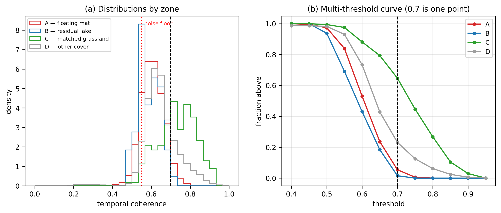
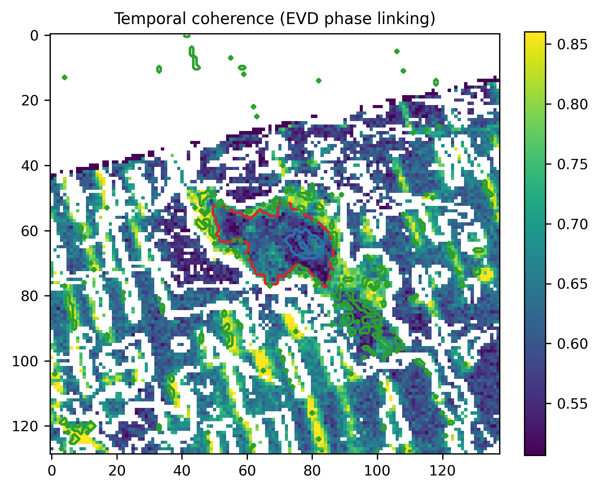
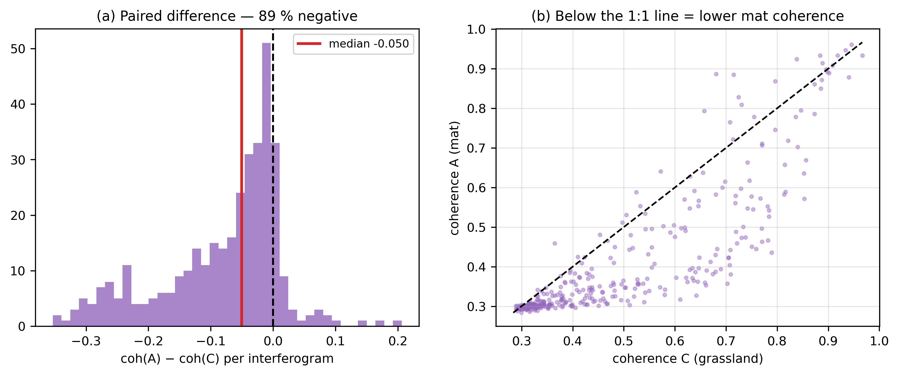
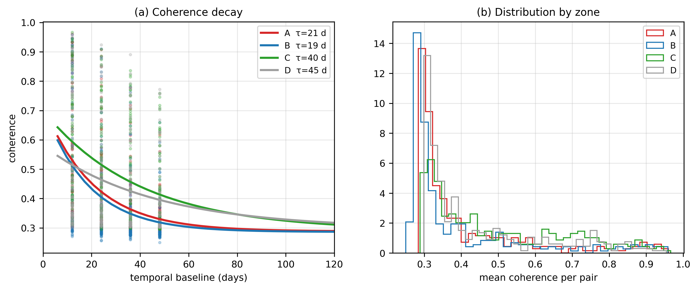
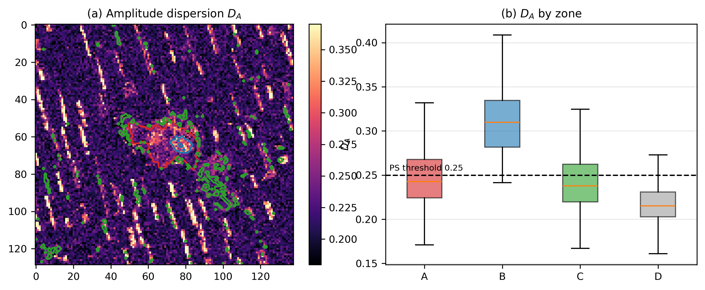
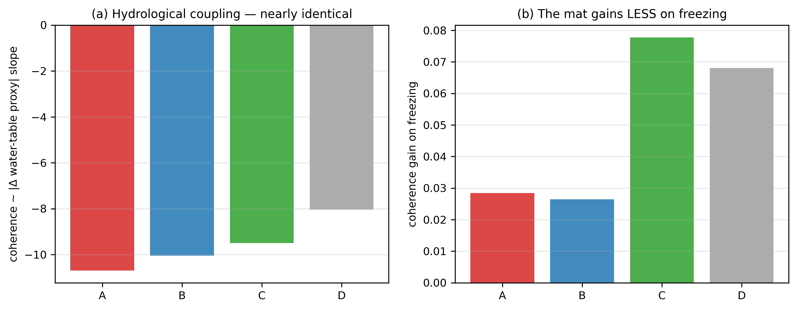
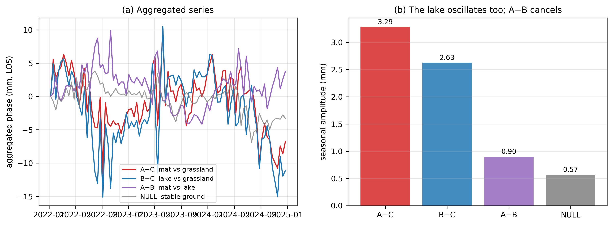
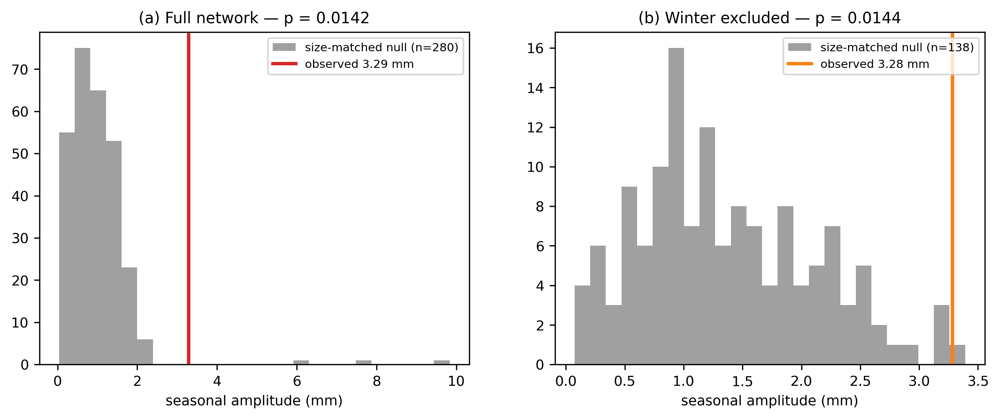
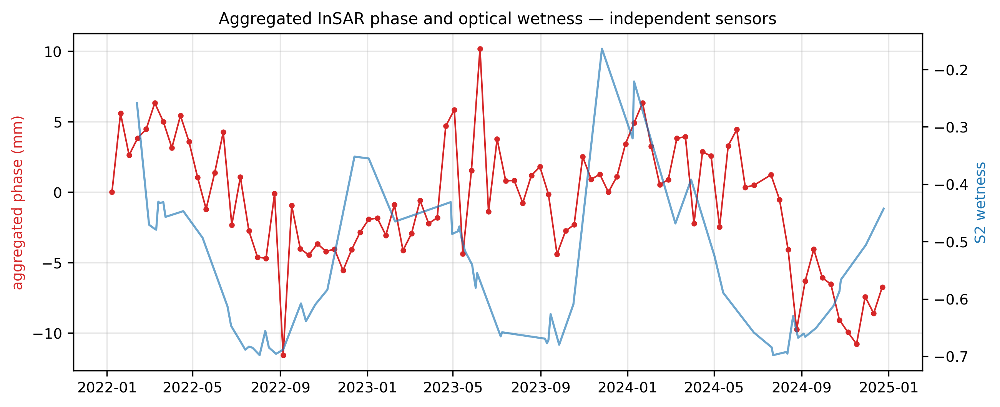
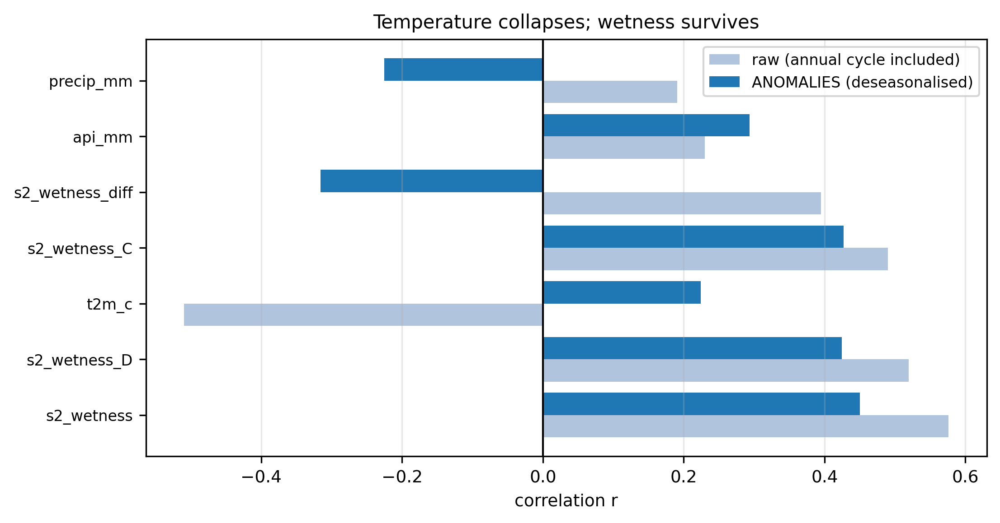

## 4. Results

### 4.1 H1 — The failure is not algorithmic

#### 4.1.1 Six estimators, one outcome

| Method | Outcome over the mat |
|---|---|
| SBAS (MintPy) | no usable pixel |
| ISBAS | idem; intermittent pixels not recovered |
| Annual pairs | idem |
| Hybrid network | 14 238 pixels "resolved" scene-wide, **0 reliable** over the AOI (median residual 2.5 rad) |
| Weighted least squares | median residual **2.46 rad** (A) vs **1.92 rad** (C), at comparable numbers of valid pairs |
| **Phase linking (EVD)** | see §4.1.2 |

The hybrid-network case is instructive: the apparent 78-fold coverage gain was
**hollow**, since the "resolved" pixels were not located over the area of
interest. A coverage criterion without a reliability criterion is misleading.

#### 4.1.2 The decisive test

Phase linking is the maximum-likelihood estimator under a circular Gaussian
model; if it fails, no estimator on the same network will succeed.

**Table 2** — Temporal coherence by zone (356 pairs, ~90 dates):

| Zone | Median | p25–p75 | **% ≥ 0.7** |
|---|---|---|---|
| **C** — matched grassland | **0.734** | 0.671–0.803 | **64.7 %** |
| D — other cover | 0.639 | 0.597–0.693 | 23.1 % |
| **A** — floating mat | **0.604** | 0.566–0.647 | **5.4 %** |
| B — residual lake | 0.584 | 0.542–0.630 | 1.5 % |

Read against the **0.55 noise floor** (§3.1; Fig. 5, Fig. 6):

- **B (lake) = 0.584** sits *at* the floor — an internal validation, since
  vegetated water is known to be decorrelated and the method classifies it
  correctly. The chain behaves as expected on the control target.
- **A (mat) = 0.604** is only ≈ 0.05 above the floor, adjacent to the lake. This
  is not "somewhat worse" than C: **A ≈ noise, C ≈ signal**.
- **C = 0.734** is clearly above, with 65 % of pixels at distributed-scatterer
  quality — **on exactly the same network**.

#### 4.1.3 Multi-threshold analysis

The 0.7 threshold is a convention; the full curve is more informative (Fig. 5b,
Table 3). A and C are nearly indistinguishable at 0.50 (0.974 vs 0.995) and
diverge in the **upper tail** (≥ 0.65). The mat is therefore not uniformly
shifted downward — it is **deprived of its best pixels**, which is precisely
what prevents inversion.

#### 4.1.4 Verdict: H1 rejected

> **H1 is rejected for the available network.** Six estimators with distinct
> mathematical assumptions fail identically, including the maximum-likelihood
> estimator. The inversion failure is a **physical property of the target**.

**Scope.** Future work exploiting all SLCs (beyond the 356 HyP3 pairs) could
shift the *absolute* temporal coherence values. The **relative gap between A and
C**, measured at strictly equal network, should persist: C succeeds where A
fails, with the same pairs, the same sparsity and the same estimator.

---

### 4.2 H2 — The mat is a distinct radar target

#### 4.2.1 Coherence deficit at matched cover

**Table 4** — paired comparison, A vs C:

| Quantity | Value |
|---|---|
| Mean coherence A / C | 0.408 / 0.492 |
| **Paired Δ (coh A − coh C)** | **−0.069** |
| Wilcoxon signed-rank | ***p* = 2.2 × 10⁻⁴⁹** |
| Fraction of negative pairs | 88 % |
| **Date-jackknife** | Δ ∈ [−0.0705, −0.0652], **sign stable for every removal** |
| Decorrelation time τ | 21 d (A) vs 32 d (C) |

The deficit therefore depends on no single acquisition and survives control for
baseline, atmosphere (both by pairing), slope (DEM) and canopy optical wetness
(Sentinel-2 features). Figures S6 and S4 show the paired differences and the
decay curves.

#### 4.2.2 The cover matching is effective

A and C are **phenological twins**: median Sentinel-2 wetness −0.513 vs −0.522,
same WorldCover class, matched greenness and seasonal amplitude. The coherence
difference is consequently **not a vegetation artefact**; it arises from a
non-optical surface property at the radar scale.

#### 4.2.3 A spatially delimited unit

- **Radial profile** (Fig. 3): a low, flat plateau (≈ 0.40) throughout the
  interior, a **sharp step at the boundary**, and a peak just outside (≈ 0.47).
  The same discontinuity appears in σ⁰ and RVI.
- **Five independent sensors** express the polygon: coherence, σ⁰ VV, RVI,
  Sentinel-2 wetness, temporal coherence (Fig. 8, Fig. S1).
- **Area**: A + B = 90.24 ha vs 89.7 ha documented (**+0.6 %**).

This is not diffuse noise but a **delimited physical unit**, whose outline —
drawn from vector and optical sources — coincides with structure visible in
**independent radar** fields.

#### 4.2.4 Scattering signature

**Table 5**:

| Quantity | A (mat) | C (grassland) | Reading |
|---|---|---|---|
| Median σ⁰ VV | **−10.09 dB** | −11.22 dB | A is **brighter** (+1.1 dB) |
| RVI (dual-pol) | **0.914** | 0.881 | A is **more depolarising** |
| Amplitude dispersion D_A | 0.243 (59 % < 0.25) | 0.238 (69 %) | A is **not radar-dark** |
| Closure dispersion (median \|closure\|) | **0.683 rad** | 0.212 rad | **×3.2** |

At C-band the mat behaves as a **denser, wetter scattering volume** than dry
grassland despite identical optical phenology. The higher RVI excludes an
open-water double-bounce mechanism. The 3.2-fold closure dispersion is a direct
measurement of **scatterer non-stationarity**: mat triplets do not close, stable
ground triplets do (Fig. 11, Fig. S5).

Importantly, **A is not devoid of targets** (59 % of pixels have D_A < 0.25).
Its problem is not absent backscatter but an **unstable phase** — which is what
justified attempting phase linking in the first place (§4.1).

#### 4.2.5 Coherence predictors reverse sign between zones

Within-zone analysis (internal variability, not A vs C). Over the 499 mat pixels
with 12 covariates: cross-validated **R² = 0.239 ± 0.022** (random forest 0.326),
against 0.127 without the radar covariates.

**Table 6**:

| Covariate | ρ in **A** (mat) | ρ in **C** (grassland) | Difference |
|---|---|---|---|
| σ⁰ VV | **−0.379** | −0.008 | −0.371 |
| Mean greenness | **+0.320** | −0.009 | +0.329 |
| Elevation | −0.168 | **+0.430** | **−0.598** |

The same variables act **in opposite directions** depending on zone (Fig. 9).
This is **independent evidence** — obtained through a statistical route that
neither the paired comparison nor phase linking used — that the mat possesses
its **own physics** and does not behave as ordinary vegetation.

**Reading precautions.** (i) The RVI / VH-VV collinearity (VIF ≈ 240; monotone
transforms of the same ratio) produced spurious coefficients (−1.21 and +0.95);
only the **cleaned** model is interpretable (σ⁰ −0.275, RVI −0.251, wetness
−0.240). (ii) **Greenness is a proxy**: ρ = +0.320 marginally but a partial
coefficient of +0.029 — it predicts nothing once σ⁰ and wetness are accounted
for. (iii) **Elevation is likely a positional proxy**: on a near-flat floating
mat the 30 m DEM relief is at noise level, and it should not be read physically.
(iv) The only predictor robust across both linear and non-linear models is
**σ⁰ VV**.

#### 4.2.6 Verdict: H2 supported

> **H2 is supported.** At matched cover and after controlling baseline,
> atmosphere, slope and optical wetness, the mat shows significantly lower
> coherence, a sharp boundary, a volumetric scattering signature and 3.2-fold
> non-stationarity — and the drivers of its coherence **reverse** relative to
> grassland. It is a **distinct radar unit**, not "vegetation at C-band".

---

### 4.3 H3 — Dielectric signal, not motion

#### 4.3.1 The change of observable works

On identical simulated data (Fig. S3), per-pixel inversion returns
**−13.7 mm yr⁻¹** with 36 % usable pixels, whereas aggregation returns
**−19.8 mm yr⁻¹** against a ground truth of **−20**. The signal was not below the
noise floor; it was below the **per-pixel** noise floor.

#### 4.3.2 Common phase across zones (|R|)

| Zone | Median \|R\| |
|---|---|
| C — grassland | **0.569** |
| D — other | 0.426 |
| B — lake | 0.395 |
| **A — mat** | **0.234** |

The mat has the **lowest common phase of all zones**, consistent with H2. **This
ranking is the only claim this test supports**, for three reasons: |R| contains
atmosphere, common to all pixels; the ratio to the 1/√N_eff floor is not
comparable across zones; and with **measured** N_eff (§4.5.1) A and C sit only
×1.3 above their floors, which is not a detection. This test is therefore
**motivation and ordering, not proof**.

#### 4.3.3 Velocity has no power on a periodic signal

| Network | Signal A − C | Null (floor) |
|---|---|---|
| Full | −1.53 mm yr⁻¹ | **−1.50 mm yr⁻¹** |
| Baselines ≤ 60 d | −3.87 mm yr⁻¹ | **−4.88 mm yr⁻¹** |

The signal is **indistinguishable from the null**. More fundamentally, bog
breathing is **seasonal**, so regressing a *velocity* on a periodic signal
returns ≈ 0 by construction: this test had **no power** on the physics being
sought. The null control is what exposed the design error.

#### 4.3.4 Seasonal amplitude: detection

Annual-cycle fit on the aggregated A − C series against **280 size-matched
nulls** (Fig. 7, Fig. 10; Table 7):

| | Amplitude | Phase (DOY) | Seasonal R² | ***p*** |
|---|---|---|---|---|
| **A − C** | **3.29 mm** | **104** (mid-April) | 0.30 | **0.014** |

Null median 0.86 mm, p95 1.87 mm; 3 of 280 nulls exceed the observed value. The
*p*-value is a **real value**, not a floor (the minimum reachable with 280 draws
is 0.0036). The mid-April maximum is consistent with spring swelling at high
water table.

#### 4.3.5 Three independent arguments exclude motion

**(a) The lake oscillates too.** The residual lake **cannot breathe
mechanically**, yet:

| | Amplitude | Phase (DOY) | *p* |
|---|---|---|---|
| A − C (mat) | 3.29 mm | 104 | 0.014 |
| **B − C (lake)** | **2.63 mm** | **95** | 0.036 |

That is **80 % of the mat amplitude, within 10 days of the same phase**.

**(b) Mat minus lake cancels.** Referencing A to the lake rather than the
grassland gives **0.90 mm**, phase DOY 146 (random), seasonal R² 0.05,
***p* = 0.448** — exactly at the null median of 0.83 mm. Mat and lake are
seasonally **indistinguishable**. Had the mat been breathing mechanically while
the lake was not, A − B would have revealed it. It reveals nothing.

**(c) Order of magnitude.**

| | Expected amplitude |
|---|---|
| Mat floating freely on a ±10 cm water table | ≈ 100 mm |
| Published raised-bog breathing (Hrysiewicz et al., 2024) | 10–40 mm |
| **Measured here** | **3.3 mm** |

The signal is **one to two orders of magnitude too small** for flotation.

#### 4.3.6 Closure-phase bias does not discriminate

Over the 518 closed triplets in the network (Fig. 11, Table 8):

| Zone | Mean bias (rad) | σ | Median \|closure\| |
|---|---|---|---|
| A | −0.090 | 1.6 | **0.683** |
| B | −0.088 | 1.5 | **0.777** |
| C | +0.027 | 1.1 | 0.212 |
| D | −0.021 | 1.1 | 0.210 |

**No systematic bias is detected.** (A pre-registered prediction that increasing
the triplet count would push this to ≈ 5σ was **falsified**: the network holds
only 518 closed triplets, and at 518 the estimate *decreased* — the behaviour of
a fluctuation.)

What is robust is the **dispersion** (×3.2; π/2 ≈ 1.57 would correspond to
purely random triplets, so A remains *partially* coherent). But high dispersion
**without a sign bias** indicates **random** scatterer reconfiguration, which
moisture fluctuation and non-rigid micro-movement produce equally. **This test
measures the degree of non-stationarity, not its nature.**

#### 4.3.7 Upper bound on motion, with stated assumptions

**Level 1 — robust ceiling (no assumption about the lake).** The total A − C
seasonal amplitude is 3.29 mm LOS. Attributing **all** of it to motion — that
is, deliberately ignoring §4.3.5 — gives

> d_vert ≤ 3.29 / cos(32.26°) ≈ **3.9 mm** seasonal vertical amplitude.

Assumptions: purely vertical motion; no phase aliasing (verified, since
centimetre-scale motion would produce an incoherent aggregate rather than a
clean annual cycle at R² = 0.30). This is the figure to quote by default: it is
independent of the lake and remains ≈ 25× below free flotation.

**Level 2 — refined bound (assumes a stable lake).** The mat-minus-lake residual
of 0.90 mm lies below the matched-null p95 of 2.0 mm:

> mat-specific motion **< 2 mm LOS** (≈ **2.4 mm** vertical).

> **Critical assumption, stated.** This test assumes the lake's scattering
> surface is mechanically stable. Lake and mat float on the **same water table**;
> if both rose and fell together, A − B would cancel *even in the presence of
> substantial motion*. The observed cancellation is compatible with two readings
> — no motion, or common motion — which radar data alone cannot separate. Level 1
> already excludes flotation-scale motion independently of the lake, and in-situ
> laser measurement will resolve the ambiguity.

#### 4.3.8 Verdict: H3 rejected

> **H3 is rejected.** The detected seasonal signal (3.29 mm, *p* = 0.014) is
> **dielectric**: the lake, which cannot breathe, oscillates identically; the
> mat-minus-lake difference cancels; and the amplitude is one to two orders of
> magnitude too small for flotation. We are measuring a **seasonal moisture
> contrast** between saturated surfaces and dry grassland.

*Distinction to maintain*: this establishes that the **seasonal signal** is
dielectric. It says nothing about the nature of the **decorrelation** mechanism,
which remains undetermined between dielectric variability and non-rigid
micro-movement (§5.5).

---

### 4.4 H4 — What the sensor tracks is surface wetness

#### 4.4.1 The seasonality trap

The raw lag sweep gives Sentinel-2 wetness *r* = +0.576 (lag 54 d, *p* ≤ 0.021)
**and** air temperature *r* = −0.509 (lag 72 d, *p* ≤ 0.021), both apparently
significant. This is **unusable as it stands**: temperature and wetness are
strongly anti-correlated seasonally; the antecedent precipitation index — the
most *direct* hydrological proxy — fails (*p* = 0.43); and two annual-cycle
signals always correlate at *some* lag, the sweep merely aligning phases.

#### 4.4.2 Anomaly analysis

Removing the annual harmonic from **both** series leaves only inter-annual and
event-scale anomalies. Against 92 size-matched nulls (Fig. 13, Table 9):

| Forcing | *r* seasonal | ***r* ANOMALIES** | Lag | ***p*** |
|---|---|---|---|---|
| **NDWI zone A** | 0.576 | **+0.450** | **12 d** | **≤ 0.011** |
| **NDWI zone C** | 0.490 | **+0.427** | **12 d** | 0.022 |
| **NDWI zone D** | 0.519 | **+0.424** | 42 d | ≤ 0.011 |
| NDWI(A) − NDWI(C) | 0.395 | −0.316 | 6 d | 0.150 |
| Antecedent precipitation | 0.230 | 0.293 | 6 d | 0.172 |
| Precipitation | 0.191 | −0.225 | 66 d | 0.312 |
| **Air temperature** | **−0.509** | **0.224** | 78 d | **0.581** |

#### 4.4.3 Three convergent facts

**(a) Temperature collapses.** −0.509 → 0.224, *p* from 0.021 to 0.581. Its
correlation was **only** the shared annual cycle. The temperature–wetness
confound is thereby **resolved**, and a thermal artefact is excluded.

**(b) Wetness survives**, and it originates from an **optical sensor entirely
independent of the radar** (different platform, different measurement physics).

**(c) The lag drops from 54 d to 12 d** — one revisit cycle, hence
*instantaneous* at our sampling resolution. This was the criterion set **a
priori**: a dielectric response is near-instantaneous, while mechanical settling
lags by weeks. **The lag therefore confirms the dielectric mechanism through a
route independent of the lake control.**

The **sign** is consistent: wetter → shallower penetration → phase centre higher
→ apparent uplift (positive *r*). Sign alone does not discriminate, since
mechanical swelling would give the same, but it is coherent.

#### 4.4.4 The mechanism: a sensitivity contrast

The failure of the **differential** forcing (NDWI_A − NDWI_C: *r* = −0.316,
*p* = 0.15) is initially surprising, since the InSAR series is itself
differential.

**Model.** A common **regional** moisture M(t) drives φ(A) with sensitivity k_A
and φ(C) with k_C, where **k_A > k_C** (saturated peat responds more strongly
than mineral grassland). Then

> φ(A) − φ(C) = (k_A − k_C) · M(t)

The **differential** phase therefore tracks **absolute** moisture through a
*sensitivity* contrast rather than a moisture contrast; and
NDWI(A) − NDWI(C) ≈ 0 + noise, since both surfaces respond optically in a
similar way.

**Pre-registered prediction.** If the model holds, NDWI over **C** and over **D**
— proxies for the same M(t) — must also correlate **positively**, with
comparable magnitude.

**Confirmed**: NDWI(A) +0.450, NDWI(C) +0.427, NDWI(D) +0.424 — nearly identical
— while the differential fails. The model is therefore validated by a
**prediction stated before the test**, not by post-hoc rationalisation, and **the
failure of the differential forcing is a consequence of the model rather than
evidence against the hydrological link**.

#### 4.4.5 Verdict: H4 supported

> **H4 is supported, with a moderate effect size.** On anomalies, the aggregated
> phase co-varies with surface wetness (*r* = 0.42–0.45 depending on reference
> zone, *p* ≤ 0.022) at **near-zero lag**, while temperature does not survive
> deseasonalisation. Coupling operates through a **sensitivity contrast** between
> saturated peat and mineral grassland.

**Limits.** The effect is moderate (0.450 against a null p95 of 0.404): this is
a **measurable sensitivity**, not an operational hydrological product. The three
zonal NDWI series are **not independent** (all proxy the same regional M(t)), so
this is one confirmation of a predicted pattern rather than three. *p*-values sit
at the 1/(1 + 92) floor. In-situ water table depth remains preferable to NDWI and
would settle the question, since its temporal structure differs from that of
temperature.

---

### 4.5 Robustness and falsification

Six of eight alternative explanations are excluded (Appendix A). Two results
warrant reporting here because they modified our own conclusions.

#### 4.5.1 Effective sample size, measured

The 1/√N argument assumes independent pixels, which they are not. Measuring the
spatial correlation length by empirical autocorrelation (1/e threshold):

| Zone | L_corr | N_eff **measured** | N_eff *assumed* | \|R\| / measured floor |
|---|---|---|---|---|
| A | 160 m | 31 | *125* | **×1.3** |
| B | 80 m | 16 | *16* | ×1.6 |
| C | 360 m | 5 | *100* | **×1.3** |
| D | 280 m | 219 | *2 688* | ×6.3 |

**Consequence, accepted:** the |R| comparison of §4.3.2 loses most of its power
and is demoted to motivation and ordering. **The principal conclusions are unaffected**,
because their significance derives from empirical size-matched nulls that use no
N_eff at all. (Caveat: zone C is fragmented, so the estimator mixes within- and
between-patch correlation and its N_eff of 5 is probably understated.)

#### 4.5.2 Snow and frost excluded

Snow has its own annual cycle and affects saturated peat differently from
grassland, making it a complete competing explanation. Removing all
December–February pairs (30 % of the network):

| Dataset | *n* pairs | Amplitude | Phase (DOY) | Seasonal R² | *p* |
|---|---|---|---|---|---|
| Full | 356 | **3.286 mm** | 104.2 | 0.299 | 0.014 |
| **Winter excluded** | 248 | **3.282 mm** | 112.6 | 0.309 | 0.022 |

The amplitude changes by **0.1 %** and the seasonal R² slightly *increases*.
Snow and frost are **refuted**; the signal is carried entirely by the growing
season.
