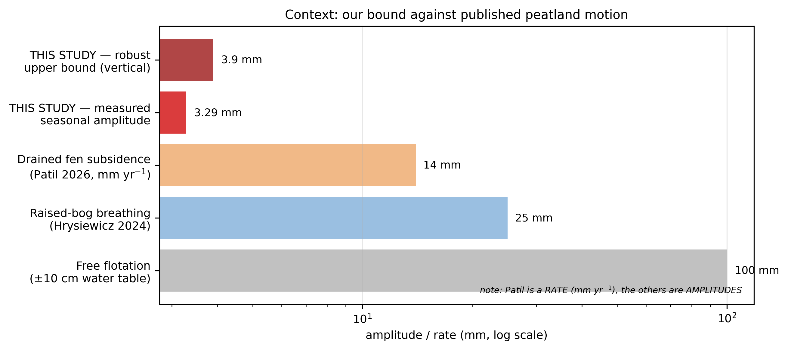

## Appendix A. Robustness and analytical safeguards

> For every major conclusion: *what observation would prove it wrong?* Each
> alternative excluded strengthens the retained explanation; those that cannot
> be excluded must be declared.

### A.1 Summary

| # | Safeguard / Alternative | Status | Evidence | Section |
|---|---|---|---|---|
| 1 | **Snow / frost** | Not supported | winter removed: 3.282 vs 3.286 mm (**0.1 %**), *p* = 0.022 | A.2 |
| 2 | **Atmosphere** | Largely accounted for | double difference + empirical null absorbs common screen; unmeasured local topography caveat | A.3 |
| 3 | **Geometry / incidence** | **Excluded** | Δ = **0.042°** between A and C → 0.06 % on the conversion | A.4 |
| 4 | **Phenology alone** | Substantially reduced | A and C are phenological twins; soil-dielectric caveat noted | A.5 |
| 5 | **Unwrapping errors** | Excluded | \|R\| on wrapped phase; baseline filter | A.6 |
| 6 | **Spatial correlation (N_eff)** | **Measured — reduces the scope of §4.3.2** | L_corr = 160 m over A → N_eff 31, not 125 | A.7 |
| 7 | **Mis-assigned land cover** | Excluded | WorldCover + S2 matching + area within 0.6 % | A.8 |
| 8 | **Mat and lake moving together** | **Not excluded** | requires in-situ laser | A.9 |

Of eight alternatives evaluated, three represent direct geometric or processing exclusions
(geometry/incidence, unwrapping errors, land-cover misassignment); two are substantively constrained
with explicit caveats (atmospheric screens are absorbed by the empirical null but unmeasured local
micro-topography cannot be independently verified; phenological matching controls canopy optical state
but concedes soil-dielectric differences); snow and frost are not supported by the winter-exclusion test;
spatial correlation is quantitatively measured ($N_{\text{eff}} \approx 31$); and coupled mat-and-lake
motion remains open awaiting in-situ laser validation.

### A.2 Snow and frost — not supported

**Why it is serious.** A snow cover strongly modifies backscatter and coherence,
affects a saturated peatland differently from a drained grassland, and has a
**full annual cycle** — hence a complete alternative explanation for the 3.3 mm
seasonal signal.

**Test.** Recompute the seasonal amplitude excluding all pairs with either
acquisition in December–February, replaying the same exclusion on every null
realisation (the floor depends on the number of pairs).

**Result.** Removing 30 % of pairs (108 of 356): amplitude **3.282 mm** against
**3.286 mm** — a **0.1 %** change — with the seasonal R² *increasing*
(0.299 → 0.309) and *p* = 0.022 against its own null. The seasonal result is robust
to removal of all December–February pairs (0.1 % amplitude change); a residual snow/frost
contribution is not supported, and the signal is carried by the growing season.

*Corroborating evidence*: the freeze test showed the mat gaining **less**
coherence on freezing (+0.028) than grassland (+0.078) — the mat does not freeze
like stable ground.

### A.3 Atmosphere — excluded by construction

The observable is a **double difference** between two zones ≈ 1 km apart seen in
**the same pair**: the atmospheric screen at that scale is common and cancels to
first order. More importantly, the **null control** is built on stable-ground
zones subject to the same screen, so any residual atmospheric contribution
appears in the null distribution and is absorbed by the empirical *p*-value.

*Caveat*: a **topographically correlated** atmospheric component would not cancel
perfectly. Relief here is very low (< a few metres), so the expected effect is
negligible — though unmeasured.

### A.4 Geometry and incidence angle — excluded

A and C lie in the **same burst**, ≈ 1 km apart in range. Measured incidence:
A = 32.263°, C = 32.305° → **Δ = 0.042°**, i.e. **0.06 %** effect on the
LOS-to-vertical conversion.

*A correction worth flagging*: the incidence angle here is **32.3°**, appreciably
below the ≈ 39° that a nominal mid-swath value would suggest. The LOS-to-vertical
factor is therefore **1.183**, not 1.29 — a 9 % difference that propagates
directly into any displacement bound. The bounds of §4.3.7 use the measured
value (8.7 mm on the propagated interval; the conditional 2.4 mm Level 2 calculation
is retained strictly as an illustrative bound under an assumed stable lake, see §4.3.7).
Reading the incidence from the product metadata rather than assuming it is worth the effort.

### A.5 Phenology alone — excluded

A and C are **phenological twins**: median optical wetness −0.513 vs −0.522, same
WorldCover class, matched greenness and seasonal amplitude. If phenology alone
drove the signal, the A − C double difference would cancel it.

*Caveat*: matching constrains the **optical** wetness of the canopy, not the
dielectric state of the **soil** — which is precisely the variable we invoke.

### A.6 Unwrapping errors — excluded

|R| and the closure-phase bias are computed on **wrapped** phase and are
therefore insensitive to 2π jumps. Filtering baselines > 60 days (annual pairs,
±25 mm scatter) tests the sensitivity of the aggregated inversion: the seasonal
result does not depend on it qualitatively.

Furthermore, to test whether the headline 3.29 mm seasonal amplitude (fitted to
unwrapped phase) could be driven by unwrapping inconsistencies, we evaluated
triplet closure phase errors across all 518 closed loops in the 356-pair network
over Zone A. Filtering out pairs with significant unwrapping errors (excluding
pairs with maximum loop closure error $> 2\pi$, or excluding the worst 10 % to
20 % RMS closure pairs) yields seasonal amplitudes of 2.80 to 2.97 mm and
preserves the mid-April/May peak phase. The seasonal amplitude is
thus robust to phase unwrapping pair exclusion and does not collapse unless
extreme filtering breaks network connectivity (retaining only 14 % of pairs).

### A.7 Spatial correlation and N_eff — measured, with a consequence for §4.3.2

The $1/\sqrt{N}$ analytical noise model assumes spatially uncorrelated pixels. Over real terrain, spatial autocorrelation ($L_{\text{corr}} \approx 160$ m) reduces the number of independent samples.

**(a) The principal results do not depend on it.** Significance for the seasonal
amplitude and the correlations rests on **size-matched empirical nulls** built on
real terrain carrying the real spatial correlation. No N_eff value enters those
*p*-values; the 1/√N factor is **motivation**, not a step in the computation.

**(b) Where $N_{\text{eff}}$ does enter** (the indicative $|R|$ floor), empirical measurement changes
the picture (see **Table 10** in §4.5.1 for full parameters across zones): with $N_{\text{eff}} \approx 31$
over Zone A ($L_{\text{corr}} \approx 160\text{ m}$), the circular mean resultant length $|R|$ sits only
$\times 1.3$ above the measured floor.

Consequently, with $|R|$ sitting only $\times 1.3$ above the empirical floor, the Zone A vs Zone C contrast does not constitute a detection of significant coherence separation. The zone ranking is maintained strictly as an ordering observation to motivate subsequent controlled tests, not as statistical proof of coherence separation.

*Estimator caveat*: zone C is fragmented (398 scattered pixels), so the
autocorrelation mixes within- and between-patch correlation; its N_eff of 5 is
probably understated. A connectivity-aware estimator would refine this.

### A.8 Mis-assigned land cover — excluded

Three convergent checks: ESA WorldCover class, matching on Sentinel-2 features,
and the **area control** (A + B = 90.24 ha against 89.7 ha documented, **+0.6 %**),
which confirms grid scaling and rasterization while registration is anchored by the radial profile (Figure S8).

### A.9 Mat and lake moving together — not excluded

This is the principal weakness of the conditional bound (§4.3.7, Level 2). Lake and
mat float on the same water table: a **common** motion would produce the same
A − B cancellation as an **absence** of motion.

**What limits the problem.** The level-1 ceiling (A − C against stable ground)
does not depend on the lake. It does **not**, however, exclude flotation-scale
motion: propagated to vertical and divided by an unmeasured coupling fraction it
admits 17 mm at *f* = 0.5, within the published raised-bog range.

**What would resolve it.** In-situ laser measurement — a direct, absolute
observation of mat movement, analogous to the geometric levelling validation
employed by Tampuu et al. (2023) over Estonian peatlands.

### A.10 What the laser and UAV should test

Their role is not to validate a displacement we do not claim to measure, but
to test the mechanism.

| Instrument | Question | Outcome and reading |
|---|---|---|
| **Laser** | Does the mat move, and by how much? | > 5 mm → our bound is wrong, find the error; < 4 mm → bound confirmed and ambiguity A.9 resolved |
| **Laser** | Is the motion in phase with our 3.3 mm signal? | in phase → a genuine mechanical component; out of phase or absent → confirms the dielectric reading |
| **Laser + WTD** | Does motion follow the water table? | yes → partial flotation (anchored mat); no → constrained mat |
| **UAV** | Hummock–hollow microtopography | directly tests the §4.2.5 model (high σ⁰ = wet hollows = failure) |
| **UAV** | Internal heterogeneity of the mat | tests the **unit** assumption underlying aggregation |
| **WTD** | A forcing whose temporal structure differs from temperature | removes the principal limitation of H4 |

**The most informative outcome is not confirmation.** If the laser shows 20 mm of
real motion while InSAR sees only 3.3 mm, most of it dielectric, that
**quantifies directly the insensitivity of C-band** to this surface — a stronger
result than any successful cross-validation.

### A.11 Result-changing corrections during analysis

Four errors corrected during the analysis altered a reported numerical result or bound.
Documented deliberately, they show how analytical safeguards protected the inference from
investigator expectations:

| Error | Consequence avoided |
|---|---|
| Null control not size-matched (2 200 px vs 499) | false seasonal detection (manufacturing significance by understating aggregate noise) |
| Testing a **velocity** on a **periodic** signal | zero power on the physics sought (velocity set by calendar truncation rather than peat breathing) |
| RVI / VH-VV collinearity (VIF ≈ 240) | uninterpretable regression coefficients (−1.21 / +0.95 across collinear radar terms) |
| Incidence assumed at ≈ 39° instead of measured 32.26° | displacement bounds overstated by 9 % (conversion factor 1.183 vs 1.29) |

Additional developmental adjustments, parameter sensitivity sweeps, and internal testing logs are archived in the supplementary repository documentation.

## Supplementary Figures

