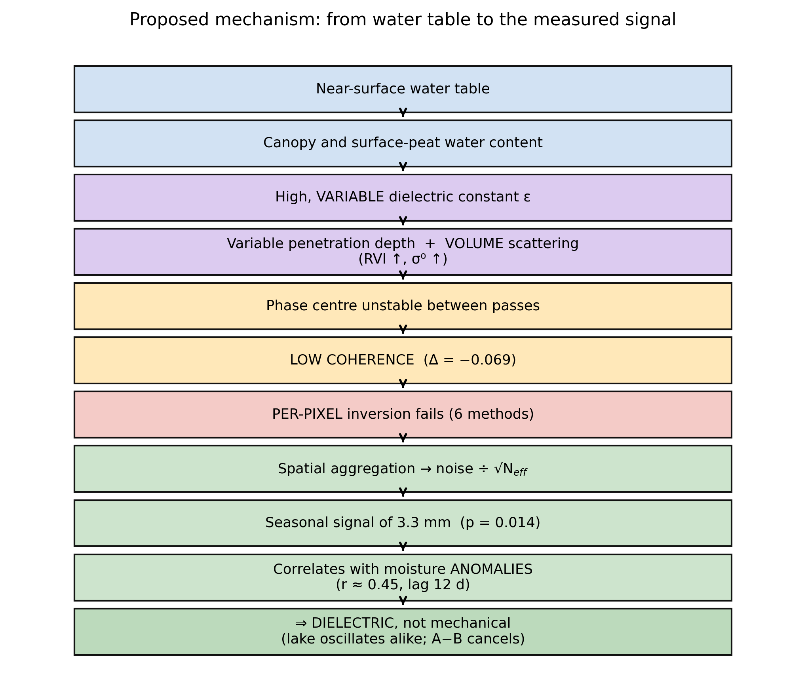

## Appendix A. Alternative explanations tested

> For every major conclusion: *what observation would prove it wrong?* Each
> alternative excluded strengthens the retained explanation; those that cannot
> be excluded must be declared.

### A.1 The proposed mechanism as a causal chain

Figure A1 renders the chain graphically. In summary: a near-surface water table
raises and modulates the dielectric constant of the canopy and surface peat;
this produces both a **variable penetration depth** and **dominant volume
scattering** (higher RVI, higher σ⁰); the phase centre therefore becomes unstable
between passes, coherence falls (Δ = −0.069), and per-pixel inversion fails
across six methods. Spatial aggregation divides the noise by √N_eff and reveals a
3.3 mm seasonal signal, which correlates with moisture anomalies at near-zero lag
— identifying it as **dielectric rather than mechanical** (the lake oscillates
identically; mat minus lake cancels).

Every observation points to a single mechanism. The remainder of this appendix
tests whether another mechanism could produce the same observations.

### A.2 Summary

| # | Alternative | Status | Evidence |
|---|---|---|---|
| 1 | **Snow / frost** | ✅ **excluded** | winter removed: 3.282 vs 3.286 mm (**0.1 %**), *p* = 0.022 |
| 2 | **Atmosphere** | ✅ largely excluded | double difference + size-matched null |
| 3 | **Geometry / incidence** | ✅ **excluded** | Δ = **0.042°** between A and C → 0.06 % on the conversion |
| 4 | **Phenology alone** | ✅ excluded | A and C are phenological twins |
| 5 | **Unwrapping errors** | ✅ excluded | \|R\| on wrapped phase; baseline filter |
| 6 | **Spatial correlation (N_eff)** | ⚠️ **measured — weakens G1** | L_corr = 160 m over A → N_eff 31, not 125 |
| 7 | **Mis-assigned land cover** | ✅ excluded | WorldCover + S2 matching + area within 0.6 % |
| 8 | **Mat and lake moving together** | ❌ **NOT excluded** | requires in-situ laser |

**Six of eight alternatives are excluded**; one is measured and requires the
scope of test G1 to be reduced; one resists and requires the laser.

### A.3 Snow and frost — excluded

**Why it is serious.** A snow cover strongly modifies backscatter and coherence,
affects a saturated peatland differently from a drained grassland, and has a
**full annual cycle** — hence a complete alternative explanation for the 3.3 mm
seasonal signal.

**Test.** Recompute the seasonal amplitude excluding all pairs with either
acquisition in December–February, replaying the same exclusion on every null
realisation (the floor depends on the number of pairs).

**Result.** Removing 30 % of pairs (108 of 356): amplitude **3.282 mm** against
**3.286 mm** — a **0.1 %** change — with the seasonal R² *increasing*
(0.299 → 0.309) and *p* = 0.022 against its own null. **Snow and frost are
refuted**; the signal is carried entirely by the growing season.

*Corroborating evidence*: the freeze test showed the mat gaining **less**
coherence on freezing (+0.028) than grassland (+0.077) — the mat does not freeze
like stable ground.

### A.4 Atmosphere — excluded by construction

The observable is a **double difference** between two zones ≈ 1 km apart seen in
**the same pair**: the atmospheric screen at that scale is common and cancels to
first order. More importantly, the **null control** is built on stable-ground
zones subject to the same screen, so any residual atmospheric contribution
appears in the null distribution and is absorbed by the empirical *p*-value.

*Caveat*: a **topographically correlated** atmospheric component would not cancel
perfectly. Relief here is very low (< a few metres), so the expected effect is
negligible — though unmeasured.

### A.5 Geometry and incidence angle — excluded

A and C lie in the **same burst**, ≈ 1 km apart in range. Measured incidence:
A = 32.263°, C = 32.305° → **Δ = 0.042°**, i.e. **0.06 %** effect on the
LOS-to-vertical conversion.

*Induced correction*: the true incidence is **32.3°**, not the ≈ 39° assumed in
an early draft; the LOS-to-vertical factor is **1.183**, not 1.29. The bounds of
§4.3.7 are corrected accordingly (ceiling 3.9 mm, refined bound 2.4 mm).

### A.6 Phenology alone — excluded

A and C are **phenological twins**: median optical wetness −0.513 vs −0.522, same
WorldCover class, matched greenness and seasonal amplitude. If phenology alone
drove the signal, the A − C double difference would cancel it.

*Caveat*: matching constrains the **optical** wetness of the canopy, not the
dielectric state of the **soil** — which is precisely the variable we invoke.

### A.7 Unwrapping errors — excluded

|R| and the closure-phase bias are computed on **wrapped** phase and are
therefore insensitive to 2π jumps. Filtering baselines > 60 days (annual pairs,
±25 mm scatter) tests the sensitivity of the aggregated inversion: the seasonal
result does not depend on it qualitatively.

### A.8 Spatial correlation and N_eff — measured, and it weakens our own test

**The criticism is well founded**: the 1/√N argument assumes independent pixels,
which they are not.

**(a) The principal results do not depend on it.** Significance for the seasonal
amplitude and the correlations rests on **size-matched empirical nulls** built on
real terrain carrying the real spatial correlation. No N_eff value enters those
*p*-values; the 1/√N factor is **motivation**, not a step in the computation.

**(b) Where N_eff does enter** (the indicative |R| floor), measurement changes
the picture:

| Zone | L_corr | N_eff measured | N_eff assumed | \|R\| / floor |
|---|---|---|---|---|
| A | 160 m | 31 | *125* | **×1.3** |
| B | 80 m | 16 | *16* | ×1.6 |
| C | 360 m | 5 | *100* | **×1.3** |
| D | 280 m | 219 | *2 688* | ×6.3 |

**Accepted consequence:** at ×1.3 above the floor, A and C do **not** constitute
a detection. The **ranking** of zones — the only claim made — is unchanged, since
it uses raw |R|. Test G1 is demoted to **motivation and ordering**, not proof.

*Estimator caveat*: zone C is fragmented (398 scattered pixels), so the
autocorrelation mixes within- and between-patch correlation; its N_eff of 5 is
probably understated. A connectivity-aware estimator would refine this.

### A.9 Mis-assigned land cover — excluded

Three convergent checks: ESA WorldCover class, matching on Sentinel-2 features,
and above all the **area control** (A + B = 90.24 ha against 89.7 ha documented,
**+0.6 %**), which validates geolocation numerically.

### A.10 Mat and lake moving together — NOT excluded

This is the principal weakness of the refined bound (§4.3.7, level 2). Lake and
mat float on the same water table: a **common** motion would produce the same
A − B cancellation as an **absence** of motion.

**What limits the problem.** The robust level-1 ceiling (≤ 3.9 mm, A − C against
stable ground) does not depend on the lake and already excludes flotation-scale
motion.

**What would resolve it.** In-situ **laser** measurement — a direct, absolute
observation of mat movement.

### A.11 What the laser and UAV should test

Their role is **not** to validate a displacement we do not claim to measure, but
to **test the mechanism**.

| Instrument | Question | Outcome and reading |
|---|---|---|
| **Laser** | Does the mat move, and by how much? | > 5 mm → our bound is wrong, find the error; < 4 mm → bound confirmed and ambiguity A.10 resolved |
| **Laser** | Is the motion in phase with our 3.3 mm signal? | in phase → a genuine mechanical component; out of phase or absent → confirms the dielectric reading |
| **Laser + WTD** | Does motion follow the water table? | yes → partial flotation (anchored mat); no → constrained mat |
| **UAV** | Hummock–hollow microtopography | directly tests the §4.2.5 model (high σ⁰ = wet hollows = failure) |
| **UAV** | Internal heterogeneity of the mat | tests the **unit** assumption underlying aggregation |
| **WTD** | A forcing whose temporal structure differs from temperature | removes the principal limitation of H4 |

**The most informative outcome is not confirmation.** If the laser shows 20 mm of
real motion while InSAR sees only 3.3 mm, most of it dielectric, that
**quantifies directly the insensitivity of C-band** to this surface — a stronger
result than any successful cross-validation.

### A.12 Two distinct questions

Our results answer **two separate questions**, which deserve distinct figures and
discussions:

| | Question | Answer | Sections |
|---|---|---|---|
| **Q1** | Can Sentinel-1 measure vertical displacement? | **No**, not reliably; bound ≤ 3.9 mm | §4.1, §4.2, §4.3 |
| **Q2** | Can Sentinel-1 inform on seasonal hydrological state? | **Possibly yes**, moderate but measurable | §4.3.4, §4.4 |

Q1 is an **instrumental-limit** result; Q2 is a **capability** result. Conflating
them would weaken both.

### A.13 Errors corrected during the analysis

Documented deliberately: they show that the protocol resisted the authors'
expectations.

| Error | Consequence avoided |
|---|---|
| Floor ratio compared across zones of differing N_eff | wrong zone ranking |
| Null control not size-matched (2 200 px vs 499) | false seasonal detection |
| Testing a **velocity** on a **periodic** signal | zero power on the physics sought |
| RVI / VH-VV collinearity (VIF ≈ 240) | uninterpretable coefficients (−1.21 / +0.95) |
| Naive correlation between two annual cycles | false attribution to moisture |
| Incidence assumed at ≈ 39° instead of measured 32.3° | bounds overstated by 9 % |
| **Prediction** "closure bias at ≈ 5σ" | **falsified** by the data (1.6σ) |
| **Prediction** "no forcing will survive" | **falsified** (wetness survives) |

Two explicit predictions were **refuted by our own data**, and one post-hoc
explanation was subjected to a falsifiable test before being accepted.
