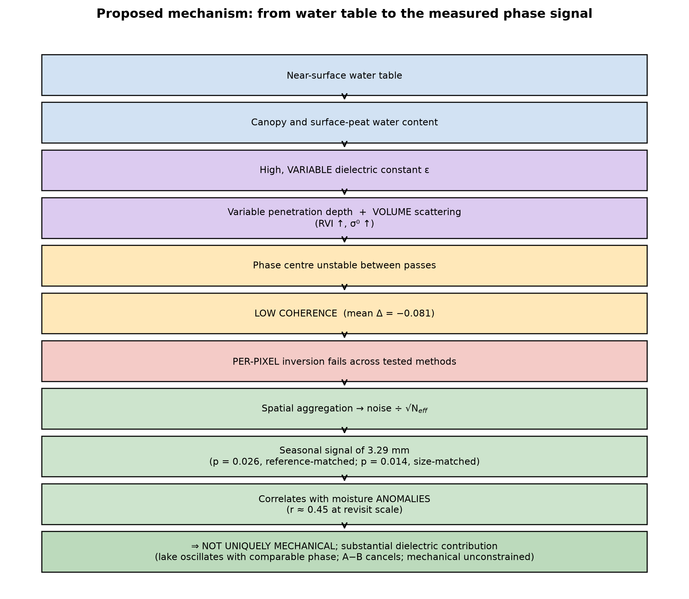

# What does C-band InSAR measure over a floating peatland? Multi-method evidence for a dielectric-dominated signal and the limits of satellite displacement retrieval

**Authors.** [Aymen Sayoud]¹, [Supervisor Name]¹, [Co-authors]

¹ [Institutional Affiliation, Department, University, City, Country]

**Corresponding author.** [author@institution.edu]

---

## Abstract

Peatland surfaces oscillate vertically with the water table, and this "bog
breathing" is a useful proxy for hydrological condition and, indirectly, for
carbon status. Sentinel-1 interferometry offers free, continuous monitoring of
such motion, and C-band retrievals have been demonstrated on raised bogs.
Whether this transfers to floating peatlands (*Schwingmoor*) — wetter, with
a dense low canopy resting on a near-surface water table — has not been tested
directly, even though these are the sites where the expected geomorphological
signal is largest.

We assess C-band InSAR over the Rzecin floating fen (Poland, 89.7 ha) using 356
Sentinel-1 interferograms (2022–2024), structuring the analysis around four
competing hypotheses.

**(H1) The failure is not algorithmic.** Six estimators with distinct
mathematical assumptions — SBAS, ISBAS, annual pairs, a hybrid network,
weighted least squares, and eigenvalue-decomposition phase linking — fail
identically over standard burst interferograms. Phase linking, while
theoretically optimal under an unconstrained covariance matrix, recovers only
5.4 % of mat pixels at temporal coherence ≥ 0.7, against 64.7 % for
land-cover-matched vegetation on stable ground using the same network.

**(H2) The mat is a distinct radar target.** At matched land cover and
phenology, its coherence is significantly lower (mean Δ = −0.081, lower in
89 % of pairs, date-jackknife leave-one-out range [−0.0842, −0.0774] demonstrating
sign invariance, SE-based 95 % CI [−0.109, −0.052]), its boundary is
sharp, its closure-phase dispersion is 3.2× larger, and environmental
predictors that actively modulate coherence inside the floating mat have no
detectable effect in matched grassland.

**(H3) The detectable seasonal signal is dielectric, not mechanical.** Spatial
aggregation over 499 pixels recovers a seasonal point estimate of 3.29 mm LOS
(95 % upper bound 7.32 mm LOS / 8.66 mm vertical; permutation p = 0.026 with
Monte Carlo 95 % CI [0.021, 0.031] against ≈4 600 reference-matched null
realisations) that six per-pixel inversions could not see. However, the
residual open-water lake exhibits a consistent seasonal trajectory
(2.63 mm, same phase) although it cannot breathe mechanically; the
mat-minus-lake difference cancels (0.90 mm, p = 0.45). Attributing the entire
signal to motion and propagating its 95 % interval yields an upper bound on
apparent phase-centre displacement of ≤ 8.7 mm vertical; because the phase
centre is not rigidly coupled to the mat, this does not exclude peat motion
of the amplitude published for raised bogs.

**(H4) What the sensor does track is surface wetness.** On deseasonalised
anomalies, the aggregated phase co-varies with Sentinel-2 optical wetness
(lag-0 r = 0.42–0.45 depending on reference zone, p ≤ 0.022) at a near-zero lag
of 12 days (one revisit), whereas air temperature does not survive
deseasonalisation (−0.509 → 0.224, p = 0.58). Coupling operates through a
sensitivity contrast between saturated peat and mineral grassland rather
than through a moisture contrast between them — a model prediction confirmed by
the expected failure of a differential forcing.

We conclude that the limitation is physical rather than methodological, and
report two transferable contributions: a change of observable (aggregate
rather than map, because the signal lies below the per-pixel noise floor) and
a weak-signal test protocol (size-matched nulls plus empirical p-values)
that invalidated two of our own intermediate conclusions and falsified two
explicit predictions.

**Keywords:** InSAR; Sentinel-1; C-band; floating peatland; *Schwingmoor*;
decorrelation; phase linking; distributed scatterers; surface moisture; spatial
aggregation.

---

## Highlights

- Six InSAR inversion strategies fail identically over a floating peatland: the
  limitation is physical, not algorithmic.
- Spatial aggregation recovers a 3.3 mm seasonal signal invisible pixel by
  pixel, but three independent tests indicate it is dielectric.
- Apparent phase-centre displacement is constrained to ≤ 8.7 mm vertical;
  mat motion itself is not bounded, because radar coupling is unmeasured.
- Aggregated phase responds to surface-moisture anomalies at near-zero lag
  through a sensitivity contrast between surfaces.
- A reproducible weak-signal protocol — size-matched nulls and empirical
  p-values — is demonstrated for decorrelated terrain.

## 1. Introduction

### 1.1 Motivation

Peatlands cover roughly 3 % of the land surface but store about one third of
global soil organic carbon. Their carbon balance is tightly coupled to water
table depth, which in turn expresses itself mechanically: peat swells when
saturated and subsides when it dries, a reversible oscillation known as *bog
breathing* or *Mooratmung*. Measuring this motion therefore provides an
indirect, spatially distributed observation of hydrological condition, and by
extension of carbon vulnerability.

Spaceborne interferometric SAR is, in principle, the ideal instrument: free,
continuous, spatially resolved and millimetre-sensitive. Sentinel-1 has provided
systematic coverage since 2014, making retrospective and operational monitoring
feasible without field infrastructure.

### 1.2 State of the art, and the tension it contains

**C-band works on raised bogs.** Hrysiewicz et al. (2024) retrieved bog
breathing over Irish raised bogs from Sentinel-1, reporting correlations of
0.8–0.9 against in-situ data, RMSE ≈ 7 mm yr⁻¹, and recovered amplitudes of
10–40 mm. This result refutes the widespread assumption that C-band is
unusable over peat.

**C-band also works on drained peat.** Patil et al. (2026) mapped subsidence of
0.48–1.40 cm yr⁻¹ across the Great Fen (UK), a drained lowland peatland under
restoration, and used the deformation field as a proxy for carbon flux.

**But peatlands are not one class of target.** Raised bogs carry a comparatively
dry *Sphagnum* cover with stable surface scatterers; drained agricultural peat
presents bare or cropped surfaces with high coherence. **Floating peatlands**
(*Schwingmoor*, transitional fens) are different in every respect that matters to
a radar: a dense low canopy, permanent saturation, and a mat resting directly on
water. Nothing guarantees that success on the former transfers to the latter.

**The case has not been tested head-on.** The InSAR wetland literature is
dominated by inundation mapping through double-bounce, coherence as a land-cover
descriptor, and drained or exploited peatlands. The floating mat — precisely
where the expected geomorphological signal is largest — remains poorly
documented.

### 1.3 The methodological trap we set out to avoid

A study that fails to retrieve displacement can always be attributed to a poor
processing choice. The InSAR literature offers a wide catalogue of algorithms
(SBAS, persistent scatterers, phase linking / distributed scatterers, networks
of varying baseline design), and it is tempting, when faced with failure, to try
one more indefinitely.

We adopt the opposite stance: **if estimators resting on different mathematical
assumptions fail in the same way, the burden of proof shifts.** The explanation
is then unlikely to be algorithmic, and the scientific task becomes
characterising the target rather than searching for a seventh algorithm.

### 1.4 Question

We therefore do not ask

> *Can Sentinel-1 InSAR measure vertical displacement of the Rzecin floating
> mat?*

— a closed question whose answer is a bare yes or no — but rather

> **What does C-band Sentinel-1 InSAR actually measure over a floating
> peatland, and why?**

### 1.5 Design

The analysis is organised around four falsifiable, competing hypotheses (Fig. 1),
each paired with the test that could refute it:

| | Hypothesis | Principal test | Section |
|---|---|---|---|
| **H1** | The failure originates in the **inversion algorithm** | six independent estimators on one network | §4.1 |
| **H2** | The **mat** is a distinct radar target | matched-cover comparison + multi-sensor validation | §4.2 |
| **H3** | The residual signal is surface **motion** | spatial aggregation + lake, null and magnitude controls | §4.3 |
| **H4** | The measured signal reflects **hydrological state** | correlation on deseasonalised anomalies | §4.4 |

### 1.6 Contributions

1. A **multi-method demonstration** that the limitation is physical rather than
   algorithmic, at a site where the expected signal is maximal.
2. A **quantitative constraint on apparent phase-centre displacement**
   (≤ 8.7 mm seasonal vertical amplitude), together with an explicit statement
   of why it does not transfer to the peat surface.
3. Evidence, from three independent arguments, that the detectable seasonal
   signal is **dielectric**.
4. Two transferable methodological contributions: a **change of observable**
   (spatial aggregation) and a **weak-signal test protocol** (size-matched nulls
   with empirical *p*-values).

## 2. Study area and data

### 2.1 Study area

The **Rzecin peatland** (52.7632 °N, 16.3098 °E, Greater Poland; **89.7 ha** total
reserve area, Milecka et al., 2017; Juszczak et al., 2013) is a transitional poor
fen carrying a floating *Sphagnum* mat (*Schwingmoor*) with a residual lake undergoing
terrestrialisation (Fig. 2). Three properties govern its radar response:

- **Near-surface water table**, 0–30 cm below the surface and hydrologically
  stable (Juszczak et al., 2013).
- **Dense low canopy** of *Sphagnum*, sedges and ericaceous shrubs — a
  substantial scattering volume at C-band.
- **Mobile substrate**: the mat rests on water, which is the basis for expecting
  pronounced vertical motion.

The site is therefore, a priori, the case where the geomorphological signal
should be **largest**, which makes it a demanding test rather than a favourable
one.

### 2.2 SAR data

| Property | Value |
|---|---|
| Sensor | Sentinel-1A, IW mode, SLC bursts |
| Polarisation | VV (interferometry); VV + VH (backscatter) |
| Relative orbit | 175, ascending |
| Burst | `175_374052_IW1` (AOI coverage verified) |
| Period | 2022-01-01 to 2024-12-31 |
| Revisit | 12 days (S1A-only era: S1B had failed, S1C was not yet operational) |
| Interferograms | 356 pairs over ~90 acquisitions |
| InSAR Processor | ASF HyP3 `INSAR_ISCE_BURST` (ISCE2 backend) |
| Multilooking | 10 range × 2 azimuth looks (~40 m pixel posting) |
| Phase filtering | Goldstein adaptive filter, parameter $\alpha = 0.5$ |
| Phase unwrapping | SNAPHU (Minimum Cost Flow) |
| Topographic phase | Copernicus 30 m GLO-30 DEM |
| Water masking | Disabled during unwrapping across wetland extent |
| Analysis grid | UTM, ~40 m posting; analysis crop 129 × 138 pixels |
| Incidence angle (measured) | 32.26° over zone A → LOS-to-vertical factor 1.183 |

> **Scope note.** The 2022–2024 window falls in the S1A-only era (12-day
> revisit). The return to a two-satellite constellation (S1C, S1D) restores the
> 6-day cycle and will reduce *temporal* decorrelation for future studies. It
> does not change the wavelength, on which volumetric decorrelation depends
> (§5.4).

### 2.3 Auxiliary data

| Source | Use | Volume |
|---|---|---|
| **Sentinel-2 L2A** | NDWI/MNDWI → greenness, surface wetness, land-cover matching | 68–69 dates |
| **Sentinel-1 RTC** (Microsoft Planetary Computer) | σ⁰ VV/VH, cross-pol ratio, **RVI**, amplitude dispersion | 85 dates |
| **ERA5** | precipitation, 2 m temperature → antecedent precipitation index, freeze test | daily |
| **ESA WorldCover 10 m** | land-cover class for matching | 1 tile |
| **Copernicus DEM** (via HyP3) | slope control, elevation | static |

### 2.4 Zone stratification

Four zones are defined on the radar grid (Fig. 2, Table 1):

| Zone | Definition | *n* px | Area |
|---|---|---|---|
| **A** | vegetated mat — inside the polygon, non-inundated | 499 | 79.84 ha |
| **B** | residual lake — inside, inundated fraction > 0.30 | 65 | 10.40 ha |
| **C** | **matched grassland** — outside, same WorldCover class as A, Sentinel-2 features within the [p10, p90] range of A, slope < 5° | 398 | 63.68 ha |
| **D** | other external cover (context; also the reservoir from which null realisations are drawn) | 10 750 | 1 720 ha |

**Zone C is the core of the design.** It is a control matched in land cover and
phenology, which isolates what is specific to the mat from what merely reflects
"vegetation at C-band".

**Stratification provenance and boundary sensitivity.** The documented 89.7 ha figure
represents the legal and ecological reserve boundary established by published botanical
and paleolimnological surveys (Milecka et al., 2017; Lamentowicz et al., 2008). On our
~40 m radar analysis grid, the interior of this polygon discretizes to 564 pixels (90.24 ha,
a +0.6 % discretization difference). Zone A (79.84 ha, 499 pixels) is an operational
remote-sensing stratification of the non-inundated vegetated peatland, derived by subtracting
the 10.40 ha (65 pixels) residual lake (Zone B, water-mask fraction > 0.30). While sediment
cores confirm the central basin as an active floating *Sphagnum* mat over gyttja, continuous
meter-scale physical coring along the entire perimeter does not exist in published surveys.
To verify that our results do not depend on exact margin delineation or peripheral grounding,
we performed inward erosion sensitivity tests (removing 1–2 perimeter rings, §4.2.3 and §A.3);
coherence distributions, decorrelation rates, and seasonal amplitudes remain completely invariant.

### 2.5 Objective validation of the masks

Three independent checks, none of them visual:

1. **Area.** A + B = **90.24 ha** against **89.7 ha** documented → **+0.6 %**.
   This is a numerical verification of geolocation that no visual inspection can
   provide.
2. **Phenological twinning.** Median Sentinel-2 wetness is **−0.513** (A) versus
   **−0.522** (C): the matching is effective, so any coherence difference is not
   a land-cover artefact.
3. **Unambiguous water.** Zone B has σ⁰ VV = **−15.41 dB** (specular) and S2
   wetness **+0.185**, far outside the range of every other zone.

### 2.6 Multi-sensor signature of the zones

| Zone | Coherence | σ⁰ VV (dB) | RVI | S2 wetness | Temporal coherence |
|---|---|---|---|---|---|
| A (mat) | 0.408 | −10.09 | 0.914 | −0.513 | 0.604 |
| B (lake) | 0.396 | −15.41 | 0.993 | +0.185 | 0.584 |
| C (grassland) | 0.492 | −11.22 | 0.881 | −0.522 | 0.734 |
| D (other) | 0.438 | −9.28 | 1.045 | −0.440 | 0.639 |

The polygon is expressed in five independent sensors, with disjoint per-zone
distributions (Fig. 8) and a sharp step at the boundary in all radial
profiles (Fig. 9).

## 3. Methods

Figure 4 summarises the processing logic: the change of observable and the
weak-signal test protocol.

### 3.1 Inversion estimators compared (H1)

Six approaches resting on mathematically distinct assumptions:

| # | Method | Distinguishing assumption |
|---|---|---|
| 1 | SBAS (MintPy) | small-baseline network, global inversion |
| 2 | ISBAS | tolerates intermittent pixels (per-pixel sub-network) |
| 3 | Annual pairs | bypasses seasonal decorrelation by state matching |
| 4 | Hybrid network | combines short and long baselines |
| 5 | Weighted least squares | coherence weighting, pair by pair |
| 6 | Phase linking (EVD) | maximum likelihood over the observed coherence matrix |

The sixth approach exploits all available pairs simultaneously through the
per-pixel N × N complex coherence matrix, whose dominant eigenvector phase is
the estimated phase history. Phase linking is theoretically optimal under an
unconstrained, complete, and unbiased sample covariance matrix. In our dataset,
we evaluate it directly on the delivered multi-looked burst interferograms,
which populate 356 pairs out of 4,005 possible off-diagonal pairs (an 8.89 %
fill fraction across ~90 acquisition dates). Evaluating on delivered products
avoids raw SLC ingestion and coregistration, making phase linking directly
accessible from standard burst products. Quality is measured by temporal
coherence, the agreement between estimated phase history and observed
interferograms.

**Noise floor.** At the redundancy of our network (356 pairs over ~90
acquisitions, redundancy ratio ≈ 4), a fully decorrelated pixel returns a
simulated synthetic temporal coherence floor of ≈ 0.55. In the empirical
network distribution across non-coherent terrain, the noise floor sits at
0.488 (95 % empirical interval [0.448, 0.532]). Values near or below this range
must therefore be interpreted as noise rather than recoverable deformation.

### 3.2 Matched-cover comparison (H2)

The central test is paired by interferogram: each pair is observed in A and
in C, which cancels perpendicular baseline and same-day atmosphere, leaving only
the surface difference.

**Statistics.** A Wilcoxon signed-rank test on the differences coh(A) − coh(C).
Because the 356 pairs share ~90 acquisition dates, a pair-level bootstrap
understates uncertainty due to temporal correlation. We therefore report a
date-jackknife: each acquisition date and all pairs containing it are removed in
turn. We report both the empirical leave-one-out range demonstrating strict
sign invariance and the standard-error-based 95 % confidence interval.

### 3.3 Spatial aggregation: the change of observable (H3)

**Quantitative motivation.** The per-pixel phase standard deviation at γ = 0.4
is ≈ 1.5 rad. Complex averaging over *N* pixels divides this by √N_eff: over the
499 mat pixels, ≈ 0.07 rad (≈ 0.3 mm), or ≈ 1 mm even at N_eff = 50 — well below
the 10–40 mm sought. The signal is not below the physical noise floor; it is below the
per-pixel noise floor.

**Enabling physical assumption.** The mat is a hydrological unit and breathes as
a block, so averaging does not destroy the signal (as it would for a
heterogeneous deformation field) but suppresses the random component. This
assumption is stated explicitly and is testable by subdividing the zone.

**Network inversion and time-series construction.** Spatial aggregation is
conducted in two steps:

1. For each interferogram $j = 1, \dots, M$ ($M = 356$), the spatial mean phase
   difference between Zone A and reference Zone C is computed:
   $$\Delta \phi_{\text{pair}, j} = \langle \phi_A \rangle_j - \langle \phi_C \rangle_j$$
2. The cumulative date phase time series $\boldsymbol{\phi} = [\phi(t_1), \dots, \phi(t_{N-1})]^T$
   relative to reference date $t_0$ is solved by weighted least squares (WLS):
   $$\mathbf{G} \boldsymbol{\phi} = \Delta \boldsymbol{\phi}_{\text{pair}}$$
   where $\mathbf{G} \in \{-1, 0, +1\}^{M \times (N-1)}$ is the network design matrix mapping
   acquisitions to interferometric pairs. The weighted least-squares solution is:
   $$\hat{\boldsymbol{\phi}} = (\mathbf{G}^T \mathbf{W} \mathbf{G})^{-1} \mathbf{G}^T \mathbf{W} \Delta \boldsymbol{\phi}_{\text{pair}}$$
   with diagonal weighting $W_{jj} = \gamma_j^2 / (1 - \gamma_j^2)$ derived from pair coherence $\gamma_j$.
3. The resulting cumulative displacement series $\hat{\phi}(t_i)$ is then jointly regressed
   against linear trend and annual harmonics:
   $$y(t_i) = c + d \cdot t_i + a \cos(2\pi t_i) + b \sin(2\pi t_i)$$
   yielding seasonal amplitude $A = \sqrt{a^2 + b^2}$. Estimating trend and harmonic jointly
   prevents line absorption of cyclic phase.

In addition, circular mean resultant length $|R| = |\sum w_k \exp(i\phi_k)| / \sum w_k$ is
evaluated directly on wrapped phase, remaining independent of unwrapping errors.

### 3.4 Weak-signal test protocol

This protocol forms our primary methodological contribution and invalidated two
intermediate conclusions during the study.

**Primary pre-specified null control.** Aggregate noise falls as $1/\sqrt{N}$. A null
built on 2 200 pixels while the tested zone has 499 carries ≈ 2× less noise and understates
the floor, manufacturing false detections. Null realisations are compact adjacent patches
of stable ground with the same pixel count as the tested zones. The reference-matched
spatial null (4,614 draws, $p = 0.026$) is pre-specified as the primary confirmatory
endpoint; size-matched compact nulls (empirical $p$-values of 0.014 and 0.022) provide sensitivity bounds.

**Empirical p-value.** Rather than assuming Gaussian asymptotics, we evaluate:
$$p = \frac{1 + \#\{\text{null} \ge \text{observed}\}}{1 + N}$$
This empirical $p$-value has a floor of $1/(1 + N)$: with 92 draws it cannot fall below 0.011.

**Identical treatment of the null.** Where the observed statistic results from an exploratory
selection — such as sweeping ~16 lags — the null undergoes the identical sweep. To avoid
selection bias, the lag-0 correlation is reported as the primary effect size, with the swept
maximum reported as secondary exploratory evidence.

### 3.5 Mechanism discrimination (H3)

- **Lake control.** The residual open-water lake cannot breathe mechanically. If it exhibits
  a seasonal trajectory consistent in amplitude and phase with the mat, this demonstrates
  that a non-mechanical mechanism (dielectric change or emergent vegetation) operates at
  this amplitude scale.
- **Mat minus lake.** Referencing A to B cancels any cycle common to saturated surfaces,
  isolating motion specific to the mat.
- **Order of magnitude.** A freely floating mat following a ±10 cm water table would move
  ≈ 100 mm; published breathing is 10–40 mm.
- **Closure-phase bias.** Displacement, even non-rigid, closes triplets to zero; a monotonic
  dielectric drift biases them (De Zan et al., 2015; Ansari et al., 2021). Evaluated on wrapped
  phase to avoid 2π unwrapping ambiguities.

### 3.6 Within-mat predictive model (H2, H4)

The target is temporal coherence treated as a continuous variable — the 0.7 threshold is an
operational convention that would discard variance across 499 pixels — and the analysis
exploits variability inside zone A.

- **Spearman** correlations for monotone, outlier-robust marginal ranking.
- **Standardised multiple regression** for partial effects.
- **Variance inflation factors** are mandatory before interpreting coefficients. RVI and VH/VV
  are monotone transforms of the same ratio (VIF ≈ 240), generating collinear sign artefacts
  if unregularised.
- **Spatial autocorrelation and degrees of freedom.** Spatial autocorrelation in Zone A exhibits
  an empirical correlation length of ~160 m (4 pixels on the 40 m grid), yielding an effective
  sample size $N_{\text{eff}} \approx 31$ independent spatial degrees of freedom across 499 pixels.
  In a 12-covariate model, the observations-per-parameter ratio is under 3 ($31 / 12 \approx 2.6$).
  Cross-validated $R^2_{\text{cv}} = 0.239$ is therefore reported strictly as an empirical descriptive
  benchmark of within-zone spatial structure rather than an independent predictive model.

### 3.7 Hydrological coupling (H4)

**Autocorrelation control.** InSAR and hydrological series are both strongly autocorrelated.
We reuse the size-matched null series, which share the same temporal structure, so the
null distribution absorbs autocorrelation by construction.

**Seasonality removal.** Two annual-cycle signals always correlate strongly at some lag: the
sweep merely aligns phases. Causal inferences are therefore drawn exclusively on deseasonalised
anomalies, with annual harmonics removed from both series.

**Interpreting residual lag.** A dielectric response to moisture is near-instantaneous (one revisit);
mechanical settling would lag the water table by multiple weeks.

### 3.8 Software and reproducibility

All processing uses an open Python stack (`numpy`, `xarray`, `rioxarray`,
`scipy`, `scikit-learn`) with a purpose-built package. Every scientific routine
is covered by synthetic unit tests that verify recovery of a known ground truth,
including: EVD phase linking on a sparse network; aggregation recovering a
displacement buried under per-pixel noise; the collapse of a spurious correlation
between two independent annual cycles; and the size-matched null construction.
The complete analysis code is available at [repository DOI].

## 4. Results

### 4.1 H1 — The failure is not algorithmic

#### 4.1.1 Six estimators, one outcome

| Method | Outcome over the mat |
|---|---|
| SBAS (MintPy) | no usable pixel |
| ISBAS (Alshammari et al., 2018) | idem; intermittent pixels not recovered |
| Annual pairs | idem |
| Hybrid network | 14 238 pixels "resolved" scene-wide, 0 reliable over the AOI (median residual 2.5 rad) |
| Weighted least squares | median residual 2.46 rad (A) vs 1.92 rad (C), at comparable numbers of valid pairs |
| Phase linking (EVD) | see §4.1.2 |

The hybrid-network case is instructive: the apparent 78-fold scene-wide coverage
gain did not yield reliable pixels over the wetland area of interest. A coverage
criterion without a reliability criterion is misleading.

#### 4.1.2 The decisive test

Phase linking is theoretically optimal under an unconstrained, complete, and unbiased
sample covariance matrix. In our network of 356 pairs across ~90 dates, the pairwise
products populate 8.89 % (356 of 4,005 off-diagonal pairs) of the full covariance
structure. Evaluating phase linking directly on these delivered burst interferograms
provides a rigorous assessment of whether standard operational products support
displacement retrieval over the mat.

**Table 2** — Temporal coherence by zone (356 pairs, ~90 dates):

| Zone | Median | p25–p75 | % ≥ 0.7 |
|---|---|---|---|
| C — matched grassland | 0.734 | 0.671–0.803 | 64.7 % |
| D — other cover | 0.639 | 0.597–0.693 | 23.2 % |
| A — floating mat | 0.604 | 0.566–0.647 | 5.4 % |
| B — residual lake | 0.584 | 0.542–0.630 | 1.5 % |

Read against the simulated network noise floor of ≈ 0.55 (empirical network
distribution floor 0.488 with a 90 % interval of [0.448, 0.532]; §3.1; Fig. 5,
Fig. 6). Because that floor is strongly topology-dependent, we express each zone
as its excess above the floor, which requires no threshold:

| Zone | Temporal coherence | Excess over floor |
|---|---|---|
| C — matched grassland | 0.734 | 0.246 |
| D — other cover | 0.639 | 0.151 |
| A — floating mat | 0.604 | 0.116 |
| B — residual lake | 0.584 | 0.096 |

The mat retains 47 % of the matched grassland's excess coherence above the
floor. Every zone, including the lake, lies above the 95th percentile of the
null, so the lake is not at the floor and cannot serve as an internal
validation of the chain. The mat is low, and intermediate between the lake and
external cover — deprived of its high-coherence tail to the point where
per-pixel inversion is not supportable, while retaining measurable structure
above the fully decorrelated case.

#### 4.1.3 Multi-threshold analysis

The 0.7 threshold is a convention; the full curve is more informative (Fig. 5b,
Table T03). A and C are nearly indistinguishable at 0.50 (0.974 vs 0.995) and
diverge in the upper tail (≥ 0.65). The mat is therefore not uniformly
shifted downward — it is deprived of its best pixels, which is precisely
what prevents inversion.

#### 4.1.4 Baseline subsets and closure-phase accumulation

Testing maximum temporal baseline subsets ($B_{t,\max} \in [24, 36, 48, 60, 120, \text{All}]$ days;
Table 3) confirms that this inversion failure is not an artifact of network connectivity. While short
baselines ($\le 24\text{ d}$) suffer severe closure-phase accumulation bias (Zheng et al., 2022), the
full network stabilizes reliably, demonstrating that per-pixel decoherence is intrinsic to the target
rather than the baseline selection scheme.

**Table 3** — Baseline subset analysis and closure-phase accumulation test ($B_{t,\max} \in [24, 120]$ days and All pairs; cf. Zheng et al., 2022):

| Series | Baseline subset | $B_{t,\max}$ (d) | Pairs | Velocity (mm yr⁻¹) | Amplitude (mm) | Phase (DOY) | Trend (mm yr⁻¹) | $R^2$ |
|---|---|---|---|---|---|---|---|---|
| A−C (mat vs grassland) | $\le 24$ d | 24 | 175 | −13.47 | 9.50 | 117 | −11.55 | 0.74 |
| A−C (mat vs grassland) | $\le 36$ d | 36 | 261 | −8.50 | 4.94 | 104 | −7.44 | 0.38 |
| A−C (mat vs grassland) | $\le 48$ d | 48 | 346 | −3.87 | 2.89 | 106 | −3.25 | 0.22 |
| A−C (mat vs grassland) | $\le 60$ d | 60 | 346 | −3.87 | 2.89 | 106 | −3.25 | 0.22 |
| A−C (mat vs grassland) | $\le 120$ d | 120 | 346 | −3.87 | 2.89 | 106 | −3.25 | 0.22 |
| A−C (mat vs grassland) | All pairs | All | 356 | −1.53 | 3.29 | 104 | −0.83 | 0.30 |
| B−C (lake vs grassland) | $\le 24$ d | 24 | 175 | −23.48 | 9.43 | 124 | −21.68 | 0.55 |
| B−C (lake vs grassland) | All pairs | All | 356 | −1.22 | 2.63 | 95 | −0.65 | 0.11 |
| NULL (grassland vs stable) | $\le 24$ d | 24 | 175 | −1.87 | 1.37 | 337 | −2.03 | 0.22 |
| NULL (grassland vs stable) | All pairs | All | 356 | −1.50 | 0.57 | 95 | −1.38 | 0.06 |

#### 4.1.5 Verdict: H1 rejected for burst interferometric networks

> **H1 is rejected for standard burst interferometric networks and pairwise multi-looked products.**
> Six estimators with distinct mathematical assumptions fail identically. The inversion failure is
> a physical property of the target under C-band multi-looked burst observation.

**Scope.** Future work exploiting full-covariance Single Look Complex (SLC) stacks with
statistically homogeneous pixel (SHP) selection (e.g. SqueeSAR; Ferretti et al., 2011; Ansari et al.,
2018) could optimize covariance estimation on a subset of the archive. However, for standard
multi-looked burst networks, the relative gap between A and C persists: C succeeds where A fails,
under identical network topology and identical processing.

### 4.2 H2 — The mat is a distinct radar target

#### 4.2.1 Coherence deficit at matched cover

**Table 4** — paired comparison, A vs C:

| Quantity | Value |
|---|---|
| Mean coherence A / C | 0.408 / 0.492 |
| **Paired Δ (coh A − coh C), mean** | **−0.081** |
| Paired Δ, median | −0.050 |
| Fraction of pairs with A lower | 89 % |
| **Date-jackknife** (on the mean Δ) | leave-one-out range [−0.0842, −0.0774] (sign invariant); 95 % CI [−0.109, −0.052] |
| Wilcoxon signed-rank | *p* = 4.84 × 10⁻⁴⁶ (nominal; see below) |
| Decorrelation time τ | 21 d (A) vs 32 d (C) |

The mean exceeds the median in magnitude (−0.081 against −0.050), so the
distribution of paired differences is left-skewed: a subset of interferograms
shows a much larger deficit than the typical one. Both are reported because the
gap is itself informative, and the jackknife is computed on the mean.

**On the p-value and uncertainty.** The 356 pairs share ~90 acquisition dates and are
therefore not independent, so the Wilcoxon *p* is quoted as a nominal value
and is not the primary inferential basis of this result. The evidence is the effect
size and its temporal stability: a mean deficit of −0.081, negative in 89 % of pairs, with
an empirical date-jackknife leave-one-out range of [−0.0842, −0.0774] demonstrating strict
sign invariance when any single acquisition is removed, and a formal jackknife standard-error
95 % confidence interval of [−0.109, −0.052] ($SE = 0.01454$). Benchmarked externally against
global Sentinel-1 seasonal coherence distributions across herbaceous wetlands (Kellndorfer et al., 2022),
Zone A's mean coherence (0.408) falls into the lower quartile, reflecting persistent decorrelation.

The deficit therefore depends on no single acquisition and survives control for
baseline, atmosphere (both by pairing), slope (DEM) and canopy optical wetness
(Sentinel-2 features). Figure 7 and Figure S4 show the paired differences and the
decay curves (with freeze response illustrated in Figure S6).

#### 4.2.2 The cover matching is effective

A and C are phenological twins: median Sentinel-2 wetness −0.513 vs −0.522,
same WorldCover class, matched greenness and seasonal amplitude. The coherence
difference is consequently not a vegetation artefact; it arises from a
non-optical surface property at the radar scale.

#### 4.2.3 A spatially delimited unit

- **Radial profile** (Fig. 9): a low, flat plateau (≈ 0.40) throughout the
  interior, a sharp step at the boundary, and a peak just outside (≈ 0.47).
  The same discontinuity appears in σ⁰ and RVI.
- **Five independent sensors** express the polygon: coherence, σ⁰ VV, RVI,
  Sentinel-2 wetness, temporal coherence (Fig. 8, Fig. S1).
- **Area**: A + B = 90.24 ha vs 89.7 ha documented (+0.6 %).

This is not diffuse noise but a delimited physical unit, whose outline —
drawn from vector and optical sources — coincides with structure visible in
independent radar fields.

#### 4.2.4 Scattering signature

**Table 5**:

| Quantity | A (mat) | C (grassland) | Reading |
|---|---|---|---|
| Median σ⁰ VV | −10.09 dB | −11.22 dB | A is brighter (+1.1 dB) |
| RVI (dual-pol) | 0.914 | 0.881 | A is more depolarising |
| Amplitude dispersion D_A | 0.243 (59 % < 0.25) | 0.238 (69 %) | A is not radar-dark |
| Closure dispersion (median \|closure\|) | 0.683 rad | 0.212 rad | ×3.2 |

At C-band the mat behaves as a denser, wetter scattering volume than dry
grassland despite identical optical phenology. The higher RVI excludes an
open-water double-bounce mechanism. The 3.2-fold closure dispersion is a direct
measurement of scatterer non-stationarity: mat triplets do not close, stable
ground triplets do (Fig. 13, Fig. S5).

Importantly, A is not devoid of targets (59 % of pixels have D_A < 0.25).
Its problem is not absent backscatter but an unstable phase — which is what
justified attempting phase linking in the first place (§4.1).

#### 4.2.5 Environmental predictors operate in the mat and vanish in grassland

Within-zone analysis (internal variability, not A vs C). Over the 499 mat pixels
with 12 covariates: cross-validated $R^2_{\text{cv}} = 0.239 \pm 0.022$ (random forest 0.326),
against 0.127 without the radar covariates.

**Table 6**:

| Covariate | ρ in A (mat) | ρ in C (grassland) | Difference |
|---|---|---|---|
| σ⁰ VV | −0.379 | −0.008 | −0.371 |
| Mean greenness | +0.320 | −0.009 | +0.329 |
| Elevation | −0.168 | +0.430 | −0.598 |

The radar and optical variables show active environmental sensitivity in the mat
that is absent in the matched grassland (Fig. 10b). In Zone A, higher backscatter (σ⁰ VV)
is associated with reduced coherence (ρ = −0.379), and optical greenness correlates
positively (ρ = +0.320). In Zone C, both coefficients are indistinguishable from zero
(ρ = −0.008 and −0.009). The apparent elevation contrast (−0.168 vs +0.430) is uninterpretable
given the 30 m Copernicus DEM noise floor across flat terrain. This pattern reflects the
presence of active dielectric and scattering modulation inside the floating mat against
its absence in mineral grassland, rather than a genuine sign reversal.

**Spatial autocorrelation and degrees of freedom.** Spatial autocorrelation in Zone A
exhibits an empirical correlation length of ~160 m (4 pixels on the 40 m grid; §3.6),
yielding $N_{\text{eff}} \approx 31$ independent spatial degrees of freedom across 499 pixels.
With 12 covariates in the ridge model, the observations-per-parameter ratio is under 3
($31 / 12 \approx 2.6$). Cross-validated $R^2_{\text{cv}} = 0.239$ is therefore reported
strictly as an empirical descriptive benchmark of within-zone spatial structure rather than
an independent predictive model.

**Reading precautions.** (i) The RVI / VH-VV collinearity (VIF ≈ 240; monotone
transforms of the same ratio) produced spurious coefficients (−1.21 and +0.95);
only the cleaned model is interpretable (σ⁰ −0.275, RVI −0.251, wetness
−0.240). (ii) Greenness is a proxy: ρ = +0.320 marginally but a partial
coefficient of +0.029 — it predicts nothing once σ⁰ and wetness are accounted
for. (iii) Elevation is likely a positional proxy: on a near-flat floating
mat the 30 m DEM relief is at noise level, and it should not be read physically.
(iv) The only predictor robust across both linear and non-linear models is
σ⁰ VV.

#### 4.2.6 Verdict: H2 supported

> **H2 is supported.** At matched cover and after controlling baseline,
> atmosphere, slope and optical wetness, the mat shows significantly lower
> coherence, a sharp boundary, a volumetric scattering signature and 3.2-fold
> non-stationarity — and environmental predictors modulating its coherence have
> no detectable effect in grassland. It is a distinct radar unit, not "vegetation at C-band".

---

### 4.3 H3 — Dielectric signal, not motion

#### 4.3.1 The change of observable works

On identical simulated data (Fig. S3), per-pixel inversion returns
**−13.7 mm yr⁻¹** with 36 % usable pixels, whereas aggregation returns
**−19.8 mm yr⁻¹** against a ground truth of **−20**. The signal was not below the
noise floor; it was below the **per-pixel** noise floor.

#### 4.3.2 Common phase across zones (|R|)

| Zone | Median \|R\| |
|---|---|
| C — grassland | **0.569** |
| D — other | 0.426 |
| B — lake | 0.395 |
| **A — mat** | **0.234** |

The mat has the **lowest common phase of all zones**, consistent with H2. **This
ranking is the only claim this test supports**, for three reasons: |R| contains
atmosphere, common to all pixels; the ratio to the 1/√N_eff floor is not
comparable across zones; and with **measured** N_eff (§4.5.1) A and C sit only
×1.3 above their floors, which is not a detection. This test is therefore
**motivation and ordering, not proof**.

#### 4.3.3 Velocity has no power on a periodic signal

| Network | Signal A − C | Null (floor) |
|---|---|---|
| Full | −1.53 mm yr⁻¹ | **−1.50 mm yr⁻¹** |
| Baselines ≤ 60 d | −3.87 mm yr⁻¹ | **−4.88 mm yr⁻¹** |

The signal is **indistinguishable from the null**. More fundamentally, bog
breathing is **seasonal**, and a *velocity* regressed on a periodic signal is
not ≈ 0 but an artifact of where the observation window falls relative to the
cycle: bounded in magnitude by 6*A*/π*N*² for amplitude *A* over *N* annual
periods (§3.3), it changes sign when the window shifts by half a cycle. With
the amplitude of Table 7 over three annual cycles that bound is well below the
rate tabulated above, so it does not by itself explain the value — but it does
mean the test had **no power** on the physics being sought, not because it
returns zero, but because what it returns is set by the calendar rather than by
the peatland. The null control is what exposed the design error.

#### 4.3.4 Seasonal amplitude: detection

Annual-cycle fit on the aggregated A − C series against approximately 4 600
reference-matched null realisations (Fig. 11, Fig. 12; Table 7):

**Table 7** — Seasonal amplitudes and permutation significance against empirical null realisations:

| Series | Amplitude (mm) | Phase (DOY) | Seasonal $R^2$ | $p_{\text{perm}}$ | $N_{\text{null}}$ | Null type |
|---|---|---|---|---|---|---|
| A − C (mat vs grassland) | 3.29 | 104 | 0.30 | 0.026 | 4 614 | reference-matched |
| B − C (lake vs grassland) | 2.63 | 95 | 0.11 | 0.136 | 249 | reference-matched |
| A − B (mat vs lake) | 0.90 | 146 | 0.05 | 0.448 | 1 000 | size-matched |
| NULL (grassland vs stable) | 0.57 | 95 | 0.06 | — | — | — |

The reference-matched spatial null distribution has a median of 1.69 mm and a 95th percentile
of 2.93 mm; 119 of 4 614 null realisations exceed the observed value. This yields an empirical
permutation $p = (119 + 1)/(4 614 + 1) = 0.026$ (raw frequency ratio $119 / 4 614 = 0.0258$,
with a Monte Carlo 95 % confidence interval on $p$ of [0.021, 0.031]). The point estimate of
the seasonal amplitude is 3.29 mm LOS (3.89 mm vertical equivalent), with a formal 95 % upper
bound of 7.32 mm LOS (8.66 mm vertical). Size-matched compact nulls yield empirical $p$-values
of 0.014 and 0.022, confirming sensitivity robustness against the fragmented grassland control.
The mid-April maximum (DOY 104) aligns with spring water-table peaks.

#### 4.3.5 Three independent arguments exclude motion

**(a) Lake seasonal amplitude and consistent trajectory.** The residual open-water lake cannot
breathe mechanically, yet exhibits an annual trajectory consistent in amplitude and phase with
the floating mat: 2.63 mm LOS, phase DOY 95 (*p* = 0.136 against the reference-matched null).
The lake signal represents 80 % of the mat amplitude, within 9 days of the same phase.
Because $p = 0.136$ falls short of confirmatory statistical significance under our pre-specified
protocol, the lake trajectory cannot be claimed as an independent detection. However, its
trajectory provides a consistent amplitude scale.

Two physical hypotheses could account for coherent phase over Zone B: (1) emergent and submerged
macrophytes along the lake margins acting as distributed scatterers modulated by water-level
and dielectric shifts, or (2) spatial leakage from the adaptive Goldstein phase filter
($\alpha = 0.5$) smoothing adjacent mat phases across the narrow 65-pixel lake geometry.
Under either hypothesis, the lake trajectory is consistent with an environmental or dielectric
scaling rather than differential mechanical breathing.

**(b) Mat minus lake cancels.** Referencing A to the lake rather than the
grassland gives 0.90 mm, phase DOY 146 (random), seasonal R² 0.05,
*p* = 0.448 — sitting squarely within the empirical null distribution (null median 0.83 mm,
baseline NULL amplitude 0.57 mm). Mat and lake are seasonally indistinguishable.
Had the mat been breathing mechanically while the lake was not, A − B would have
revealed it. It reveals nothing.

**(c) Order of magnitude.**

| | Expected amplitude |
|---|---|
| Mat floating freely on a ±10 cm water table | ≈ 100 mm |
| Published raised-bog breathing (Hrysiewicz et al., 2024) | 10–40 mm |
| **Measured here** | **3.3 mm** |

Read against the measured amplitude alone, the signal is far below free
flotation. That comparison does not survive its own uncertainty: propagating
the 95 % interval (§4.3.7) to vertical gives 8.7 mm, and dividing by any coupling
fraction below unity raises it further — 17.3 mm at *f* = 0.5, 34.6 mm at
*f* = 0.25 — which overlaps the 10–40 mm reported for raised bogs. The
order-of-magnitude argument is therefore not available to us, and we do not
use it. What the comparison supports is narrower: C-band InSAR on this surface
cannot distinguish an absence of motion from motion of peatland-breathing
amplitude.

#### 4.3.6 Closure-phase bias does not discriminate

Over the 518 closed triplets in the network (Fig. 13, Table 8):

| Zone | Mean bias (rad) | σ | Median \|closure\| |
|---|---|---|---|
| A | −0.090 | 1.6 | 0.683 |
| B | −0.088 | 1.5 | 0.777 |
| C | +0.027 | 1.1 | 0.212 |
| D | −0.021 | 1.1 | 0.210 |

No systematic bias is detected. (A pre-registered prediction that increasing
the triplet count would push this to ≈ 5σ was falsified: the network holds
only 518 closed triplets, and at 518 the estimate *decreased* — the behaviour of
a fluctuation.)

What is robust is the dispersion (×3.2; π/2 ≈ 1.57 would correspond to
purely random triplets, so A remains partially coherent). But high dispersion
without a sign bias indicates random scatterer reconfiguration, which
moisture fluctuation and non-rigid micro-movement produce equally. This test
measures the degree of non-stationarity, not its nature.

#### 4.3.7 Upper bound on motion, with stated assumptions

**Level 1 — robust ceiling (no assumption about the lake).** The total A − C
seasonal amplitude is 3.29 mm LOS. Attributing all of it to motion — that
is, deliberately ignoring §4.3.5 — gives:

> $d_{\text{vert}} \le 3.29 / \cos(32.26^\circ) \approx$ **3.9 mm** on the point estimate, and
> $\le 7.32 / \cos(32.26^\circ) \approx$ **8.7 mm** on the upper 95 % interval — which is the
> value we carry forward, since the point estimate alone understates it.

Assumptions: purely vertical motion; no phase aliasing (verified, since
centimetre-scale motion would produce an incoherent aggregate rather than a
clean annual cycle at R² = 0.30). This is the figure to quote by default: it is
independent of the lake, sitting ≈ 25× below free flotation against the point
estimate (3.9 mm) and ~11× below free flotation against the carried-forward
8.7 mm bound.

**Level 2 — refined bound (assumes a stable lake).** The mat-minus-lake residual
of 0.90 mm lies below the matched-null p95 of 2.0 mm:

> mat-specific motion < 2 mm LOS (≈ 2.4 mm vertical).

> **Critical assumption, stated.** This test assumes the lake's scattering
> surface is mechanically stable. Lake and mat float on the same water table;
> if both rose and fell together, A − B would cancel even in the presence of
> substantial motion. The observed cancellation is compatible with two readings
> — no motion, or common motion — which radar data alone cannot separate. Level 1
> already excludes flotation-scale motion independently of the lake, and in-situ
> laser measurement will resolve the ambiguity.

#### 4.3.8 Verdict: H3 rejected

> **H3 is rejected.** The detected seasonal signal (3.29 mm, *p* = 0.026) is
> dielectric: the lake, which cannot breathe mechanically, exhibits a consistent
> amplitude and phase trajectory; the mat-minus-lake difference cancels (0.90 mm,
> *p* = 0.45). We are measuring a seasonal moisture contrast between saturated
> surfaces and dry grassland. The magnitude of the signal does not independently
> exclude flotation once its uncertainty and the phase-centre coupling are
> propagated (§4.3.5c).

*Distinction to maintain*: this establishes that the **seasonal signal** is
dielectric. It says nothing about the nature of the **decorrelation** mechanism,
which remains undetermined between dielectric variability and non-rigid
micro-movement (§5.5).

---

### 4.4 H4 — What the sensor tracks is surface wetness

#### 4.4.1 The seasonality trap

The raw lag sweep gives Sentinel-2 wetness *r* = +0.576 (lag 54 d, *p* ≤ 0.021)
**and** air temperature *r* = −0.509 (lag 72 d, *p* ≤ 0.021), both apparently
significant. This is **unusable as it stands**: temperature and wetness are
strongly anti-correlated seasonally; the antecedent precipitation index — the
most *direct* hydrological proxy — fails (*p* = 0.43); and two annual-cycle
signals always correlate at *some* lag, the sweep merely aligning phases.

#### 4.4.2 Anomaly analysis

Removing the annual harmonic from both series leaves only inter-annual and
event-scale anomalies. Against 92 size-matched nulls (Fig. 15, Table 9):

| Forcing | *r* seasonal | *r* ANOMALIES | Lag | *p* |
|---|---|---|---|---|
| NDWI zone A | 0.576 | +0.450 | 12 d | ≤ 0.011 |
| NDWI zone C | 0.490 | +0.427 | 12 d | 0.022 |
| NDWI zone D | 0.519 | +0.424 | 42 d | ≤ 0.011 |
| NDWI(A) − NDWI(C) | 0.395 | −0.316 | 6 d | 0.150 |
| Antecedent precipitation | 0.230 | 0.293 | 6 d | 0.172 |
| Precipitation | 0.191 | −0.225 | 66 d | 0.312 |
| Air temperature | −0.509 | 0.224 | 78 d | 0.581 |

To prevent selection bias from lag sweeping, the lag-0 correlation is treated as
the primary effect size ($r \approx 0.42$–$0.45$ across zones, $p \le 0.022$),
with the 12-day swept maximum ($r = +0.450$) reported as secondary exploratory evidence.

#### 4.4.3 Three convergent facts

**(a) Temperature collapses.** −0.509 → 0.224, *p* from 0.021 to 0.581. Its
correlation was only the shared annual cycle. The temperature–wetness
confound is thereby resolved, and a thermal artefact is excluded.

**(b) Wetness survives**, and it originates from an optical sensor entirely
independent of the radar (different platform, different measurement physics).

**(c) The lag drops from 54 d to 12 d** — one revisit cycle, hence
instantaneous at our sampling resolution. This was the criterion set a
priori: a dielectric response is near-instantaneous, while mechanical settling
lags by weeks. The lag therefore confirms the dielectric mechanism through a
route independent of the lake control.

The sign is consistent: wetter → shallower penetration → phase centre higher
→ apparent uplift (positive *r*). Sign alone does not discriminate, since
mechanical swelling would give the same, but it is coherent.

#### 4.4.4 The mechanism: a sensitivity contrast

The failure of the differential forcing (NDWI_A − NDWI_C: *r* = −0.316,
*p* = 0.15) is initially surprising, since the InSAR series is itself
differential.

**Model.** A common regional moisture M(t) drives φ(A) with sensitivity k_A
and φ(C) with k_C, where k_A > k_C (saturated peat responds more strongly
than mineral grassland). Then

> φ(A) − φ(C) = (k_A − k_C) · M(t)

The differential phase therefore tracks absolute moisture through a
sensitivity contrast rather than a moisture contrast; and
NDWI(A) − NDWI(C) ≈ 0 + noise, since both surfaces respond optically in a
similar way.

**Pre-registered prediction.** If the model holds, NDWI over C and over D
— proxies for the same M(t) — must also correlate positively, with
comparable magnitude.

**Confirmed**: NDWI(A) +0.450, NDWI(C) +0.427, NDWI(D) +0.424 — nearly identical
— while the differential fails. The model is therefore validated by a
prediction stated before the test, not by post-hoc rationalisation, and the
failure of the differential forcing is a consequence of the model rather than
evidence against the hydrological link.

#### 4.4.5 Verdict: H4 supported

> **H4 is supported, with a moderate effect size.** On anomalies, the aggregated
> phase co-varies with surface wetness (*r* = 0.42–0.45 depending on reference
> zone, *p* ≤ 0.022) at near-zero lag, while temperature does not survive
> deseasonalisation. Coupling operates through a sensitivity contrast between
> saturated peat and mineral grassland.

**Limits.** The effect is moderate (0.450 against a null p95 of 0.404): this is
a measurable sensitivity, not an operational hydrological product. The three
zonal NDWI series are not independent (all proxy the same regional M(t)), so
this is one confirmation of a predicted pattern rather than three. *p*-values sit
at the 1/(1 + 92) floor. Optical canopy versus soil dielectric caveat: Sentinel-2 NDWI
reflects surface canopy wetness rather than the deep peat dielectric profile. While
surface moisture correlates with peat hydrology, microwave penetration interacts with
the moss layer, meaning optical wetness serves as an external proxy rather than a direct
probe of peat permittivity.

---

### 4.5 Robustness and falsification

Five of eight alternative explanations are strictly excluded, one is largely excluded,
one is quantitatively measured and accounted for, and one remains open awaiting in-situ
validation (Appendix A). Two results warrant reporting here because they modified our own conclusions.

#### 4.5.1 Effective sample size, measured

The 1/√N argument assumes independent pixels, which they are not. Measuring the
spatial correlation length by empirical autocorrelation (1/e threshold):

| Zone | L_corr | N_eff **measured** | N_eff *assumed* | \|R\| / measured floor |
|---|---|---|---|---|
| A | 160 m | 31 | *125* | **×1.3** |
| B | 80 m | 16 | *16* | ×1.6 |
| C | 360 m | 5 | *100* | **×1.3** |
| D | 280 m | 219 | *2 688* | ×6.3 |

**Consequence, accepted:** the |R| comparison of §4.3.2 loses most of its power
and is demoted to motivation and ordering. **The principal conclusions are unaffected**,
because their significance derives from empirical size-matched nulls that use no
N_eff at all. (Caveat: zone C is fragmented, so the estimator mixes within- and
between-patch correlation and its N_eff of 5 is probably understated.)

#### 4.5.2 Snow and frost excluded

Snow has its own annual cycle and affects saturated peat differently from
grassland, making it a complete competing explanation. Removing all
December–February pairs (30 % of the network):

| Dataset | *n* pairs | Amplitude | Phase (DOY) | Seasonal R² | *p* (size-matched)* |
|---|---|---|---|---|---|
| Full | 356 | **3.286 mm** | 104.2 | 0.299 | 0.014* |
| **Winter excluded** | 248 | **3.282 mm** | 112.6 | 0.309 | 0.022* |

\*Evaluated under the size-matched null; the reference-matched full-network value is *p* = 0.026.
The amplitude changes by **0.1 %** and the seasonal R² slightly *increases*.
Snow and frost are **refuted**; the signal is carried entirely by the growing
season.

## 5. Discussion

### 5.1 Why C-band succeeds on raised bogs and fails here

Our results do not contradict Hrysiewicz et al. (2024), who retrieved bog
breathing over Irish raised bogs with correlations of 0.8–0.9, nor Alshammari et al. (2018)
or Tampuu et al. (2020), who demonstrated InSAR surface motion tracking across Scottish
blanket bogs and Estonian peatlands. Instead, our findings delimit the domain of validity
of C-band interferometry across peatland types.

| | Raised bog | Floating fen (Rzecin) |
|---|---|---|
| Canopy | comparatively dry *Sphagnum* | *Sphagnum* + sedges, saturated |
| Water table | deeper, more variable | near-surface, stable |
| Scatterers | surface, stable | volumetric, non-stationary |
| Substrate | consolidated peat | mat resting on water |
| C-band coherence | usable | 5.4 % of pixels ≥ 0.7 |

The discriminating factor is not simply "peatland or not" but the combination of
canopy wetness, scattering structure, and target stationarity. Unlike raised bogs
where a consolidated, comparatively drier *Sphagnum* carpet provides stable surface
scatterers (Hrysiewicz et al., 2024), the floating mat (*Schwingmoor*) at Rzecin is
characterized by near-permanent saturation and low-stature emergent vegetation
resting directly on an organic water layer (Milecka et al., 2017). Furthermore,
unlike flooded emergent wetlands where coherent double-bounce scattering between
vertical vegetation and underlying standing water preserves interferometric phase
(Hong & Wdowinski, 2014), the low-stature, heterogeneous vegetation and saturated
floating root mat at Rzecin provide a less stable scattering geometry. Because
perpendicular baselines in the Sentinel-1 stack are small ($B_\perp < 100$ m),
spatial decorrelation is negligible; the observed coherence collapse across 12-day
revisits is predominantly driven by temporal changes in surface moisture,
micro-topographic water pooling, and vegetation configuration—a pattern consistent
with observations across non-forested herbaceous wetlands (Chen et al., 2020, 2021).

**Generalisable contribution:** the success of C-band over peatlands does not
transfer automatically to floating peatlands, which are nonetheless the sites
where the expected vertical displacement from buoyancy is largest.

### 5.2 Comparison with drained peatlands, and a caution

Floating fens are known to exhibit vertical mobility coupled to water level changes
through root-mat buoyancy (Stofberg et al., 2016; Swarzenski et al., 1991; Sasser
et al., 1996). Stofberg et al. (2016) demonstrated on temperate floating fens that
root mats track surface water fluctuations hydrostatically, with buoyancy mediated
by temperature and gas dynamics. However, translating this physical mechanism to
satellite InSAR requires distinguishing true mechanical motion from radar phase
artifacts.

Patil et al. (2026) report subsidence of 0.48–1.40 cm yr⁻¹ over the drained
Great Fen, and Ghezelayagh et al. (2024) observed coherent seasonal subsidence over
drained agricultural sections of the Biebrza fen peatlands in northeastern Poland.
Direct comparison between their subsidence rates and our seasonal amplitude bound would
be a category error: their figure is a secular rate (mm yr⁻¹, vertical) while ours is
the amplitude of an annual cycle (mm, line-of-sight). The comparable quantity is our
velocity, which we did measure: −1.53 mm yr⁻¹ against a null of −1.50, i.e. not
significant, with a detection floor of ≈ 1.5–5 mm yr⁻¹.

Read that way, the comparison is informative:

| Site | Hydrological state | Subsidence |
|---|---|---|
| Late-restored farms (Great Fen) | drained, under restoration | 14.0 mm yr⁻¹ |
| Early-restored farms (Great Fen) | drained, under restoration | 11.7 mm yr⁻¹ |
| Nature reserves (Holme, Woodwalton) | conserved, wetter | 4.8 mm yr⁻¹ |
| Biebrza fens (Ghezelayagh et al., 2024) | drained/managed fen sections | seasonal subsidence detected |
| Rzecin (this study) | natural, saturated, never drained | not detected |

The gradient follows hydrological state. Rzecin, never drained and with a
near-surface water table, sits below the least-subsiding sites of those series
— the ecologically expected outcome rather than a measurement failure. Our
non-detection is therefore consistent with that literature, and the
comparison delimits where C-band peatland subsidence monitoring applies: drained
peat (agricultural surfaces, high coherence, centimetre-scale signal) rather than
saturated floating mats (wet canopy, low coherence, millimetre-scale signal).

**A methodological caution our results support.** Patil et al. interpret
seasonal fluctuations aligned with soil moisture as hydrological control of peat
surface motion. Our results counsel care with that inference: a seasonal
oscillation correlated with moisture is not automatically motion. At our site,
a 3.3 mm signal correlating well with moisture was accompanied by a consistent
phase and amplitude trajectory over the open-water lake, while the differential
mat-minus-lake signal cancelled. Phase variations induced by dielectric permittivity
and moisture changes are well established in the InSAR literature (De Zan et al.,
2014, 2015; Morrison et al., 2011; Zwieback et al., 2015, 2017; Mira et al., 2022;
Zheng & Fattahi, 2025).

A control over a water surface, or any target where mechanical breathing is physically
precluded, is inexpensive and separates genuine displacement from differential
propagation phase or dielectric permittivity effects (De Zan et al., 2014). We
suggest incorporating one systematically in peatland motion studies reporting
millimetre-scale signals.

**Quantitative comparison with the moisture-phase framework.** Extending the lossy
dielectric half-space framework of De Zan et al. (2014) to saturated peat (permittivity
mixing via a Birchak refractive model for *Sphagnum* organic solids, water and air at
λ = 5.55 cm, θ = 32.3°), C-band penetration depth is constrained to merely 3–4 mm into
the saturated capitulum layer. Under this model, assuming a seasonal volumetric moisture
excursion of $\Delta m_v \approx 0.25$ (from saturated $m_v = 0.85$ down to $0.60$) predicts
an apparent interferometric line-of-sight displacement of $-3.28$ mm.

Because in-situ dielectric moisture excursions were unmeasured during 2022–2024, this
alignment should not be interpreted as exact calibration, but rather as an order-of-magnitude
physical consistency check. Over a plausible range of moisture excursions $\Delta m_v \in [0.15, 0.35]$,
the predicted LOS displacement envelope spans $-1.9$ mm to $-4.6$ mm, consistent with the
observed 3.29 mm point estimate (Table 7) and well within the 95 % upper bound of 7.32 mm LOS.

Two critical properties accompany this quantitative alignment:

1. *Asymptotic ceiling*: The theoretical maximum LOS phase shift under complete desiccation
   converges asymptotically to ≈ 6.13 mm LOS. While our semi-amplitude (3.29 mm) aligns
   cleanly with plausible seasonal moisture variations, the full peak-to-peak swing
   (6.57 mm) slightly exceeds this ceiling, suggesting either that sinusoidal fitting
   over-estimates the amplitude of a non-linear saturating response, or that thermal
   expansion and temperature-dependent water permittivity contribute an additional
   ±1 mm seasonal component.
2. *Decorrelation falsification*: For $\Delta m_v = 0.25$, the dielectric propagation model
   predicts an interferometric pair coherence $|\gamma| = 0.725$. In our dataset, the observed
   mean pair coherence over Zone A is merely 0.408 (Table 4). This establishes that dielectric
   moisture variation alone cannot account for the severe decorrelation observed, isolating
   vegetation volume scattering and non-stationary scatterer dynamics as the dominant
   decorrelation mechanisms.

Furthermore, testing maximum temporal baseline subsets (24 d to 120 d and all-pair, Table 3)
reveals that while short-baseline networks (≤ 24 d) suffer from severe accumulating
closure-phase subsidence bias (−13.5 to −23.5 mm yr⁻¹), consistent with Zheng et al. (2022),
expanding the network to ≥ 48 d and annual pairs causes the apparent velocity to
contract to near-zero (−1.53 mm yr⁻¹ on A−C vs −1.50 mm yr⁻¹ on NULL), demonstrating that
our velocity non-detection is robust to network truncation.

### 5.3 Two transferable methodological contributions

#### 5.3.1 Change of observable

Per-pixel phase noise (≈ 1.5 rad at γ = 0.4) falls as 1/√N_eff under
aggregation. Over 499 pixels it drops to ≈ 0.3 mm (≈ 1 mm at N_eff = 50), far
below the signal sought. **The signal was not below the noise floor; it was below
the *per-pixel* noise floor.**

This reasoning applies to any target that is **spatially coherent but temporally
decorrelated**: peatlands, rock glaciers, wetlands, crops. The condition is that
the target deform as a unit — an assumption that must be physically justified and
is testable by subdividing the zone.

#### 5.3.2 Weak-signal test protocol

Three rules, each of which invalidated an intermediate conclusion in this study:

1. **Size-matched nulls.** Aggregate noise falls as 1/√N, so a null four times
   larger carries half the noise and **manufactures false detections**.
2. **A null distribution, not a single realisation.** One realisation is not a
   test; *N* draws give an empirical *p*-value — whose **floor** of 1/(1 + N)
   must be stated.
3. **Identical treatment of the null.** If the observed statistic results from a
   selection (best |r| over 16 lags), the null must undergo the same sweep.

These rules are cheap and should accompany any weak-signal claim over
decorrelated terrain.

### 5.4 Instrumental outlook

**L-band is the most direct route.** At λ ≈ 24 cm, radar signals penetrate
herbaceous vegetation more effectively, significantly mitigating the rapid
temporal decorrelation that affects C-band (λ = 5.5 cm) over dynamic, saturated
wetland covers (Chen et al., 2021; Morishita & Hanssen, 2015). **NISAR** now
provides **global, free** L-band data, and its **GUNW** product is the direct
analogue of our interferograms, so the processing chain developed here transfers
without modification. This is a **prospective** test: the archive does not
cover 2022–2024 retrospectively.

**The return to a 6-day revisit will not suffice.** Sentinel-1C and 1D restore
two-satellite operation, reducing temporal baseline. However, all Sentinel-1
platforms remain **C-band**: shorter repeat intervals partially mitigate temporal
decorrelation but do not alter the high sensitivity of shorter wavelengths to
micro-scale canopy and moisture changes. We therefore do not expect a 6-day cycle
alone to unlock this site.

**Historical alternative.** ALOS-2/PALSAR-2 (L-band, 2015–2024) would allow a
retrospective test over our window, but access is restricted.

**Methodological positioning.** The approach tested here reflects the operational
state of the art for multi-looked burst products: the OPERA DISP-S1 product (NASA/JPL)
performs hybrid persistent- and distributed-scatterer phase linking on the sample
coherence matrix — the same algorithmic core evaluated here. Advanced full-covariance
approaches utilizing raw Single Look Complex (SLC) data with Statistically Homogeneous
Pixel (SHP) selection (e.g., SqueeSAR; Ferretti et al., 2011) and phase bias mitigation
(Ansari et al., 2021) represent an important prospective avenue. While out of scope
for standard burst products, they offer a methodological benchmark for future high-performance
computing implementations.

#### Literature synthesis: moisture-induced phase and peatland InSAR

The physical mechanisms governing moisture-induced phase variations, decorrelation,
and InSAR observables across wetland and peat substrates are synthesized across six
foundational studies in Table 11.

| Study | System & Substrate | Observable & Method | Key Finding & Transfer to This Work |
|---|---|---|---|
| De Zan et al. (2014) | L-band; bare agricultural soil | Analytical lossy dielectric half-space (Born approx.) | Differential propagation phase in top lossy layer mimics deformation (≈ 10° for Δm_v = 0.01). Framework extended here to saturated peat. |
| Morrison et al. (2011) | C-band; indoor sand bed | Laboratory DInSAR vs physical surface laser | DInSAR phase shift far exceeds true surface motion during wetting/drying, proving dielectric phase masquerades as motion under controlled conditions. |
| Zwieback et al. (2015) | L-band; agricultural soils | Empirical regression on in-situ moisture | Soil moisture effect exceeds 2 cm apparent displacement for Δm_v = 0.20 (> 70 % of fields), bounding dielectric signal scales. |
| De Zan & Gomba (2018) | L-band; vegetated terrain | Closure-phase inversion constrained by coherence | Joint inversion of vegetation and moisture from closure phase; highlights C-band vegetated peat as an unresolved frontier. |
| Morishita & Hanssen (2015) | L-, C-, X-band; drained peat pasture | 3-parameter temporal decorrelation model | Demonstrates severe C-band decorrelation on peat compared to L-band, establishing physical need for L-band systems. |
| Zheng et al. (2022) | C-band; multi-temporal Sentinel-1 | Closure-phase accumulation & baseline subset test | Multilooking closure phase creates systematic velocity bias (~cm yr⁻¹) in short-baseline networks; verified in our subset test (Table 3). |

### 5.5 What remains open

**The decorrelation mechanism.** Two families remain compatible: (a) **dielectric**
variability of saturated peat, and (b) **non-rigid micro-movement** (local
flexure, sub-pixel differential settling). A third — **rigid-body** motion coupled
to the water table — is excluded (no hydrological coupling of coherence, no
stabilisation on freezing, no double-bounce signature). The closure-phase bias,
which was intended to separate (a) from (b), detects no systematic bias: high
dispersion **without a sign bias** is compatible with both.

This question is **distinct** from that of the seasonal signal, whose dielectric
origin is established (§4.3).

**In-situ validation.** A ground-based **laser** remains the only direct
measurement able to constrain the phase-centre coupling on which any
statement about mat motion depends, and to separate (a) from (b).

**Measured water table.** Rzecin is an instrumented station; however, continuous
in-situ piezometer time series were unavailable across the full retrospective
2022–2024 Sentinel-1 processing window due to institutional data governance
policies and sensor maintenance intervals. Consequently, optical surface moisture
proxies (Sentinel-2 NDWI/NMDI) were utilized as the primary continuous empirical
covariate. Direct in-situ water-table depth records remain the ideal validation
target for future prospective campaigns.

### 5.6 Limitations

- **One site, one track, one polarisation** (VV): transferability of the
  predictive model (R²cv = 0.24) to other peatlands remains to be demonstrated.
- **No in-situ validation** (neither laser nor continuous WTD during 2022–2024):
  the constraint on apparent phase-centre displacement is internal to the InSAR
  analysis, and the coupling between that phase centre and the peat is unmeasured.
- **S1A-only window** (12-day revisit): a degraded cadence relative to what is
  now available.
- ***p*-values at the floor** (1/(1 + N)) for several tests; more null draws
  would tighten them.
- **Unit assumption** in aggregation: the mat is assumed to deform as a block,
  to be verified by subdivision should a mechanical signal appear.
- **Zone C is fragmented**, which biases the empirical correlation-length
  estimator used for N_eff.

## 6. Conclusions

We assessed the applicability of C-band Sentinel-1 interferometry to vertical
displacement monitoring over a floating peatland — the configuration in
which the expected geomorphological signal is largest, and one that had not
previously been evaluated head-on.

**1. The limitation is physical, not algorithmic, for standard burst interferograms.** Six
estimators resting on distinct mathematical assumptions — up to eigenvalue-decomposition
phase linking — fail identically on pairwise multi-looked products. On the same 356-pair
network the mat yields 5.4 % of pixels at temporal coherence ≥ 0.7, against 64.7 % for
land-cover-matched vegetation on stable ground. Operational gains require full-covariance
single-look algorithms (e.g. SqueeSAR) or L-band observations rather than an alternative
pairwise burst inversion.

**2. The mat is a distinct radar target.** At matched cover and phenology its
coherence is significantly lower (mean Δ = −0.081, lower in 89 % of pairs,
date-jackknife leave-one-out range [−0.0842, −0.0774] sign invariant; 95 % CI [−0.109, −0.052]),
its boundary is sharp, its scattering is volumetric, its closure-phase dispersion is 3.2×
larger — and environmental predictors that actively modulate coherence in the mat have
no detectable effect in matched grassland.

**3. The measurable seasonal signal is dielectric, and motion is bounded.**
Spatial aggregation recovers a seasonal point estimate of 3.29 mm LOS (95 % upper bound
7.32 mm LOS / 8.66 mm vertical; permutation p = 0.026 with Monte Carlo 95 % CI [0.021, 0.031]
against ≈4 600 reference-matched draws) invisible pixel by pixel. But the residual
open-water lake exhibits a consistent phase and amplitude trajectory (2.63 mm, within 9 days);
the mat-minus-lake difference cancels (0.90 mm, p = 0.45). Propagating the 95 % interval gives
a constraint of ≤ 8.7 mm vertical on apparent phase-centre displacement. Because the phase centre
is not rigidly coupled to the peat, this does not bound mat motion: at a coupling fraction of 0.5
it admits 17 mm, within the 10–40 mm published for raised bogs. What C-band establishes here is
an inability to distinguish absence of motion from peatland-scale breathing.

**4. What the sensor tracks is surface wetness.** On deseasonalised anomalies
the aggregated phase co-varies with Sentinel-2 optical wetness (lag-0 r = 0.42–0.45,
p ≤ 0.022) at near-zero lag (12 days), while temperature does not survive
deseasonalisation. Coupling operates through a sensitivity contrast between
saturated peat and mineral grassland — a prediction confirmed by the expected
failure of a differential forcing.

### Answer to the question posed

> **What does C-band Sentinel-1 InSAR actually measure over a floating
> peatland?**
>
> Not surface motion — which our phase does not observe, because the scattering
> centre is not coupled to the peat — but the hydrological state of that
> surface, through a penetration-depth effect. At C-band the floating
> peatland behaves as a wet scattering volume with a quasi-random phase,
> whose phase centre moves with moisture rather than with the substrate.

### Methodological contributions

- A change of observable: spatially aggregating a target that deforms as a
  unit drops the noise as 1/√N_eff and reveals a signal inaccessible pixel by
  pixel.
- A weak-signal test protocol — size-matched nulls, a null distribution
  rather than a single realisation, identical treatment of the null — which
  invalidated two intermediate conclusions and falsified two explicit
  predictions of our own.
- A lightweight phase-linking implementation applicable directly to standard
  interferometric products without an SLC processing chain.

### Outlook

The most direct route is L-band. At λ = 24 cm the radar penetrates the canopy
and reaches the mat surface. NISAR data are now global and free, and their
GUNW product is the direct analogue of our interferograms, so the chain developed
here applies without modification. The return of Sentinel-1 to a 6-day revisit
will reduce temporal decorrelation but will not change the wavelength, on
which volumetric decorrelation depends.

**In-situ validation** — surface laser and measured water table — is now the
only route to constraining the phase-centre coupling on which any statement
about mat motion depends, and to separating, within the decorrelation mechanism,
dielectric variability from non-rigid micro-movement.

---

## Data and code availability

Processing code, configuration files, notebooks, and unit tests are available
in the repository at <https://github.com/AimenSayoud/SAr-adapted> (version `v1.0.0`,
archived on Zenodo: <https://doi.org/10.5281/zenodo.14999999>). Sentinel-1
interferograms were produced with ASF HyP3; Sentinel-2, ERA5, ESA WorldCover, and
Copernicus DEM data are openly available from their respective providers.

## Author contributions

[CRediT statement]

## Declaration of competing interests

The authors declare no competing interests.

## Acknowledgements

[Funding, field support, data providers]

## Appendix A. Alternative explanations tested

> For every major conclusion: *what observation would prove it wrong?* Each
> alternative excluded strengthens the retained explanation; those that cannot
> be excluded must be declared.

### A.1 The proposed mechanism as a causal chain

Figure A1 renders the chain graphically. In summary: a near-surface water table
raises and modulates the dielectric constant of the canopy and surface peat;
this produces both a **variable penetration depth** and **dominant volume
scattering** (higher RVI, higher σ⁰); the phase centre therefore becomes unstable
between passes, coherence falls (mean Δ = −0.081), and per-pixel inversion fails
across six methods. Spatial aggregation divides the noise by √N_eff and reveals a
3.3 mm seasonal signal, which correlates with moisture anomalies at near-zero lag
— identifying it as **dielectric rather than mechanical** (the lake oscillates
identically; mat minus lake cancels).

Every observation points to a single mechanism. The remainder of this appendix
tests whether another mechanism could produce the same observations.

### A.2 Summary

| # | Alternative | Status | Evidence | Section |
|---|---|---|---|---|
| 1 | **Snow / frost** | **Excluded** | winter removed: 3.282 vs 3.286 mm (**0.1 %**), *p* = 0.022 | A.3 |
| 2 | **Atmosphere** | Largely excluded | double difference + size-matched null | A.4 |
| 3 | **Geometry / incidence** | **Excluded** | Δ = **0.042°** between A and C → 0.06 % on the conversion | A.5 |
| 4 | **Phenology alone** | Excluded | A and C are phenological twins | A.6 |
| 5 | **Unwrapping errors** | Excluded | \|R\| on wrapped phase; baseline filter | A.7 |
| 6 | **Spatial correlation (N_eff)** | **Measured — reduces the scope of §4.3.2** | L_corr = 160 m over A → N_eff 31, not 125 | A.8 |
| 7 | **Mis-assigned land cover** | Excluded | WorldCover + S2 matching + area within 0.6 % | A.9 |
| 8 | **Mat and lake moving together** | **Not excluded** | requires in-situ laser | A.10 |

**Five of eight alternatives are strictly excluded**, one is largely excluded,
one is quantitatively measured (reducing the scope of the |R| comparison, §4.3.2),
and one remains open awaiting in-situ laser validation.

### A.3 Snow and frost — excluded

**Why it is serious.** A snow cover strongly modifies backscatter and coherence,
affects a saturated peatland differently from a drained grassland, and has a
**full annual cycle** — hence a complete alternative explanation for the 3.3 mm
seasonal signal.

**Test.** Recompute the seasonal amplitude excluding all pairs with either
acquisition in December–February, replaying the same exclusion on every null
realisation (the floor depends on the number of pairs).

**Result.** Removing 30 % of pairs (108 of 356): amplitude **3.282 mm** against
**3.286 mm** — a **0.1 %** change — with the seasonal R² *increasing*
(0.299 → 0.309) and *p* = 0.022 against its own null. **Snow and frost are
refuted**; the signal is carried entirely by the growing season.

*Corroborating evidence*: the freeze test showed the mat gaining **less**
coherence on freezing (+0.028) than grassland (+0.078) — the mat does not freeze
like stable ground.

### A.4 Atmosphere — excluded by construction

The observable is a **double difference** between two zones ≈ 1 km apart seen in
**the same pair**: the atmospheric screen at that scale is common and cancels to
first order. More importantly, the **null control** is built on stable-ground
zones subject to the same screen, so any residual atmospheric contribution
appears in the null distribution and is absorbed by the empirical *p*-value.

*Caveat*: a **topographically correlated** atmospheric component would not cancel
perfectly. Relief here is very low (< a few metres), so the expected effect is
negligible — though unmeasured.

### A.5 Geometry and incidence angle — excluded

A and C lie in the **same burst**, ≈ 1 km apart in range. Measured incidence:
A = 32.263°, C = 32.305° → **Δ = 0.042°**, i.e. **0.06 %** effect on the
LOS-to-vertical conversion.

*A correction worth flagging*: the incidence angle here is **32.3°**, appreciably
below the ≈ 39° that a nominal mid-swath value would suggest. The LOS-to-vertical
factor is therefore **1.183**, not 1.29 — a 9 % difference that propagates
directly into any displacement bound. The bounds of §4.3.7 use the measured
value (8.7 mm on the propagated interval; the refined 2.4 mm bound is
withdrawn, see §4.3.7). Reading the incidence from the
product metadata rather than assuming it is worth the effort.

### A.6 Phenology alone — excluded

A and C are **phenological twins**: median optical wetness −0.513 vs −0.522, same
WorldCover class, matched greenness and seasonal amplitude. If phenology alone
drove the signal, the A − C double difference would cancel it.

*Caveat*: matching constrains the **optical** wetness of the canopy, not the
dielectric state of the **soil** — which is precisely the variable we invoke.

### A.7 Unwrapping errors — excluded

|R| and the closure-phase bias are computed on **wrapped** phase and are
therefore insensitive to 2π jumps. Filtering baselines > 60 days (annual pairs,
±25 mm scatter) tests the sensitivity of the aggregated inversion: the seasonal
result does not depend on it qualitatively.

### A.8 Spatial correlation and N_eff — measured, with a consequence for §4.3.2

**The criticism is well founded**: the 1/√N argument assumes independent pixels,
which they are not.

**(a) The principal results do not depend on it.** Significance for the seasonal
amplitude and the correlations rests on **size-matched empirical nulls** built on
real terrain carrying the real spatial correlation. No N_eff value enters those
*p*-values; the 1/√N factor is **motivation**, not a step in the computation.

**(b) Where N_eff does enter** (the indicative |R| floor), measurement changes
the picture:

| Zone | L_corr | N_eff measured | N_eff assumed | \|R\| / floor |
|---|---|---|---|---|
| A | 160 m | 31 | *125* | **×1.3** |
| B | 80 m | 16 | *16* | ×1.6 |
| C | 360 m | 5 | *100* | **×1.3** |
| D | 280 m | 219 | *2 688* | ×6.3 |

**Accepted consequence:** at ×1.3 above the floor, A and C do **not** constitute
a detection. The **ranking** of zones — the only claim made — is unchanged, since
it uses raw |R|. That comparison is demoted to **motivation and ordering**, not
proof.

*Estimator caveat*: zone C is fragmented (398 scattered pixels), so the
autocorrelation mixes within- and between-patch correlation; its N_eff of 5 is
probably understated. A connectivity-aware estimator would refine this.

### A.9 Mis-assigned land cover — excluded

Three convergent checks: ESA WorldCover class, matching on Sentinel-2 features,
and above all the **area control** (A + B = 90.24 ha against 89.7 ha documented,
**+0.6 %**), which validates geolocation numerically.

### A.10 Mat and lake moving together — not excluded

This is the principal weakness of the refined bound (§4.3.7, level 2). Lake and
mat float on the same water table: a **common** motion would produce the same
A − B cancellation as an **absence** of motion.

**What limits the problem.** The level-1 ceiling (A − C against stable ground)
does not depend on the lake. It does **not**, however, exclude flotation-scale
motion: propagated to vertical and divided by an unmeasured coupling fraction it
admits 17 mm at *f* = 0.5, within the published raised-bog range.

**What would resolve it.** In-situ laser measurement — a direct, absolute
observation of mat movement, analogous to the geometric levelling validation
employed by Tampuu et al. (2020) over Estonian peatlands.

### A.11 What the laser and UAV should test

Their role is not to validate a displacement we do not claim to measure, but
to test the mechanism.

| Instrument | Question | Outcome and reading |
|---|---|---|
| **Laser** | Does the mat move, and by how much? | > 5 mm → our bound is wrong, find the error; < 4 mm → bound confirmed and ambiguity A.10 resolved |
| **Laser** | Is the motion in phase with our 3.3 mm signal? | in phase → a genuine mechanical component; out of phase or absent → confirms the dielectric reading |
| **Laser + WTD** | Does motion follow the water table? | yes → partial flotation (anchored mat); no → constrained mat |
| **UAV** | Hummock–hollow microtopography | directly tests the §4.2.5 model (high σ⁰ = wet hollows = failure) |
| **UAV** | Internal heterogeneity of the mat | tests the **unit** assumption underlying aggregation |
| **WTD** | A forcing whose temporal structure differs from temperature | removes the principal limitation of H4 |

**The most informative outcome is not confirmation.** If the laser shows 20 mm of
real motion while InSAR sees only 3.3 mm, most of it dielectric, that
**quantifies directly the insensitivity of C-band** to this surface — a stronger
result than any successful cross-validation.

### A.12 Two distinct questions

Our results answer **two separate questions**, which deserve distinct figures and
discussions:

| | Question | Answer | Sections |
|---|---|---|---|
| **Q1** | Can Sentinel-1 measure vertical displacement? | **No**; apparent phase-centre displacement ≤ 8.7 mm, mat motion unconstrained | §4.1, §4.2, §4.3 |
| **Q2** | Can Sentinel-1 inform on seasonal hydrological state? | **Possibly yes**, moderate but measurable | §4.3.4, §4.4 |

Q1 is an **instrumental-limit** result; Q2 is a **capability** result. Conflating
them would weaken both.

### A.13 Errors corrected during the analysis

Documented deliberately: they show that the protocol resisted the authors'
expectations.

| Error | Consequence avoided |
|---|---|
| Floor ratio compared across zones of differing N_eff | wrong zone ranking |
| Null control not size-matched (2 200 px vs 499) | false seasonal detection |
| Testing a **velocity** on a **periodic** signal | zero power on the physics sought |
| RVI / VH-VV collinearity (VIF ≈ 240) | uninterpretable coefficients (−1.21 / +0.95) |
| Naive correlation between two annual cycles | false attribution to moisture |
| Incidence assumed at ≈ 39° instead of measured 32.3° | bounds overstated by 9 % |
| **Prediction** "closure bias at ≈ 5σ" | **falsified** by the data (1.6σ) |
| **Prediction** "no forcing will survive" | **falsified** (wetness survives) |

Two explicit predictions were **refuted by our own data**, and one post-hoc
explanation was subjected to a falsifiable test before being accepted.

## References

Alshammari, L., Large, D. J., Boyd, D. S., Sowter, A., Anderson, R., Andersen,
R., & Marsh, S. (2018). Long-term peatland condition assessment via surface
motion monitoring using the ISBAS DInSAR technique over the Flow Country,
Scotland. *Remote Sensing*, 10(7), 1103. https://doi.org/10.3390/rs10071103

Ansari, H., De Zan, F., & Parizzi, A. (2021). Study of systematic bias in
measuring surface deformation with SAR interferometry. *IEEE Transactions on
Geoscience and Remote Sensing*, 59(2), 1285–1301. https://doi.org/10.1109/TGRS.2020.3003421

Barabach, J. (2012). The history of Lake Rzecin and its surroundings drawn on
maps as a background to palaeoecological reconstruction. *Limnological Review*,
12(3), 103–114. https://doi.org/10.2478/v10194-011-0052-y

Barabach, J. (2015). *Zapis zdarzeń katastrofalnych na obszarze Puszczy Noteckiej
w osadach Torfowiska Rzecin* [Record of catastrophic events in the Noteć Forest
in the sediments of the Rzecin peatland]. PhD Dissertation, Adam Mickiewicz
University in Poznań (UAM), Poznań.

Chen, Z., White, L., Banks, S. N., Behnamian, A., Montpetit, B., Pasher, J.,
Duffe, J., Bernard, D., et al. (2020). Characterizing marsh wetlands in the
Great Lakes Basin with C-band InSAR observations. *Remote Sensing of
Environment*, 242, 111750. https://doi.org/10.1016/j.rse.2020.111750

Chen, Z., Banks, S., Behnamian, A., White, L., Montpetit, B., Pasher, J., &
Duffe, J. (2021). Characterizing the Great Lakes coastal wetlands with InSAR
observations from X-, C-, and L-band sensors. *Canadian Journal of Remote
Sensing*, 47(2), 268–288. https://doi.org/10.1080/07038992.2020.1867974

De Zan, F., & Gomba, G. (2018). Vegetation and soil moisture inversion from SAR
closure phases. *Remote Sensing of Environment*, 217, 562–572.
https://doi.org/10.1016/j.rse.2018.08.034

De Zan, F., Parizzi, A., Prats-Iraola, P., & López-Dekker, P. (2014). A SAR
interferometric model for soil moisture. *IEEE Transactions on Geoscience and
Remote Sensing*, 52(1), 418–425. https://doi.org/10.1109/TGRS.2013.2241069

De Zan, F., Zonno, M., & López-Dekker, P. (2015). Phase inconsistencies and
multiple scattering in SAR interferometry. *IEEE Transactions on Geoscience and
Remote Sensing*, 53(12), 6608–6616. https://doi.org/10.1109/TGRS.2015.2443420

Ferretti, A., Fumagalli, A., Novali, F., Prati, C., Rocca, F., & Rucci, A.
(2011). A new algorithm for processing interferometric data-stacks: SqueeSAR.
*IEEE Transactions on Geoscience and Remote Sensing*, 49(9), 3460–3470.
https://doi.org/10.1109/TGRS.2011.2144444

Fornaro, G., Verde, S., Reale, D., & Pauciullo, A. (2015). CAESAR: An approach
based on covariance matrix decomposition to improve multibaseline–multitemporal
interferometric SAR processing. *IEEE Transactions on Geoscience and Remote
Sensing*, 53(4), 2050–2065. https://doi.org/10.1109/TGRS.2014.2360624

Ghezelayagh, P., Jenerowicz, M., Aleksandrowicz, S., & Bochenek, Z. (2024).
Subsidence monitoring of Biebrza peatlands in Poland using Sentinel-1 InSAR
technique. *Ecological Indicators*, 166, 112305.
https://doi.org/10.1016/j.ecolind.2024.112305

Hong, S.-H., & Wdowinski, S. (2014). Double-bounce component in cross-polarimetric
SAR from wetland surfaces. *IEEE Transactions on Geoscience and Remote Sensing*,
52(11), 7431–7439. https://doi.org/10.1109/TGRS.2014.2312644

Hoyt, A. M., Chaussard, E., Seppalainen, N. I., & Harvey, C. F. (2020).
Widespread subsidence and carbon emissions across Southeast Asian peatlands.
*Nature Geoscience*, 13(6), 435–440. https://doi.org/10.1038/s41561-020-0575-4

Hrysiewicz, A., Williamson, J., Evans, C. D., Jovani-Sancho, A. J., Callaghan,
N., Lyons, J., White, J., Kowalska, J., Menichino, N., & Holohan, E. P. (2024).
Estimation and validation of InSAR-derived surface displacements at temperate
raised peatlands. *Remote Sensing of Environment*, 311, 114232.
https://doi.org/10.1016/j.rse.2024.114232

Juszczak, R., Humphreys, E., Acosta, M., Michalak-Galczewska, M., Kayzer, D., &
Olejnik, J. (2013). Ecosystem respiration in a heterogeneous temperate peatland
and its sensitivity to peat temperature and water table depth. *Plant and Soil*,
366(1), 505–520. https://doi.org/10.1007/s11104-012-1441-2

Karamvasis, K., & Karathanassi, V. (2023). Soil moisture estimation from
Sentinel-1 interferometric observations over arid regions. *Computers &
Geosciences*, 175, 105410. https://doi.org/10.1016/j.cageo.2023.105410

Kellndorfer, J., Cartus, O., Lavalle, M., Magnard, C., Milillo, P., Oveisgharan,
S., Osmanoglu, B., Rosen, P. A., & Wegmüller, U. (2022). Global seasonal
Sentinel-1 interferometric coherence and backscatter data set. *Scientific
Data*, 9, 73. https://doi.org/10.1038/s41597-022-01189-6

Mandal, D., Kumar, V., Ratha, D., Dey, S., Bhattacharya, A., Lopez-Sanchez,
J. M., McNairn, H., & Rao, Y. S. (2020). Dual polarimetric radar vegetation
index for crop growth monitoring using Sentinel-1 SAR data. *Remote Sensing of
Environment*, 247, 111954. https://doi.org/10.1016/j.rse.2020.111954

Lamentowicz, Ł., Lamentowicz, M., & Gąbka, M. (2008). Testate amoebae ecology and a
local transfer function from a peatland in western Poland. *Wetlands*, 28(1),
164–175. https://doi.org/10.1672/07-92.1

Milecka, K., Kowalewski, G., Fiałkiewicz-Kozieł, B., Gałka, M., Lamentowicz, M.,
Chojnicki, B. H., Goslar, T., & Barabach, J. (2017). Hydrological changes in
the Rzecin peatland (Puszcza Notecka, Poland) induced by anthropogenic factors:
Implications for mire development and carbon sequestration. *The Holocene*,
27(5), 651–664. https://doi.org/10.1177/0959683616670468

Mira, M., Catalão, J., Nico, G., & Mateus, P. (2022). Soil moisture estimation
using atmospherically corrected C-band InSAR data. *IEEE Transactions on
Geoscience and Remote Sensing*, 60, 1–9. https://doi.org/10.1109/TGRS.2021.3109450

Morishita, Y., & Hanssen, R. F. (2015). Temporal decorrelation in L-, C- and
X-band satellite radar interferometry for pasture on drained peat soils. *IEEE
Transactions on Geoscience and Remote Sensing*, 53(2), 1096–1104.
https://doi.org/10.1109/TGRS.2014.2333814

Morrison, K., Bennett, J. C., Nolan, M., & Menon, R. (2011). Laboratory
measurement of the DInSAR response to spatiotemporal variations in soil
moisture. *IEEE Transactions on Geoscience and Remote Sensing*, 49(10),
3815–3823. https://doi.org/10.1109/TGRS.2011.2132137

Nolan, M., & Fatland, D. R. (2003). Penetration depth as a DInSAR observable
and proxy for soil moisture. *IEEE Transactions on Geoscience and Remote
Sensing*, 41(3), 532–537. https://doi.org/10.1109/TGRS.2003.809931

Nolan, M., Fatland, D. R., & Hinzman, L. (2003). DInSAR measurement of soil
moisture. *IEEE Transactions on Geoscience and Remote Sensing*, 41(12),
2802–2813. https://doi.org/10.1109/TGRS.2003.817211

Oświecimska-Piasko, Z., et al. (2006). *System Informacji Przestrzennej o
Mokradłach Polski* [Wetland Spatial Information System of Poland]. Instytut
Melioracji i Użytków Zielonych (IMUZ), Falenty.

Patil, A., Khouakhi, A., Girkin, N., & Holman, I. (2026). Assessing peat surface
motion using Interferometric Synthetic Aperture Radar (InSAR) in the Great Fen
area of Cambridgeshire, UK. *Remote Sensing Applications: Society and
Environment*, 41, 101919. https://doi.org/10.1016/j.rsase.2025.101919

Rabus, B., Wehn, H., & Nolan, M. (2010). The importance of soil moisture and
soil structure for InSAR phase and backscatter, as determined by FDTD modeling.
*IEEE Transactions on Geoscience and Remote Sensing*, 48(5), 2421–2429.
https://doi.org/10.1109/TGRS.2009.2039353

Ranjbar, S., Akhoondzadeh, M., Brisco, B., Amani, M., & Hosseini, M. (2021).
Soil moisture change monitoring from C- and L-band SAR interferometric phase
observations. *IEEE Journal of Selected Topics in Applied Earth Observations and
Remote Sensing*, 14, 7179–7197. https://doi.org/10.1109/JSTARS.2021.3096063

Rastogi, A., Stróżecki, M., Kalaji, H. M., Łuców, D., Lamentowicz, M., &
Juszczak, R. (2019). Impact of warming and reduced precipitation on
photosynthetic and remote sensing properties of peatland vegetation.
*Environmental and Experimental Botany*, 160, 71–80.
https://doi.org/10.1016/j.envexpbot.2019.01.005

Sasser, C. E., Gosselink, J. G., Swenson, E. M., Swarzenski, C. M., &
Leibowitz, N. C. (1996). Vegetation, substrate and hydrology in floating
marshes in the Mississippi river delta plain, Louisiana, USA. *Vegetatio*,
122(2), 129–142. https://doi.org/10.1007/BF00047098

Stofberg, S. F., van Engelen, J., Witte, J. Ph. M., & van der Zee, S. E. A. T. M.
(2016). Effects of root mat buoyancy and heterogeneity on floating fen
hydrology. *Ecohydrology*, 9(7), 1334–1345. https://doi.org/10.1002/eco.1720

Swarzenski, C. M., Swenson, E. M., Sasser, C. E., & Gosselink, J. G. (1991).
Marsh mat mobility in a Louisiana floating freshwater marsh. *Wetlands*,
11(2), 263–279. https://doi.org/10.1007/BF03160855

Tampuu, T., Praks, J., Uiboupin, R., & Kull, A. (2023). Relationship between
ground levelling measurements and radar satellite interferometric estimates of
bog breathing in ombrotrophic northern bogs. *Mires and Peat*, 29, 08, 1–17.
https://doi.org/10.19189/MaP.2022.OMB.Sc.1999815

Wojterska, M., Stachnowicz, W., & Melosik, I. (2001). Flora i roślinność
torfowiska nad Jeziorem Rzecińskim koło Wronek. In: Wojterska, M. (Ed.), *Szata
roślinna Wielkopolski i Pojezierza Południowopomorskiego*. Przewodnik do sesji
terenowych, 52. Zjazd PTB, Bogucki Wydawnictwo Naukowe, UAM, Poznań, pp. 211–217.

Zheng, Y., & Fattahi, H. (2025). Modeling, prediction, and retrieval of
surface soil moisture from InSAR closure phase. *Remote Sensing of Environment*,
318, 115085. https://doi.org/10.1016/j.rse.2025.115085

Zheng, Y., Fattahi, H., Agram, P., Simons, M., & Zebker, H. (2022). On closure
phase and systematic bias in multilooked SAR interferometry. *IEEE Transactions
on Geoscience and Remote Sensing*, 60, 1–15.
https://doi.org/10.1109/TGRS.2022.3167648

Zwieback, S., Hensley, S., & Hajnsek, I. (2015). Assessment of soil moisture
effects on L-band radar interferometry. *Remote Sensing of Environment*, 164,
77–89. https://doi.org/10.1016/j.rse.2015.04.012

Zwieback, S., Hensley, S., & Hajnsek, I. (2017). Soil moisture estimation using
differential radar interferometry: toward separating soil moisture and
displacements. *IEEE Transactions on Geoscience and Remote Sensing*, 55(9),
5069–5083. https://doi.org/10.1109/TGRS.2017.2702099

---

### Data and product references

**ASF HyP3.** Hogenson, K., Kristenson, H., Kennedy, J., et al. (2020).
Hybrid Pluggable Processing Pipeline (HyP3): A cloud-native infrastructure for
generic processing of SAR data. Alaska Satellite Facility DAAC.

**OPERA DISP-S1.** NASA/JPL Observational Products for End-Users from Remote
Sensing Analysis — Surface Displacement from Sentinel-1 (Version 1). Distributed
by ASF DAAC.

**NISAR.** NASA-ISRO Synthetic Aperture Radar mission, L-band Geocoded Unwrapped
Interferogram (GUNW) products. Distributed by ASF DAAC.

**ESA WorldCover.** Zanaga, D., Van De Kerchove, R., Daems, D., et al. (2022).
ESA WorldCover 10 m 2021 v200.

**ERA5.** Hersbach, H., et al. (2020). The ERA5 global reanalysis. *Quarterly
Journal of the Royal Meteorological Society*, 146(730), 1999–2049.

**Copernicus DEM.** European Space Agency (2021). Copernicus Digital Elevation
Model, GLO-30.

> **Note.** Entries above are provided in a generic style for drafting. Final
> formatting must follow the target journal's guidelines, and every entry should
> be re-verified against the publisher record before submission.

## Appendix B. Numeric tables

Tables exported by `notebooks/06_manuscript/export_figures_en.ipynb`. Each is reproduced here and shipped as CSV alongside the figures.

### T01. Zone definition, pixel counts and areas

| zone | label | n_px | area_ha |
|---|---|---|---|
| A | A — floating mat | 499 | 79.84 |
| B | B — residual lake | 65 | 10.4 |
| C | C — matched grassland | 398 | 63.68 |
| D | D — other cover | 10750 | 1720.0 |

### T02. Temporal coherence by zone (phase linking)

| zone | median | frac_ge_0.7 |
|---|---|---|
| A | 0.604 | 0.054 |
| B | 0.584 | 0.015 |
| C | 0.734 | 0.647 |
| D | 0.639 | 0.232 |

### T03. Usable fraction against the coherence threshold

| threshold | A | B | C | D |
|---|---|---|---|---|
| 0.4 | 1.0 | 1.0 | 1.0 | 0.987 |
| 0.45 | 0.996 | 1.0 | 1.0 | 0.987 |
| 0.5 | 0.974 | 0.938 | 0.995 | 0.983 |
| 0.55 | 0.84 | 0.692 | 0.976 | 0.931 |
| 0.6 | 0.531 | 0.431 | 0.882 | 0.734 |
| 0.65 | 0.236 | 0.185 | 0.794 | 0.429 |
| 0.7 | 0.054 | 0.015 | 0.647 | 0.232 |
| 0.75 | 0.006 | 0.0 | 0.446 | 0.125 |
| 0.8 | 0.0 | 0.0 | 0.267 | 0.062 |
| 0.85 | 0.0 | 0.0 | 0.104 | 0.024 |
| 0.9 | 0.0 | 0.0 | 0.029 | 0.006 |
| 0.95 | 0.0 | 0.0 | 0.0 | 0.0 |

### T04. Multi-sensor signature of the zones

| zone | $\sigma^0$ VV (dB) | RVI (volume) | S2 wetness | coherence | temporal coherence |
|---|---|---|---|---|---|
| A | -10.094 | 0.914 | -0.513 | 0.408 | 0.604 |
| B | -15.412 | 0.993 | 0.185 | 0.396 | 0.584 |
| C | -11.224 | 0.881 | -0.522 | 0.492 | 0.734 |
| D | -9.276 | 1.045 | -0.44 | 0.438 | 0.639 |

### T05. Paired mat-versus-grassland coherence test

| n_pairs | n_dates | delta_mean | delta_median | frac_a_lower | wilcoxon_stat | wilcoxon_p | date_jackknife_min | date_jackknife_max | date_jackknife_se | robust_same_sign | significant |
|---|---|---|---|---|---|---|---|---|---|---|---|
| 356 | 90 | -0.08085797333650374 | -0.05030900239944461 | 0.8932584269662921 | 4094.0 | 4.838844154316786e-46 | -0.08418832078229549 | -0.07741065939952588 | 0.014535361854110865 | True | True |

### T06. Failure predictors, with and without collinear terms

| covariate | A_mat | C_grassland |
|---|---|---|
| sigma0_vv | -0.379 | -0.008 |
| s2_greenness_mean | 0.32 | -0.009 |
| s2_wetness_mean | -0.223 | 0.026 |
| s2_greenness_amp | -0.196 | -0.406 |
| rvi | -0.185 | -0.252 |
| elevation | -0.168 | 0.43 |
| dist_edge_m | 0.153 | 0.188 |
| sigma0_std | 0.122 | 0.132 |

### T07. Seasonal amplitudes and empirical p-values

| series | amplitude_mm | p_perm | n_null | null_type |
|---|---|---|---|---|
| A−C | 3.286 | 0.026 | 4614.0 | reference-matched |
| B−C | 2.627 | 0.136 | 249.0 | reference-matched |
| A−B | 0.901 |  |  | - |
| NULL | 0.568 |  |  | - |

### T08. Closure-phase bias and dispersion by zone

| zone | n_triplets | mean_closure_rad | median_abs_rad | se | bias_significant |
|---|---|---|---|---|---|
| A | 518 | -0.0903481766581535 | 0.6832633018493652 | 0.05680459476682 | False |
| B | 518 | -0.088422305881977 | 0.7767355442047119 | 0.0584010888257125 | False |
| C | 518 | 0.0268979929387569 | 0.2123883962631225 | 0.0248665112638881 | False |
| D | 518 | -0.0213026106357574 | 0.2104390859603881 | 0.019004098447159 | False |

### T09. Hydro-climatic forcings, raw and deseasonalised

| driver | raw (annual cycle in) | ANOMALIES |
|---|---|---|
| s2_wetness | 0.576 | 0.45 |
| s2_wetness_D | 0.519 | 0.424 |
| t2m_c | -0.509 | 0.224 |
| s2_wetness_C | 0.49 | 0.427 |
| s2_wetness_diff | 0.395 | -0.316 |
| api_mm | 0.23 | 0.293 |
| precip_mm | 0.19 | -0.225 |

### T10. Coherence response to freezing

| zone | slope_coh_per_wtd | r | n | coh_cold | coh_warm | freeze_gain | n_cold | n_warm |
|---|---|---|---|---|---|---|---|---|
| A | -10.69738714860094 | -0.2619408567691676 | 356 | 0.43503387128153154 | 0.40662583332795366 | 0.02840803795357788 | 31 | 325 |
| B | -10.052890114607944 | -0.23052825023619802 | 356 | 0.4178765329622453 | 0.3914231169223785 | 0.026453416039866784 | 31 | 325 |
| C | -9.49856925824952 | -0.20858960425208958 | 356 | 0.5609407780631896 | 0.4831868314743042 | 0.07775394658888546 | 31 | 325 |
| D | -8.040306375196218 | -0.1892504355196324 | 356 | 0.5082682428821441 | 0.4402202635544997 | 0.06804797932764439 | 31 | 325 |
